# Sundial Protocol: Architecture, Ledger Rules, and Implementation

**Whitepaper — Version 1.0**

Published 25 September 2026

Source stamp: `sundial-monorepo`, branch `main`, commit `4a2e186b3` (11 September 2026).
Documentation sources: `internal-docs`, branch `main`, commit `dbde72e` (16 September 2026).
Technical specification sources: `technical-spec/`, last changed at commit `e0abd1c97` (11 May 2026).

## Authors and contributors

**Authors.** Vic Genin (vic@sundialprotocol.com), Sam Delaney (sam@sundialprotocol.com).

**Contributors to the specification.** Philip DiSarro (Anastasia Labs), Jonathan Rodriguez (Anastasia Labs), George Flerovsky, Raul Antonio (Fluid Tokens), Matteo Coppola (Fluid Tokens), fallen-icarus (P2P-Defi), Riley Kilgore (IOG), Keyan Maskoot (Anastasia Labs), Bora Oben (Anastasia Labs), Mark Petruska (Anastasia Labs), Kasey White (Cardano Foundation).

**Formal verification.** Martin Ceresa, Jean-Frédéric Etienne, James Chapman (IOG).

**Implementation authors** (contributors to `demo/`, `onchain/`, and `internal-docs/` in the repository history). Georgii Gerasev, Grigory Petrov, Vic Genin, Harun Mwangi, Suganya Arun, Sam Delaney.

## Abstract

Sundial is an optimistic rollup protocol for UTXO-based networks. It moves transaction processing from Layer 1 (L1) to Layer 2 (L2) and keeps L1's security and decentralization for the transactions it moves, so that it handles a much higher volume of transactions at lower cost without weakening the guarantees of the settlement layer.

This whitepaper specifies the protocol, describes its implementation, and states how it is operated. The specification covers the L2 ledger and its state transitions; the deposit, withdrawal, and transaction-order events that connect L1 and L2; the consensus protocol implemented as L1 smart contracts (operator directory, scheduler, state queue, settlement, reserve, escape hatch); the proof protocol, in which multi-step computation threads verify fraud proofs onchain; the 21 ledger rules with their 30 violations, and 4 data availability violations, each specified with a fraud proof construction; and the data availability layer that binds published block data to the roots committed on L1. The implementation part describes the node that receives transactions, validates them with a two-phase ledger rule engine, assembles and commits blocks, and merges mature blocks into the confirmed state. The operations part covers deployment, service objectives, measured performance, security, and verification.

Operators guarantee the validity of the blocks they commit by posting bonds that are slashed if a block is proven invalid. Watchers, who can be anyone, are rewarded with a share of a slashed bond when their fraud proof prevents an invalid block from merging into the confirmed state. Because Sundial's ledger is a UTXO ledger with deterministic transactions, a fraud proof isolates the violating transaction. Violations that involve more than one transaction, or the previous UTXO set, need Merkle proofs for those pieces alone, and no fraud proof reads the rest of the block or any other block. This keeps fraud proofs small and cheap to verify onchain.

Sundial's ledger model treats assets as UTXOs, so applications that settle UTXO assets from other chains, such as Bitcoin yield products, can build on this ledger; they are outside the scope of this document. The transaction type, the script model, and the reference implementation described here are Cardano's.

## License

This work is licensed under a Creative Commons “Attribution-ShareAlike 4.0 International” license (CC BY-SA 4.0).

## Contents

  - [Authors and contributors](#authors-and-contributors)
  - [Abstract](#abstract)
  - [License](#license)
  - [Notation and conventions](#notation-and-conventions)
  - [Executive summary](#executive-summary)
  - [Introduction](#introduction)
- **[Part I — Protocol](#part-i--protocol)**
  - [1 Ledger state](#1-ledger-state)
    - [1.1 Block](#11-block)
    - [1.2 UTXO set](#12-utxo-set)
    - [1.3 Deposit event](#13-deposit-event)
    - [1.4 Withdrawal event](#14-withdrawal-event)
    - [1.5 Transaction Order event](#15-transaction-order-event)
    - [1.6 Transaction](#16-transaction)
    - [1.7 Confirmed state](#17-confirmed-state)
  - [2 User event protocol](#2-user-event-protocol)
    - [2.1 Deposit (L1)](#21-deposit-l1)
    - [2.2 Transaction request (L2)](#22-transaction-request-l2)
    - [2.3 Transaction order (L1)](#23-transaction-order-l1)
    - [2.4 Withdrawal order (L1)](#24-withdrawal-order-l1)
    - [2.5 Witness Staking Script](#25-witness-staking-script)
  - [3 Consensus protocol](#3-consensus-protocol)
    - [3.1 Time model](#31-time-model)
    - [3.2 Operator directory](#32-operator-directory)
    - [3.3 Scheduler](#33-scheduler)
    - [3.4 State queue](#34-state-queue)
    - [3.5 Escape hatch](#35-escape-hatch)
    - [3.6 Settlement](#36-settlement)
    - [3.7 Reserve and payout](#37-reserve-and-payout)
    - [3.8 Sundial hub oracle](#38-sundial-hub-oracle)
  - [4 Proof protocol](#4-proof-protocol)
    - [4.1 Fraud proof catalogue](#41-fraud-proof-catalogue)
    - [4.2 Fraud proof tokens](#42-fraud-proof-tokens)
    - [4.3 Fraud proof computation threads](#43-fraud-proof-computation-threads)
  - [5 Ledger rules and fraud proofs](#5-ledger-rules-and-fraud-proofs)
    - [5.1 Sundial Ledger Rules and Fraud Proofs](#51-sundial-ledger-rules-and-fraud-proofs)
    - [5.2 Data availability rules](#52-data-availability-rules)
    - [5.3 Rule enforcement map](#53-rule-enforcement-map)
    - [5.4 Block-level conditions](#54-block-level-conditions)
  - [6 Data availability and archival](#6-data-availability-and-archival)
    - [6.1 Requirements](#61-requirements)
    - [6.2 Block serialization and retrieval](#62-block-serialization-and-retrieval)
    - [6.3 Root verification](#63-root-verification)
    - [6.4 Storage backing](#64-storage-backing)
    - [6.5 Archive nodes](#65-archive-nodes)
  - [7 Phase Two Validation](#7-phase-two-validation)
    - [7.1 Overview](#71-overview)
    - [7.2 State Representation](#72-state-representation)
    - [7.3 Off-chain Decoding](#73-off-chain-decoding)
    - [7.4 Fraud Proofs in UPLC Evaluation](#74-fraud-proofs-in-uplc-evaluation)
    - [7.5 Relationship to the transaction type and the rule engine](#75-relationship-to-the-transaction-type-and-the-rule-engine)
- **[Part II — Implementation](#part-ii--implementation)**
  - [8 Implementation overview](#8-implementation-overview)
    - [8.1 Realization of the protocol](#81-realization-of-the-protocol)
    - [8.2 Technology](#82-technology)
    - [8.3 Package boundaries](#83-package-boundaries)
    - [8.4 Contract set](#84-contract-set)
  - [9 Node architecture](#9-node-architecture)
    - [9.1 Concurrent components](#91-concurrent-components)
    - [9.2 Worker threads](#92-worker-threads)
    - [9.3 Role model](#93-role-model)
    - [9.4 Startup](#94-startup)
  - [10 Transaction ingress](#10-transaction-ingress)
    - [10.1 Submission](#101-submission)
    - [10.2 Durable queue](#102-durable-queue)
    - [10.3 Consumption and recovery](#103-consumption-and-recovery)
    - [10.4 Processing](#104-processing)
    - [10.5 Failure handling](#105-failure-handling)
    - [10.6 Rejection and backpressure paths](#106-rejection-and-backpressure-paths)
  - [11 Ledger rule engine](#11-ledger-rule-engine)
    - [11.1 Phase A: stateless rules](#111-phase-a-stateless-rules)
    - [11.2 Phase B: stateful rules](#112-phase-b-stateful-rules)
    - [11.3 Execution model](#113-execution-model)
    - [11.4 Reject codes](#114-reject-codes)
    - [11.5 Configuration](#115-configuration)
  - [12 Block production](#12-block-production)
    - [12.1 Commitment window and batching policy](#121-commitment-window-and-batching-policy)
    - [12.2 Block body assembly](#122-block-body-assembly)
    - [12.3 Roots](#123-roots)
    - [12.4 Header and L1 commitment](#124-header-and-l1-commitment)
    - [12.5 Submission](#125-submission)
    - [12.6 Lifecycle and crash recovery](#126-lifecycle-and-crash-recovery)
    - [12.7 Merge](#127-merge)
  - [13 Data model](#13-data-model)
    - [13.1 Tables](#131-tables)
    - [13.2 Ledger views](#132-ledger-views)
    - [13.3 Merkle Patricia Trie stores](#133-merkle-patricia-trie-stores)
    - [13.4 Address history](#134-address-history)
  - [14 SDK and L1 transaction construction](#14-sdk-and-l1-transaction-construction)
    - [14.1 Module map](#141-module-map)
    - [14.2 Initialization](#142-initialization)
    - [14.3 L1 transaction catalogue](#143-l1-transaction-catalogue)
  - [15 Node API](#15-node-api)
    - [15.1 Endpoint reference](#151-endpoint-reference)
    - [15.2 Client flow](#152-client-flow)
- **[Part III — Operations](#part-iii--operations)**
  - [16 Deployment architecture](#16-deployment-architecture)
    - [16.1 Topology](#161-topology)
    - [16.2 Container composition](#162-container-composition)
    - [16.3 Cloud deployment](#163-cloud-deployment)
    - [16.4 Scale-out characteristics](#164-scale-out-characteristics)
  - [17 Observability and service objectives](#17-observability-and-service-objectives)
    - [17.1 Service objectives](#171-service-objectives)
    - [17.2 Metrics](#172-metrics)
    - [17.3 Traces, logs, and dashboards](#173-traces-logs-and-dashboards)
    - [17.4 Reliability reporting](#174-reliability-reporting)
  - [18 Performance](#18-performance)
    - [18.1 Method](#181-method)
    - [18.2 Measured results](#182-measured-results)
    - [18.3 Inclusion latency](#183-inclusion-latency)
    - [18.4 L1 cost per committed block](#184-l1-cost-per-committed-block)
    - [18.5 Resource use](#185-resource-use)
    - [18.6 Latency budget by pipeline hop](#186-latency-budget-by-pipeline-hop)
  - [19 Security](#19-security)
    - [19.1 Protocol guarantees](#191-protocol-guarantees)
    - [19.2 Trust model of the reference deployment](#192-trust-model-of-the-reference-deployment)
    - [19.3 Threat model](#193-threat-model)
    - [19.4 Operator key custody and deployment controls](#194-operator-key-custody-and-deployment-controls)
    - [19.5 Independent review](#195-independent-review)
    - [19.6 Integrator guidance](#196-integrator-guidance)
  - [20 Verification and testing](#20-verification-and-testing)
    - [20.1 Formal verification](#201-formal-verification)
    - [20.2 Validator testing](#202-validator-testing)
    - [20.3 Node testing](#203-node-testing)
    - [20.4 Merkle proof helpers](#204-merkle-proof-helpers)
    - [20.5 Quality gates](#205-quality-gates)
- **[Appendices](#appendices)**
  - [Appendix A. Linked list](#appendix-a-linked-list)
  - [Appendix B. Single-threaded state machine](#appendix-b-single-threaded-state-machine)
  - [Appendix C. Protocol parameters](#appendix-c-protocol-parameters)
  - [Appendix D. Reject code reference](#appendix-d-reject-code-reference)
  - [Appendix E. Glossary](#appendix-e-glossary)
  - [Appendix F. Related documents and realization map](#appendix-f-related-documents-and-realization-map)
  - [Appendix G. Networks and deployments](#appendix-g-networks-and-deployments)
  - [References](#references)
  - [Changelog](#changelog)

## List of figures

- [Figure 1. Sundial protocol overview](#figure-1)
- [Figure 2. Data flow across the four layers](#figure-2)
- [Figure 3. The protocol realization stack](#figure-3)
- [Figure 4. A block's transition from the previous block's UTXO set to a new UTXO set](#figure-4)
- [Figure 5. A Merkle Patricia Trie example for a block's transactions](#figure-5)
- [Figure 6. Censorship resistance](#figure-6)
- [Figure 7. The time model](#figure-7)
- [Figure 8. Operator lifecycle](#figure-8)
- [Figure 9. Escape hatch flow](#figure-9)
- [Figure 10. Worked example of a double-spend fraud proof](#figure-10)
- [Figure 11. The double-spend computation thread](#figure-11)
- [Figure 12. Data availability](#figure-12)
- [Figure 13. Streaming root verification](#figure-13)
- [Figure 14. Node architecture](#figure-14)
- [Figure 15. Transaction ingress](#figure-15)
- [Figure 16. The ledger rule engine](#figure-16)
- [Figure 17. Block lifecycle in the node](#figure-17)
- [Figure 18. Data model](#figure-18)
- [Figure 19. Deployment topology](#figure-19)
- [Figure 20. End-to-end transaction lifecycle from submission to confirmation, with the timing of each hop](#figure-20)
- [Figure 21. State diagram of a simplified git pull-request workflow, modeled as a single-threaded state machine](#figure-21)

## List of tables

- [Table 1. Fraud proof catalogue of the reference instance](#table-1)
- [Table 2. Ledger rule enforcement map](#table-2)
- [Table 3. Trie keys and values of the block body sets](#table-3)
- [Table 4. Layers of the protocol realization](#table-4)
- [Table 5. Packages of the implementation](#table-5)
- [Table 6. Node fibers, cadences, and sources](#table-6)
- [Table 7. Node roles](#table-7)
- [Table 8. Phase A rules of the engine](#table-8)
- [Table 9. Phase B rules of the engine](#table-9)
- [Table 10. PostgreSQL tables of the node](#table-10)
- [Table 11. Modules of the SDK](#table-11)
- [Table 12. L1 transactions of the protocol](#table-12)
- [Table 13. Node endpoints](#table-13)
- [Table 14. Scale-out characteristics by role](#table-14)
- [Table 15. Service objectives](#table-15)
- [Table 16. Measured throughput runs](#table-16)
- [Table 17. Pipeline hops and their timing](#table-17)
- [Table 18. Independent reviews on record](#table-18)
- [Table 19. Automated test results](#table-19)
- [Table 20. Consensus protocol parameters and design ranges](#table-20)
- [Table 21. Ledger parameters](#table-21)
- [Table 22. Node parameters and defaults](#table-22)
- [Table 23. Network configurations](#table-23)
- [Table 24. Reject codes](#table-24)
- [Table 25. Related documents](#table-25)
- [Table 26. Realization of each mechanism by artifact](#table-26)
- [Table 27. Endpoints of the reference testnet](#table-27)

## Notation and conventions

**Requirement words.** The words *must*, *must not*, and *may* in the specification chapters (Part I) state requirements of the protocol. A validator condition that begins “must” is a condition that the named validator enforces.

**Identifiers.** `monospace` names identify protocol parameters, datum fields, redeemers, validators, files, and environment variables. Repository paths are relative to the root of `sundial-monorepo`. Package and directory names of the implementation retain the `midgard` prefix ([§8.3](#83-package-boundaries)).

**Time.** All times are POSIX timestamps in milliseconds. Durations are in milliseconds. A block's event interval is half-open: its `start_time` is inclusive and its `end_time` is exclusive.

**Encodings.** Hashes are written in hexadecimal. `Blake2b-224` produces 28-byte digests, and `Blake2b-256` produces 32-byte digests [[6]](#references). `PubKeyHash` and `VerificationKeyHash` are 28-byte Blake2b-224 digests.

**Symbols.**

| Symbol | Meaning |
|---|---|
| $x := e$ | $x$ is defined as $e$. |
| $\mathsf{Map}(K, V)$ | A finite map from keys of type $K$ to values of type $V$ with unique keys. |
| $\mathsf{Option}(T)$ | Either a value of type $T$ or nothing (`None`). |
| $?\,T$ | A field of type $T$ that deserialization sets to an “empty” default when the serialization omits it. |
| $\{ f_1 : T_1, \dots \}$ | A record with fields $f_i$ of types $T_i$. |
| $\mathcal{H}(x)$ | The hash of $x$; $\mathcal{H}_{\mathsf{Blake2b-224}}$ and $\mathcal{H}_{\mathsf{Blake2b-256}}$ name the algorithm. |
| $\mathrm{MPTR}(S)$ | The Merkle Patricia Trie root hash of the key–value sequence $S$. |
| $\mathcal{RH}(\cdot)$ | The Merkle Patricia Trie root hash of the argument. |
| $t \in txs$ | $t$ is a transaction of the block under discussion. |
| $utxos_{pre}$, $utxos_{post}$ | The UTXO set before and after a block's transition. |
| $\varnothing$, ★ | In transaction types: a field required to be empty, and a new or modified field. |
| $\mathsf{PosixTime}$ | A number of milliseconds since 00:00:00 UTC on 1 January 1970. |

## Executive summary

This summary is for a technical reader who reads only part of the document. It states what Sundial is, why its security argument holds, how it is built, what has been measured, and what the reference deployment enforces.

### What Sundial is

Sundial is a Layer 2 (L2) scaling protocol for UTXO-based networks. It processes blocks of transactions off-chain and commits only fixed-size block headers to a set of L1 smart contracts. A block header is 10 fields and hashes to 28 bytes whatever the number of transactions in the block; this size leverage between blocks and headers is how Sundial multiplies L1's transaction throughput. Each block is committed by an operator who guarantees its validity with a bond and publishes the block's full contents on a data availability layer. The block then waits in a queue for at least a fixed maturity period before it is merged into the confirmed state.

<a id="figure-1"></a>

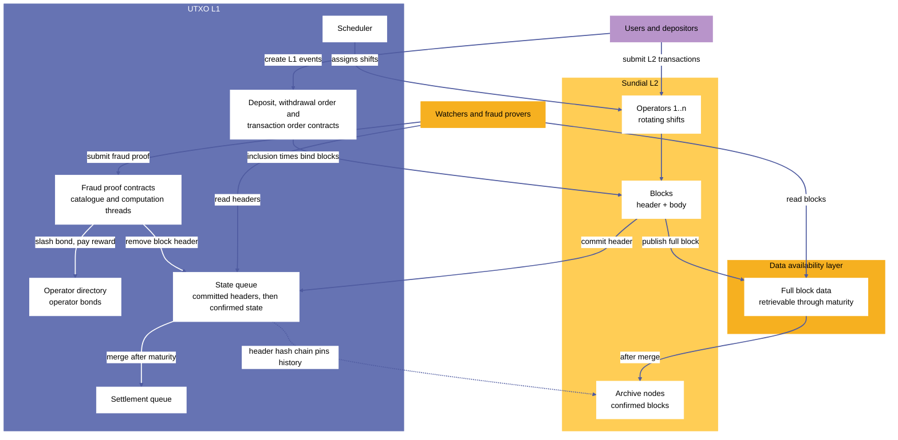

***Figure 1.** Sundial protocol overview: operators commit block headers to the L1 state queue and publish full blocks to the data availability layer; watchers read both and submit fraud proofs, which remove the block from the queue and slash the operator's bond; users submit L2 transactions to operators and create L1 events through L1 contracts; confirmed blocks pass from the data availability layer to archive nodes.*

### The security argument

While a committed block waits, anyone can read it from the data availability layer and check it against Sundial's ledger rules. A watcher who finds a violation submits a fraud proof; if it verifies onchain, the block is removed from the queue, the operator's bond is slashed, and the watcher receives a share of it. An optimistic rollup then offers security similar to processing the transactions directly onchain, provided four conditions hold: the bond is large enough to discourage fraud; the reward is large enough to keep watchers vigilant; the maturity period is long enough for watchers to detect and prove fraud; and the data availability layer is open to everyone throughout the maturity period. When the last three are calibrated so that invalid blocks are almost surely detected, the bond is a strong deterrent: a disqualified block never enters the confirmed state, so fraud yields no revenue to set against the forfeited bond.

### The architecture in one page

- **Operators** take turns, on a rotating schedule that a scheduler contract enforces, to receive L2 transactions, assemble blocks, publish them, and commit their headers. Anyone can become an operator by posting the required bond and waiting the registration period.
- **The state queue** is an L1 linked list that holds committed headers in order. A header is appended by the operator whose shift it is, and merged into the confirmed state at the front of the queue after its maturity period.
- **The ledger** is a UTXO ledger. A block turns the previous block's UTXO set into a new one by applying withdrawals, then transactions, then deposits. Its transactions are L1-style transactions restricted to what an L2 can validate: no staking or governance actions, inline datums, and POSIX timestamps.
- **User events** connect L1 and L2. Deposits, withdrawal orders, and transaction orders are L1 UTXOs that carry an inclusion time; a block whose event interval contains that time must include the event, so operators cannot censor them while they keep producing blocks ([§3.1](#31-time-model), [§5.4](#54-block-level-conditions)). If operators stop producing blocks, an escape hatch lowers the bond requirement for new operators for a limited period so that honest actors can restart production ([§3.5](#35-escape-hatch)).
- **Data availability.** Every committed block is retrievable throughout its maturity period. A streaming root verification procedure binds the retrieved data to the roots in the header.
- **Fraud proofs** are verified by computation threads: linear chains of spending validators that split a verification into steps small enough for L1's transaction limits. A catalogue committed at initialization lists the categories of proof.
- **Settlement** turns merged blocks into L1 UTXOs that let users absorb deposits into a reserve and pay out withdrawals from it.

### Headline figures

| Property | Value |
|---|---|
| Block header | 10 fields; Blake2b-224 hash, 28 bytes |
| Ledger rules | 21 rules ([§5.1](#51-sundial-ledger-rules-and-fraud-proofs)) with 30 violations, plus 4 data availability violations ([§5.2](#52-data-availability-rules)); each violation has a fraud proof construction |
| Fraud proof categories | 4 in the reference catalogue, each a multi-step computation thread of 2, 3, or 4 steps ([§4.1.3](#413-catalogue-entries)) |
| Rule engine | 22 evaluated checks (R2–R20, R23, R24, and R8b) in two phases; R21 and R22 hold by construction ([§11](#11-ledger-rule-engine)) |
| Service objectives | 7, defined as code ([§17.1](#171-service-objectives)) |
| Sustained load measured | 800 and 1,000 TPS durably accepted for 30 minutes, with 718 and 873 tx/s committed, on a 6-core host against an emulated L1 ([§18.2](#182-measured-results)) |
| Inclusion latency objective | p95 below 20 s; measured p95 of 15 s at 100 and 200 TPS ([§18.3](#183-inclusion-latency)) |

### The reference deployment

The reference testnet runs the node against the `always-succeeds` blueprint set of Plutus validators. The node's rule engine and block production enforce the ledger rules ([§19.2](#192-trust-model-of-the-reference-deployment)). The Aiken validators in `onchain/aiken` implement the protocol's onchain half: the state queue, operator directory, scheduler, settlement, user events, and four fraud proof categories.

### Reading guide

- **Protocol designers and auditors:** Part I (Chapters 1–7), Chapter 19, Chapter 20. Start with Chapter 3 and Chapter 5.
- **Integrators:** the Introduction, Chapters 2, 8, 10, 15, and 19.6.
- **Node operators:** Chapters 8–13, and Part III.
- **Everyone:** the Introduction gives the model, and the Appendices give parameters, reject codes, and a glossary.

## Introduction

Sundial is a Layer 2 (L2) scaling protocol for UTXO-based blockchains. It employs optimistic rollup technology to raise L1's capacity to process transactions and to host more complex applications, at a lower cost per transaction. As UTXO-based L1s grow in usage and demand, scaling solutions like Sundial keep performance high and transaction costs low. This document describes the architecture and technical design of the Sundial protocol and its implementation, and how it integrates with Layer 1 (L1) blockchains to process transactions securely and efficiently.

### Optimistic rollups

Optimistic rollups process blocks of transactions off-chain and commit those blocks' headers onchain to the L1 ledger. Each block is committed by a Sundial operator who guarantees the block's validity. The block then waits in a queue for at least a fixed duration to be merged into the confirmed state of the optimistic rollup on L1. The operator collateralizes the guarantee with a bond deposit and publishes the full contents of the block on the publicly accessible data availability (DA) layer.

While a committed block is queued, anyone can inspect its contents on the data availability layer and ascertain whether it is valid. If someone detects that the block is invalid, they can submit a fraud proof to prevent it from being merged into the confirmed state, slash the operator's bond, and receive a portion of the forfeited bond as a reward. An optimistic rollup thus processes a large number of transactions off-chain while maintaining security and finality properties similar to transactions processed directly onchain, provided that:

- the bond requirement for the rollup's operators is large enough to discourage fraud;
- the reward for preventing an invalid block from merging is large enough to encourage public vigilance in watching the operators;
- the waiting period for committed blocks is long enough to allow the watchers to detect and prove fraud before those blocks are merged; and
- the data availability layer is accessible by anyone who wishes to inspect the rollup blocks at any time.

Whenever the latter three security parameters are calibrated to give invalid blocks a high probability of being detected and disqualified, the bond requirement is a strong deterrent against operators attempting fraud. An operator cannot dismiss the forfeited bond as a “cost of doing business” paid to obtain potentially larger revenues from fraud: a disqualified invalid block does not affect the confirmed state, so no revenue from that fraud offsets the forfeited bond.

The main design goal of Sundial is to streamline the processes by which blocks are committed and merged, fraud is detected, and fraud proofs are verified onchain. Streamlining lets the security parameters be calibrated to strike a better balance between security, transaction throughput, confirmation time, and community participation in committing blocks and detecting fraud.

### Scalability and efficiency

By processing transactions off-chain and validating them onchain only when fraud proofs challenge them, Sundial increases throughput and reduces costs for L1 transactions. Its rollup blocks use Merkle Patricia Tries and compact state representations, which lets it handle a large volume of transactions without burdening the L1 ([Figure 2](#figure-2)).

The deterministic nature of UTXO-based L1 transactions lets Sundial fraud proofs pinpoint the specific site of a transaction that violated Sundial's ledger rules, without looking at any other part of that transaction, at any transaction of the block that is not involved in the violation, or at any other block. Most violations concern one transaction. Those that involve a second transaction (a double spend, or a spend of an output that an earlier transaction of the block creates) or the previous UTXO set need Merkle proofs for those pieces alone. This keeps fraud proofs and their onchain validation procedures small and efficient, which reduces the time and cost of submitting a fraud proof and makes it feasible for a wider group of people to police Sundial's blocks. Sundial thus reduces fraud proof size relative to optimistic rollups on Ethereum and other account-based ecosystems [[12]](#references), where a much larger part of the global state must be inspected to construct and verify a fraud proof.

<a id="figure-2"></a>

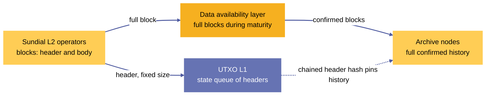

***Figure 2.** Data flow across the four layers: operators, the L1 state queue, the data availability layer, and archive nodes.*

### Censorship resistance and fallback mechanisms

On its own, the optimistic rollup mechanism gives a high level of assurance for the validity of block headers committed to the state queue and merged into the confirmed state. It does not prevent operators from censoring users' deposits, withdrawals, and L2 transactions, so Sundial's consensus protocol includes further smart contract mechanisms that provide censorship resistance for these events.

Sundial deposits and withdrawals are initiated through L1 smart contracts that assign definite inclusion times to them. An operator block is invalid if its event interval contains such an inclusion time but the block omits the associated deposit or withdrawal event. If operators continue committing blocks to the state queue, they cannot ignore deposit and withdrawal events ([§3.1](#31-time-model), [§5.4](#54-block-level-conditions)).

Sundial L2 transaction requests are typically submitted to operators through a publicly accessible API, and an operator can ignore them. Any user can escalate a request by posting a transaction order on L1. Like a deposit or a withdrawal, an L1 transaction order is assigned an inclusion time that guarantees its inclusion in a subsequent valid block.

If Sundial operators stop committing blocks altogether, inclusion times alone cannot guarantee timely processing of deposits, withdrawals, and L2 transactions. For this extreme case, Sundial's consensus protocol includes the escape hatch mechanism, which temporarily lowers the bond requirement for new operators so that honest actors can restart block production ([§3.5](#35-escape-hatch)). The first block committed after an outage carries an event interval that spans the outage, so it must include every event that arrived meanwhile: user funds are not stranded by an operator outage.

### Protocol realization

Sundial is realized in three layers that describe the same protocol at three levels of detail ([Figure 3](#figure-3)). A **formal specification** in Lean 4 (`technical-spec/Lean4Midgard/`) models the protocol's state machines and proves properties of them; the technical specification in `technical-spec/` states the rules in prose and formulas, and Part I of this document is its current form. A **validator implementation** (`onchain/aiken/`, with the Merkle proof helper scripts in `onchain/plutarch/`) implements the L1 contracts of the consensus and proof protocols as Aiken validators for Plutus V3. A **node implementation** (`demo/midgard-node`, `demo/midgard-sdk`, `demo/midgard-ts`) implements the off-chain half: the sequencer, the ledger rule engine, block production, L1 commitment, merge, the RPC surface, and observability. Part II describes the node. Appendix F maps each mechanism of the protocol to the artifact that realizes it in each layer.

<a id="figure-3"></a>

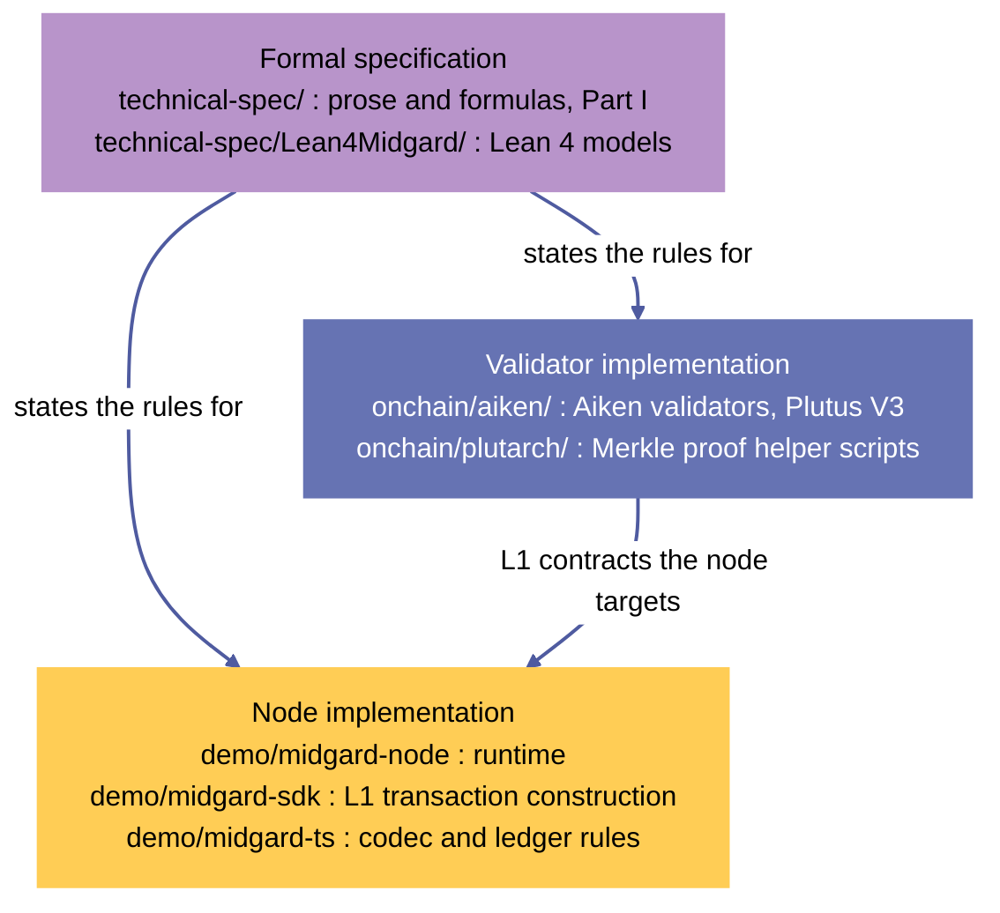

***Figure 3.** The protocol realization stack: the formal specification, the validator implementation, and the node implementation, each labeled with its artifact path.*

### Structure of this document

**Part I: Protocol** specifies the ledger state (Chapter 1), the user event protocol (Chapter 2), the consensus protocol (Chapter 3), the proof protocol (Chapter 4), the ledger rules and fraud proofs (Chapter 5), the data availability layer (Chapter 6), and phase two validation (Chapter 7). 

**Part II: Implementation** describes the node: overview, architecture, ingress, rule engine, block production, data model, SDK, and API (Chapters 8–15). 

**Part III: Operations** covers deployment, observability and service objectives, performance, security, and verification (Chapters 16–20). The appendices give the general onchain data structures the protocol uses (A, B), the parameters (C), the reject codes (D), a glossary (E), related documents and the realization map (F), and networks and deployments (G).

# Part I — Protocol

Part I specifies the Sundial protocol: the ledger and its state transitions, the events that connect L1 and L2, the L1 consensus contracts, the proof protocol, the ledger rules and their fraud proofs, the data availability layer, and phase two validation. Its statements are normative.

## 1 Ledger state

Sundial's L2 ledger consists of a chain of blocks. Each block defines a transition from the previous block's set of unspent transaction outputs (UTXOs) to a new UTXO set. Unlike a closed-system L1 ledger, Sundial's open-system L2 ledger allows block transitions to create and destroy UTXOs in response to exogenous events—namely, deposits and withdrawal requests that occur on the L1 ledger. This is in addition to Sundial's endogenous L2 transactions, which work the same as L1 transactions but with reduced functionality (no staking/governance actions).[^c1-1]

The blocks are stored temporarily on Sundial's data availability layer and permanently on Sundial's archive nodes. The blocks' headers are committed to Sundial's L1 state queue data structure to establish immutability for the blocks' sequence and contents as part of Sundial's L1 contract-based consensus protocol. Block headers have a fixed byte size regardless of how many deposit, transaction, and withdrawal events are held by their blocks—this size leverage between blocks and headers is how Sundial multiplies L1's transaction throughput.

Sundial L1 contract-based consensus protocol irreversibly considers a block to be confirmed as soon as all its predecessors are confirmed and the block's maturity period has elapsed, as long as no fraud proofs have been verified on L1 to prove that the block violates one of Sundial's ledger rules.

The irreversibility of block confirmation allows the L1 representation of confirmed block headers to be condensed. For instance, it can stop tracking confirmed withdrawal requests after they are paid out and confirmed deposits after they are absorbed into Sundial's reserve. It can avoid tracking any confirmed transactions and only needs to track the last confirmed block's UTXO set, as it is required to confirm the next block. Finally, it can drop all other header data for the last confirmed block's predecessors, as it is implicitly tracked by a chained hash in the last confirmed header and is not required to confirm the next block.

As a result, Sundial's L1 confirmed state consists of a fixed-byte-size record with selected fields from the last confirmed block header and a variable-size dataset tracking confirmed withdrawal requests and deposits until they are processed.

### 1.1 Block

A block consists of a header hash, a header, and a block body:

$$
\mathsf{Block} := \left\{
    \begin{array}{ll}
        \mathsf{header\_hash} : & \mathsf{HeaderHash} \\
        \mathsf{header} : & \mathsf{Header} \\
        \mathsf{block\_body} : & \mathsf{BlockBody}
    \end{array} \right\}
$$

The block body contains the block's transactions, deposits, and withdrawals, along with the unspent outputs that result from applying the block's transition to the previous block's unspent outputs. The transactions include both transaction requests (submitted to operators' mempools) and transaction orders (submitted as L1 events).

$$
\mathsf{BlockBody} := \left\{
    \begin{array}{ll}
        \mathsf{utxos} : & \mathsf{UtxoSet} \\
        \mathsf{transactions} : & \mathsf{TxSet} \\
        \mathsf{deposits} : & \mathsf{DepositSet} \\
        \mathsf{withdrawals} : & \mathsf{WithdrawalSet} \\
    \end{array} \right\}
$$

[Figure 4](#figure-4) shows how the block's `utxos` are derived from the previous block's `utxos` by applying the block's events. The events are applied in the following order: withdrawals, then transactions (with transaction orders prioritized over transaction requests), and finally deposits. A block that fails to uphold this ordering violates a block-level condition ([§5.4](#54-block-level-conditions)). The ordering ensures transaction orders (which are costlier) are not marked invalid in favor of transaction requests. The node applies events in this order when it assembles a block ([§12.2](#122-block-body-assembly)).

<a id="figure-4"></a>


***Figure 4.** A block's transition from the previous block's UTXO set to a new UTXO set: withdrawals, then transactions (orders before requests), then deposits.*

The block is what gets serialized and stored on Sundial's data availability layer. During serialization, each of the block body's sets is serialized as a sequence of pairs, sorted in ascending order on the unique key of each element.

However, only the header hash and header are stored on L1. This is sufficient because the header specifies Merkle Patricia Trie (MPT) [[7]](#references) root hashes for each of the sets in the block body. Each of these root hashes can be verified onchain by streaming over the corresponding set's elements, hashing them, and iteratively calculating the root hash.

[Figure 5](#figure-5) shows an example MPT representation of a block's transactions. The trie is a radix-16 trie over the hexadecimal digits (nibbles) of the keys. Each $(\mathsf{TxId_i}, \mathsf{SundialTx_i})$ pair is an entry: a leaf holds the hash of its entry together with the part of the key that is not yet consumed by the path to the leaf. A branch node has up to sixteen children, one per next nibble, and keys that share a prefix share a path. The hash of every node commits to the hashes of its children, and the `transactions_root` is the hash of the root node. The root therefore depends on the set of entries and not on the order in which they are inserted.

<a id="figure-5"></a>

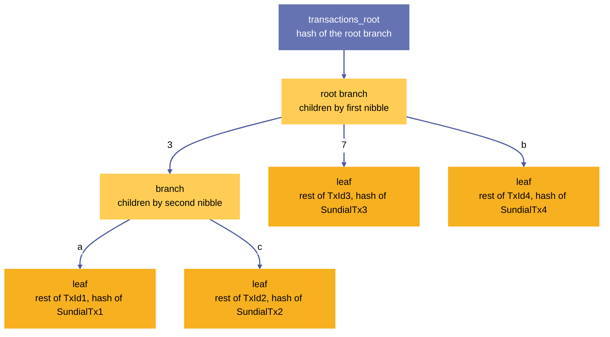

***Figure 5.** A Merkle Patricia Trie example for a block's transactions: entries are placed by the hexadecimal digits of their TxIds (here TxId1 begins with 3a, TxId2 with 3c, TxId3 with 7, TxId4 with b), keys that share a prefix share a path, each node commits to the hashes of its children, and the hash of the root node is the transactions root.*

#### 1.1.1 Block header

A block header is a record with fixed-size fields: integers, hashes, and fixed-size bytestrings. A block header hash is 28 bytes in size and calculated via the Blake2b-224.

$$
\begin{aligned}
  \mathsf{HeaderHash} &:= \mathcal{H}_\mathsf{Blake2b-224}(\mathsf{Header}) \\
  \mathsf{Header} &:= \left\{
    \begin{array}{ll}
        \mathsf{prev\_utxos\_root} : & \mathsf{RootHash} \\
        \mathsf{utxos\_root} : & \mathsf{RootHash} \\
        \mathsf{transactions\_root} : & \mathsf{RootHash} \\
        \mathsf{deposits\_root} : & \mathsf{RootHash} \\
        \mathsf{withdrawals\_root} : & \mathsf{RootHash} \\
        \mathsf{start\_time} : & \mathsf{PosixTime} \\
        \mathsf{end\_time} : & \mathsf{PosixTime} \\
        \mathsf{prev\_header\_hash} : & \mathsf{HeaderHash} \\
        \mathsf{operator\_vkey} : & \mathsf{VerificationKeyHash} \\
        \mathsf{protocol\_version} : & \mathsf{Int} \\
    \end{array} \right\}
\end{aligned}
$$

These header fields are interpreted as follows:

- The `*_root` fields are the MPT root hashes of the corresponding sets in the block body.
- The `prev_utxos_root` is a copy of the `utxos_root` from the previous block, included for convenience in the fraud proof verification procedures.
- The `start_time` and `end_time` fields are the block's event interval bounds (see [§3.1](#31-time-model)).
- The `prev_header_hash` field is a hash of the previous block header. For the genesis block, this field is set to 28 `0x00` bytes.
- The `operator_vkey` field is the hash of the verification key of the operator who committed the block header to the L1 state queue.
- The `protocol_version` is the Sundial protocol version that applies to this block.

The ten fields, in this order, are the fields of `Header` in `onchain/aiken/lib/midgard/ledger-state.ak` and in `demo/midgard-sdk/src/ledger-state.ts`. The header hash is the Blake2b-224 hash of the header's Plutus data serialization.

#### 1.1.2 Transaction requests vs. transaction orders

To distinguish between transactions applied to the ledger from different sources, Sundial recognizes two types of transactions within a block:

- **Transaction requests:** Transactions submitted to operators' mempools. These are the typical L2 transactions that operators collect from users offchain.
- **Transaction orders:** Transactions submitted as L1 events through the transaction order contract (see [§1.5](#15-transaction-order-event)). These provide an alternative submission path when users need guaranteed inclusion.

Both transaction requests and transaction orders are included in the block's `transactions` set and share the same `transactions_root` Merkle root. However, they must be applied to the ledger with transaction orders prioritized over requests.

### 1.2 UTXO set

A UTXO set is a finite map from output reference to transaction output:

$$
\begin{aligned}
\mathsf{UtxoSet} &:= \mathsf{Map(OutputRef, Output)} \\
      &:= \Bigl\{
        (k_i: \mathsf{OutputRef}, v_i: \mathsf{Output}) \mid \forall i \neq j.\; k_i \neq k_j
    \Bigr\}
\end{aligned}
$$

An output reference is a tuple that uniquely identifies an output by a hash of the ledger event that created it (either a transaction or a deposit) and its index among the outputs of that event.

$$
\mathsf{OutputRef} := \left\{
    \begin{array}{ll}
        \mathsf{id} : & \mathsf{TxId} \\
        \mathsf{index} : & \mathsf{Int}
    \end{array} \right\}
$$

An output is a tuple describing a bundle of tokens, data, and a script that have been placed by a transaction at an address in the ledger:

$$
\mathsf{Output} := \left\{
    \begin{array}{ll}
        \mathsf{addr} : & \mathsf{Address} \\
        \mathsf{value} : & \mathsf{Value} \\
        \mathsf{datum} : & \mathsf{Option(Data)} \\
        \mathsf{script} : & \mathsf{Option(Script)}
    \end{array} \right\}
$$

Within the context of a Sundial block, the UTXO set that we are interested in consists of the outputs created by deposits and transactions but not yet spent by transactions and withdrawals, considering all the deposits, transactions, and withdrawals of this block and all its predecessors. This is the UTXO set that we transform into an MPT and place into the block body's `utxos` field.

All datums of L2 outputs are inline: an output's `datum` is either absent or carries the datum data itself, never a datum hash. Every L2 address carries the Sundial network id (`network_id_Sundial`, [Appendix C](#appendix-c-protocol-parameters)), against which rules [§5.1.14](#5114-rule-network-id-of-outputs) and [§5.1.15](#5115-rule-network-id-of-transaction) are evaluated.

### 1.3 Deposit event

A deposit set is a finite map from deposit IDs to deposit info:

$$
\begin{aligned}
\mathsf{DepositSet} &:= \mathsf{Map(DepositId, DepositInfo)} \\
      &:= \Bigl\{
        (k_i: \mathsf{DepositId}, v_i: \mathsf{DepositInfo}) \mid \forall i \neq j.\; k_i \neq k_j
    \Bigr\}
\end{aligned}
$$

A deposit event in a Sundial block acknowledges that a user has created an L1 UTXO at the Sundial L1 deposit address, intending to transfer that UTXO's tokens to the L2 ledger.

$$
\begin{aligned}
\mathsf{DepositEvent} &:= (\mathsf{DepositId}, \mathsf{DepositInfo}) \\
    \mathsf{DepositId} &:= \mathsf{OutputRef} \\
    \mathsf{DepositInfo} &:= \left\{
        \begin{array}{ll}
            \mathsf{l2\_address} : & \mathsf{Address} \\
            \mathsf{l2\_datum} : & \mathsf{Option(Data)} \\
        \end{array} \right\}
\end{aligned}
$$

The deposit ID corresponds to one of the inputs spent by the user in the L1 transaction that created the L1 deposit UTXO. This identifier is needed to find the L1 deposit UTXO, ensure that deposit events are unique, and detect when an operator has fabricated a deposit event without the corresponding deposit UTXO existing in the L1 ledger.

Suppose a deposit event is permitted by Sundial's ledger rules to be included in a block. In that case, its effect is to add a new L2 UTXO to the block's UTXO set containing the value from the L1 deposit UTXO at the address (`l2_address`) and with the inline datum (`l2_datum`) specified by the user. The L2 output reference of this new UTXO is as follows:

$$
\mathsf{l2\_outref(deposit\_id)} := \left\{
    \begin{array}{ll}
        \mathsf{id} &:= \mathsf{hash(deposit\_id)} \\
        \mathsf{index} &:= 0
    \end{array} \right\}
$$

In other words, the L2 ledger treats the new UTXO as if it was created by a notional transaction with `TxId` equal to the hash of the deposit ID.

If the block containing the deposit event is confirmed, the corresponding L1 deposit UTXO may be absorbed into the Sundial reserve. [§2.1](#21-deposit-l1) describes the lifecycle of a deposit in further detail.

### 1.4 Withdrawal event

A withdrawal set is a finite map from withdrawal ID to withdrawal info:

$$
\begin{aligned}
\mathsf{WithdrawalSet} &:= \mathsf{Map(WithdrawalId, WithdrawalInfo)} \\
      &:= \Bigl\{
        (k_i: \mathsf{WithdrawalId}, v_i: \mathsf{WithdrawalInfo}) \mid \forall i \neq j.\; k_i \neq k_j
    \Bigr\}
\end{aligned}
$$

A withdrawal event in a Sundial block acknowledges that a user has created an L1 UTXO at the Sundial L1 withdrawal address, ordering transfer of an L2 UTXO at a payment address to the L1 ledger.

$$
\begin{aligned}
\mathsf{WithdrawalEvent} &:= \mathsf{(WithdrawalId, WithdrawalInfo)} \\
    \mathsf{WithdrawalId} &:= \mathsf{OutputRef} \\
    \mathsf{WithdrawalInfo} &:= \left\{
        \begin{array}{ll}
            \mathsf{body} :& \mathsf{WithdrawalBody} \\
            \mathsf{signature} :& \mathsf{(VerificationKey, Signature)} \\
            \mathsf{validity} :& \mathsf{WithdrawalValidity} \\
        \end{array} \right\}\\
    \mathsf{WithdrawalBody} &:={} \left\{
        \begin{array}{ll}
            \mathsf{l2\_outref} :& \mathsf{OutputRef} \\
            \mathsf{l2\_owner} :& \mathsf{VerificationKeyHash} \\
            \mathsf{l2\_value} :& \mathsf{Value} \\
            \mathsf{l1\_address} : & \mathsf{Address} \\
            \mathsf{l1\_datum} : & \mathsf{CardanoDatum}
        \end{array} \right\}\\
    \mathsf{WithdrawalValidity} :=\;& \mathsf{WithdrawalIsValid} \\
                               \mid\;& \mathsf{NonExistentWithdrawalUtxo} \\
                               \mid\;& \mathsf{SpentWithdrawalUtxo} \\
                               \mid\;& \mathsf{IncorrectWithdrawalOwner} \\
                               \mid\;& \mathsf{IncorrectWithdrawalValue} \\
                               \mid\;& \mathsf{IncorrectWithdrawalSignature} \\
                               \mid\;& \mathsf{TooManyTokensInWithdrawal}
\end{aligned}
$$

The `WithdrawalId` of a withdrawal event corresponds to one of the inputs spent by the user in the L1 transaction that created the L1 withdrawal request UTXO (more specifically, it's the hash of its serialized output-reference). This key is needed to identify the L1 withdrawal UTXO, ensure that withdrawal events are unique, and detect when an operator has fabricated a withdrawal event without the corresponding withdrawal request existing in the L1 ledger.

If a withdrawal event is permitted by Sundial's ledger rules to be included in a block, its effect is to remove the output at output-reference `l2_outref` from the block's UTXO set.

Suppose the block containing the withdrawal event is confirmed, with the withdrawal event tagged as valid. The L1 withdrawal request UTXO is sent to the `payout` contract, after which it can be gradually funded from the reserve. Once fully funded, its UTXO can be transferred to `l1_address` with `l1_datum` attached.

As observable from the `validity` field, withdrawal orders are optimistic in the sense that their declared information is not validated at the time of creation. However, since inclusion of the orders is obligatory, operators can tag any invalid orders by pointing where the error is present. Consequently, any block containing withdrawal orders that are incorrectly tagged as invalid violates a block-level condition ([§5.4](#54-block-level-conditions)).

[§2.4](#24-withdrawal-order-l1) describes the lifecycle of a withdrawal order in further detail.

### 1.5 Transaction Order event

A transaction order set is a finite map from transaction order ID to a Sundial transaction:

$$
\begin{aligned}
\mathsf{TxOrderSet} &:= \mathsf{Map(TxOrderId, SundialTx)} \\
      &:= \Bigl\{
        (k_i: \mathsf{TxOrderId}, v_i: \mathsf{SundialTx}) \mid \forall i \neq j.\; k_i \neq k_j
    \Bigr\}
\end{aligned}
$$

Transaction orders are events on L1 as an alternative to the L2 transaction submission to operators. Similar to a deposit or withdrawal event, a transaction order in a Sundial block acknowledges that a user has created an L1 UTXO at the Sundial L1 transaction order address, obligating the operator to include the given L2 transaction. In turn, the operator is free to set `SundialTxValidity`, if the included transaction is invalid. An incorrect invalidity claim violates a block-level condition ([§5.4](#54-block-level-conditions)).

$$
\begin{aligned}
\mathsf{TxOrderEvent} &:= \mathsf{(TxOrderId, SundialTx)} \\
    \mathsf{TxOrderId} &:= \mathsf{OutputRef}
\end{aligned}
$$

The `TxOrderId` of a transaction order event corresponds to one of the inputs spent by the user in the L1 transaction that created the transaction order UTXO on L1 (more specifically, it's the hash of its serialized output-reference). This key is needed to identify the L1 transaction order UTXO, and ensure that each order is unique.

The effect of an included transaction order on a block's UTXO set is identical to any other transaction from block's transaction tree. It removes all the transaction's inputs from the ledger and adds all its outputs.

[§2.3](#23-transaction-order-l1) describes the lifecycle of a transaction order request in further detail.

### 1.6 Transaction

A transaction set in Sundial is a finite map from transaction ID to Sundial L2 transaction, where the ID is also constrained to be the L1 transaction id: the Blake2b-256 hash of the CBOR encoding of the transaction body ([§5.1.17](#5117-rule-transaction-hash-integrity)):

$$
\begin{aligned}
\mathsf{TxSet} &:= \mathsf{Map(TxId, SundialTx)} \\
      &:= \Bigl\{
        (k_i: \mathsf{TxId}, v_i: \mathsf{SundialTx}) \mid 
        k_i \equiv \mathit{tx\_hash}(v_i) ,\;
        \forall i \neq j.\; k_i \neq k_j
    \Bigr\}
\end{aligned}
$$

An L2 transaction in a Sundial block is an endogenous event. Its corresponding UTXO set transition is validated purely based on the information contained in the UTXO set. This contrasts with deposit and withdrawal events, which create and spend UTXOs (respectively) based on information observed outside the L2 ledger.

A transaction can only spend a UTXO if it satisfies the conditions of the spending validator corresponding to the UTXO's payment address, and it can only mint and burn tokens by satisfying the conditions of the corresponding minting policies. Of course, users can inject information into the UTXO set via redeemer arguments and output datums set in transactions, but those are still subject to the transaction scripts' conditions.

#### 1.6.1 Cardano transaction types

Cardano's L1 transaction type ([Chang 2 hardfork](https://github.com/IntersectMBO/cardano-ledger/blob/cardano-ledger-conway-1.17.2.0/eras/conway/impl/src/Cardano/Ledger/Conway/Tx.hs), [[1]](#references)) served as an initial model for Sundial's L2 transaction type. In the following, field types prefixed by a question mark `?` are set to appropriate “empty” defaults during deserialization if the serialized transaction omits them:[^c1-2] [^c1-3]

$$
\begin{aligned}
\mathsf{CardanoTx} :=\;& \left\{
    \begin{array}{ll}
        \mathsf{body} : & \mathsf{CardanoTxBody} \\
        \mathsf{wits} : & \mathsf{CardanoTxWits} \\
        \mathsf{is\_valid} : & \mathsf{Bool} \\
        \mathsf{auxiliary\_data} : & \quad?\;\mathsf{TxMetadata}
    \end{array} \right\} \\
    \mathsf{CardanoTxBody} :=\;& \left\{
    \begin{array}{ll}
        \mathsf{spend\_inputs} : & \mathsf{Set(OutputRef)} \\
        \mathsf{collateral\_inputs} : & \quad?\;\mathsf{Set(OutputRef)} \\
        \mathsf{reference\_inputs} : & \quad?\;\mathsf{Set(OutputRef)} \\
        \mathsf{outputs} : & \mathsf{[Output]} \\
        \mathsf{collateral\_return} : & \quad?\;\mathsf{Output} \\
        \mathsf{total\_collateral} : & \quad?\;\mathsf{Coin} \\
        \mathsf{certificates} : & \quad?\;\mathsf{[ Set(Certificate) ]} \\
        \mathsf{withdrawals} : & \quad?\;\mathsf{Map(RewardAccount, Coin)} \\
        \mathsf{fee} : & \mathsf{Coin} \\
        \mathsf{validity\_interval} : & \mathsf{CardanoValidityInterval} \\
        \mathsf{required\_signer\_hashes} : & \quad?\;\mathsf{Set(VKeyHash)} \\
        \mathsf{mint} : & \quad?\;\mathsf{Value} \\
        \mathsf{script\_integrity\_hash} : & \quad?\;\mathsf{Hash} \\
        \mathsf{auxiliary\_data\_hash} : & \quad?\;\mathsf{Hash} \\
        \mathsf{network\_id} : & \quad?\;\mathsf{Network} \\
        \mathsf{voting\_procedures} : & \quad?\;\mathsf{VotingProcedures} \\
        \mathsf{proposal\_procedures} : & \quad?\;\mathsf{Set(ProposalProcedure)} \\
        \mathsf{current\_treasury\_value} : & \quad?\;\mathsf{Coin} \\
        \mathsf{treasury\_donation} : & \quad?\;\mathsf{Coin}
    \end{array} \right\}\\
    \mathsf{CardanoTxWits} :=\;& \left\{
    \begin{array}{ll}
        \mathsf{addr\_tx\_wits} : & \quad?\;\mathsf{Set(VKey, Signature, VKeyHash)} \\
        \mathsf{boot\_addr\_tx\_wits} : & \quad?\;\mathsf{Set(BootstrapWitness)} \\
        \mathsf{script\_tx\_wits} : & \quad?\;\mathsf{Map(ScriptHash, CardanoScript)} \\
        \mathsf{data\_tx\_wits} : & \quad?\;\mathsf{TxDats} \\
        \mathsf{redeemer\_tx\_wits} : & \quad?\;\mathsf{Redeemers}
    \end{array} \right\}\\
    \mathsf{CardanoValidityInterval} :=\;& (\mathsf{Option(Slot), Option(Slot)}) \\ 
    \mathsf{CardanoScript} :=\;& \mathsf{TimelockScript}(\mathsf{Timelock}) \\
                          \mid\;& \mathsf{PlutusScript}(\mathsf{CardanoPlutusVersion},\mathsf{PlutusBinary}) \\
    \mathsf{CardanoPlutusVersion} :=\;& \mathsf{PlutusV1} \\
                                 \mid\;& \mathsf{PlutusV2} \\
                                 \mid\;& \mathsf{PlutusV3}
\end{aligned}
$$

#### 1.6.2 Sundial transaction type

Sundial's transaction type is based on Cardano's Conway-era transaction type ([§1.6.1](#161-cardano-transaction-types)) restricted to the features that an open-system, contract-secured L2 ledger can validate, plus the extensions that let L1 scripts traverse a transaction with bounded cost. The following design rules define it; each is followed by its rationale.

- **UTXO transactions only.** Staking and governance actions (certificates, withdrawals, voting procedures, proposal procedures, treasury fields) are absent from Sundial transactions. *Rationale:* Sundial's consensus protocol is not Ouroboros proof-of-stake [[4]](#references), its governance protocol is not Cardano's hard-fork-combinator update mechanism, and its L1 scripts cannot authorize arbitrary staking or governance actions on behalf of users.
- **Conway-era features only.** Bootstrap addresses and bootstrap witnesses are absent; Plutus scripts are Plutus V3; public key hash credentials, native scripts, and Plutus V3 scripts are the admissible credentials. *Rationale:* Sundial carries no obligation to preserve backwards compatibility with pre-Conway eras.
- **No transaction metadata.** The `auxiliary_data` field and the `auxiliary_data_hash` field are absent. Users who need to pin metadata content in the ledger place it in an output datum. *Rationale:* metadata is unreachable by scripts and adds bytes to every block without contributing to validation.
- **Inline datums only.** Every output datum is inline; datum hashes and datum witnesses are absent. *Rationale:* the ledger then never indexes a datum-hash-to-datum map from transactions' datum witnesses.
- **Observers and reordered inputs.** Sundial adopts [CIP-112](https://github.com/cardano-foundation/CIPs/tree/master/CIP-0112) [[2]](#references) and [CIP-128](https://github.com/cardano-foundation/CIPs/tree/master/CIP-0128) [[3]](#references). CIP-112 provides the “Observe” script purpose, a more principled alternative to the “Withdraw 0” pattern, and lets native scripts conditionally forward their logic to an observer script. CIP-128 preserves the order of inputs in a submitted transaction instead of ordering them by `OutputRef`, which improves the execution efficiency achievable in Plutus contracts.
- **Instance network id.** Transactions and L2 UTXO addresses carry the Sundial instance's network id (`network_id_Sundial`, [Appendix C](#appendix-c-protocol-parameters)). *Rationale:* the network id separates the L2 ledger from the settlement L1 ledger and from other Sundial instances.
- **POSIX time.** Validity intervals are expressed as POSIX timestamps instead of slots. *Rationale:* Sundial's consensus protocol does not use slots, and the L1 contracts that enforce it are evaluated in the Plutus script context, where slots are converted to POSIX timestamps.
- **Declared signers.** `required_signer_hashes` lists the key hash of every spent key-hash input and nothing else (rule [§5.1.5](#515-rule-required-signatures-are-correct)), and each listed signer has a signature witness (rule [§5.1.7](#517-rule-every-needed-signature-is-provided)). *Rationale:* a missing signature is then provable from the declared list and the witness set separately, without resolving the inputs of the whole transaction.
- **Validity flag is `True`.** The `is_valid` flag is always `True`. *Rationale:* Sundial's consensus protocol expresses invalidity through `SundialTxValidity` ([§1.6.4](#164-sundial-transaction-types)) and fraud proofs, not through the flag.

The restrictions above are normative: rules [§5.1.18](#5118-rule-field-admissibility), [§5.1.20](#5120-rule-validity-flag), and [§5.1.21](#5121-rule-no-auxiliary-data) make their violation fraud, and the rule engine of [§11](#11-ledger-rule-engine) enforces them at admission.

#### 1.6.3 Sundial simplified transaction types

Sundial's actual transaction types are complicated by the need to optimize their traversal by Plutus scripts. As an intermediate step towards them, the following simplified types illustrate how the Cardano transaction types ([§1.6.1](#161-cardano-transaction-types)) are modified by the definition in [§1.6.2](#162-sundial-transaction-type). The empty set symbol ∅ marks fields required to be empty in Sundial transactions, and the star symbol ★ marks new or modified fields:

$$
\begin{aligned}
\mathsf{SundialSTx} :=\;& \left\{
    \begin{array}{ll}
        \mathsf{body} : & \mathsf{SundialSTxBody} \\
        \mathsf{wits} : & \mathsf{SundialSTxWits} \\
        \mathsf{is\_valid} : & \mathsf{Bool} \\
        \varnothing\;\mathsf{auxiliary\_data}: & \quad?\;\mathsf{TxMetadata}
    \end{array} \right\} \\
    \mathsf{SundialSTxBody} :=\;& \left\{
    \begin{array}{ll}
        \mathsf{spend\_inputs} : & \mathsf{Set(OutputRef)} \\
        \varnothing\;\mathsf{collateral\_inputs} : & \quad?\;\mathsf{Set(OutputRef)} \\
        \mathsf{reference\_inputs} : & \quad?\;\mathsf{Set(OutputRef)} \\
        \mathsf{outputs} : & \mathsf{[Output]} \\
        \varnothing\;\mathsf{collateral\_return} : & \quad?\;\mathsf{Output} \\
        \varnothing\;\mathsf{total\_collateral} : & \quad?\;\mathsf{Coin} \\
        \varnothing\;\mathsf{certificates} : & \quad?\;\mathsf{[ Set(Certificate) ]} \\
        \varnothing\;\mathsf{withdrawals} : & \quad?\;\mathsf{Map(RewardAccount, Coin)} \\
        \mathsf{fee} : & \mathsf{Coin} \\
        \star\;\mathsf{validity\_interval} : & \quad?\;\mathsf{SundialSValidityInterval} \\
        \star\;\mathsf{required\_observers} : & \quad?\;\mathsf{[ScriptCredential]} \\
        \mathsf{required\_signer\_hashes} : & \quad?\;\mathsf{[VKeyCredential]} \\
        \mathsf{mint} : & \quad?\;\mathsf{Value} \\
        \mathsf{script\_integrity\_hash} : & \quad?\;\mathsf{Hash} \\
        \mathsf{auxiliary\_data\_hash} : & \quad?\;\mathsf{Hash} \\
        \mathsf{network\_id} : & \quad?\;\mathsf{Network} \\
        \varnothing\;\mathsf{voting\_procedures} : & \quad?\;\mathsf{VotingProcedures} \\
        \varnothing\;\mathsf{proposal\_procedures} : & \quad?\;\mathsf{Set(ProposalProcedure)} \\
        \varnothing\;\mathsf{current\_treasury\_value} : & \quad?\;\mathsf{Coin} \\
        \varnothing\;\mathsf{treasury\_donation} : & \quad?\;\mathsf{Coin}
    \end{array} \right\}\\
    \mathsf{SundialSTxWits} :=\;& \left\{
    \begin{array}{ll}
        \mathsf{addr\_tx\_wits} : & \quad?\;\mathsf{Set(VKey, Signature, VKeyHash)} \\
        \varnothing\;\mathsf{boot\_addr\_tx\_wits} : & \quad?\;\mathsf{Set(BootstrapWitness)} \\
        \mathsf{script\_tx\_wits} : & \quad?\;\mathsf{Map(ScriptHash, SundialSScript)} \\
        \varnothing\;\mathsf{data\_tx\_wits} : & \quad?\;\mathsf{TxDats} \\
        \mathsf{redeemer\_tx\_wits} : & \quad?\;\mathsf{Redeemers}
    \end{array} \right\}\\
    \mathsf{SundialSValidityInterval} :=\;& (\mathsf{Option(PosixTime), Option(PosixTime)}) \\ 
    \mathsf{SundialSScript} :=\;& \mathsf{TimelockScript}(\star\;\mathsf{TimelockObserver}) \\
                          \mid\;& \mathsf{PlutusScript}(\mathsf{SundialSPlutusVersion},\mathsf{PlutusBinary}) \\
    \mathsf{SundialSPlutusVersion} :=\;& \mathsf{PlutusV3}
\end{aligned}
$$

#### 1.6.4 Sundial transaction types

Sundial's transaction types modify the above simplified types by replacing all variable-length fields with hashes (indicated by the letter $\mathcal{H}$ below). The data availability layer is responsible for confirming that the hashes correspond to their preimages, and DA fraud proofs can be submitted if this correspondence is violated.

$$
\begin{aligned}
\mathsf{SundialTx} :=\;& \left\{
    \begin{array}{ll}
        \mathsf{body} : & \mathcal{H}(\mathsf{SundialTxBody}) \\
        \mathsf{wits} : & \mathcal{H}(\mathsf{SundialTxWits}) \\
        \mathsf{validity} : & \mathsf{SundialTxValidity} \\
    \end{array} \right\} \\
    \mathsf{SundialTxBody} :=\;& \left\{
    \begin{array}{ll}
        \mathsf{spend\_inputs} : & \mathcal{H}(\mathsf{[OutputRef]}) \\
        \mathsf{reference\_inputs} : & \quad?\;\mathcal{H}(\mathsf{[OutputRef]}) \\
        \mathsf{outputs} : & \mathcal{H}(\mathsf{[Output]}) \\
        \mathsf{fee} : & \mathsf{Coin} \\
        \mathsf{validity\_interval} : & \quad?\;\mathsf{SundialSValidityInterval} \\
        \mathsf{required\_observers} : & \quad?\;\mathcal{H}(\mathsf{[ScriptCredential]}) \\
        \mathsf{required\_signer\_hashes} : & \quad?\;\mathcal{H}(\mathsf{[VKeyCredential]}) \\
        \mathsf{mint} : & \quad?\;\mathsf{Value} \\
        \mathsf{script\_integrity\_hash} : & \quad?\;\mathsf{Hash} \\
        \mathsf{auxiliary\_data\_hash} : & \quad?\;\mathsf{Hash} \\
        \mathsf{network\_id} : & \quad?\;\mathsf{Network}
    \end{array} \right\}\\
    \mathsf{SundialTxWits} :=\;& \left\{
    \begin{array}{ll}
        \mathsf{addr\_tx\_wits} : & \quad?\;\mathcal{H}(\mathsf{Set(VKey, Signature, VKeyHash)}) \\
        \mathsf{script\_tx\_wits} : & \quad?\;\mathcal{H}(\mathsf{Map(ScriptHash, SundialSScript)}) \\
        \mathsf{redeemer\_tx\_wits} : & \quad?\;\mathcal{H}(\mathsf{Redeemers})
    \end{array} \right\}\\
    \mathsf{SundialTxValidity} :=\;& \mathsf{TxIsValid} \\
                              \mid\;& \mathsf{NonExistentInputUtxo} \\
                              \mid\;& \mathsf{InvalidSignature} \\
                              \mid\;& \mathsf{FailedScript} \\
                              \mid\;& \mathsf{FeeTooLow} \\
                              \mid\;& \mathsf{UnbalancedTx}
\end{aligned}
$$

### 1.7 Confirmed state

When a Sundial block becomes confirmed, a selection of its block header fields is split into two groups (discarding the rest). These groups are used to populate the fields of two record types in Sundial's confirmed state. `ConfirmedState` takes the header's hash, its `utxos_root` (as `utxo_root`), its `end_time`, and its `protocol_version`; it records the previous confirmed header's hash as `prev_header_hash`; and it keeps the `start_time` it already had. `start_time` therefore marks the start of the confirmed history: it is set at genesis and never changes, so that `[start_time, end_time)` spans the time from genesis to the end of the last confirmed block. `Settlement` takes the header's three event roots.

$$
\begin{aligned}
\mathsf{ConfirmedState} &:= \left\{
    \begin{array}{ll}
        \mathsf{header\_hash} : & \mathsf{HeaderHash} \\
        \mathsf{prev\_header\_hash} : & \mathsf{HeaderHash} \\
        \mathsf{utxo\_root} : & \mathsf{MPTR} \\
        \mathsf{start\_time} : & \mathsf{PosixTime} \\
        \mathsf{end\_time} : & \mathsf{PosixTime} \\
        \mathsf{protocol\_version} : & \mathsf{Int} \\
    \end{array} \right\} \\
    \mathsf{Settlement} &:= \left\{
    \begin{array}{ll}
        \mathsf{deposits\_root} : & \mathsf{MPTR} \\
        \mathsf{withdrawals\_root} : & \mathsf{MPTR} \\
        \mathsf{transactions\_root} : & \mathsf{MPTR} \\
        \mathsf{resolution\_claim}: & \mathsf{Option}(\mathsf{ResolutionClaim})
    \end{array} \right\} \\
    \mathsf{ResolutionClaim} &:= \left\{
    \begin{array}{ll}
        \mathsf{time}: & \mathsf{PosixTime} \\
        \mathsf{operator}: & \mathsf{VerificationKey}
    \end{array}
    \right\}
\end{aligned}
$$

At genesis, `ConfirmedState` is set as follows, where `genesis_time` is the inclusive upper bound of the validity range of the state queue's Init transaction ([§3.4.2](#342-minting-policy), Init):

$$
\mathsf{genesisConfirmedState} := \left\{
        \begin{array}{ll}
            \mathsf{header\_hash} := & 0 \\
            \mathsf{prev\_header\_hash} := & 0 \\
            \mathsf{utxo\_root} := & \mathsf{MPTR}_\mathsf{empty} \\
            \mathsf{start\_time} := & \mathsf{genesis\_time} \\
            \mathsf{end\_time} := & \mathsf{genesis\_time} \\
            \mathsf{protocol\_version} := & 0
        \end{array} \right\}
$$

Sundial only stores the latest confirmed block's `ConfirmedState` on L1, always overwriting the previous one. By contrast, its `Settlement` never overwrites that of the previous block. Instead, the `Settlement` spins into a separate settlement UTXO that users and operators can reference to process deposits, withdrawal and transaction orders.

The current operator can optimistically attach a resolution claim to any settlement UTXO, indicating that all deposits, withdrawals, and transaction orders in the datum have been processed and that the UTXO can be spent at the given resolution time. The resolution time is set to the claim's attachment time, shifted forward by Sundial's `maturity_duration` protocol parameter, in order to provide an opportunity for fraud proofs to be verified on L1 that disprove the operator's claim that the settlement is resolved. The operator is slashed if their claim is disproved; otherwise, starting from the resolution time, the operator can spend the settlement UTXO and recover its min-ADA and some fees for processing the deposits/withdrawals/transactions.

[^c1-1]: Sundial's ledger rules permit the “Observe” script purpose defined in [CIP-112](https://github.com/cardano-foundation/CIPs/tree/master/CIP-0112), a more principled replacement for “Withdraw 0”. Transactions therefore lose no expressive power from the absence of the “Withdraw 0” action.

[^c1-2]: In this section, we are mainly concerned with comparing Cardano and Sundial's deserialized data types. Serialization formats and conversions are addressed in Sundial's CDDL specifications.

[^c1-3]: For simplicity of exposition, we omit the “era” type parameters, effectively coercing them all to the Conway era. We also simplify the script types.

## 2 User event protocol

The user event protocol controls how users interact with Sundial. It consists of three L1-based interactions and one L2-based interaction.

**Inclusion time.** Each L1 event (deposit, transaction order, withdrawal order) carries an `inclusion_time`, fixed when the event is created: it equals the upper bound of the creating L1 transaction's validity interval plus the `event_wait_duration` protocol parameter ([Appendix C](#appendix-c-protocol-parameters)). The minting policy of each event type enforces this equality. The wait gives operators time to observe the event on L1 before the block whose event interval contains the inclusion time must include it. Because event intervals tile time without gaps or overlaps and each ends at the time of its block's commitment ([§3.1](#31-time-model)), an event's inclusion time falls in exactly one block's event interval once a block has been committed after it. While operators keep committing valid blocks, every L1 event is therefore included in exactly one block. A block that omits an event whose inclusion time lies in its interval, or includes an event whose inclusion time lies outside it, violates a block-level condition of [§5.4](#54-block-level-conditions).

<a id="figure-6"></a>

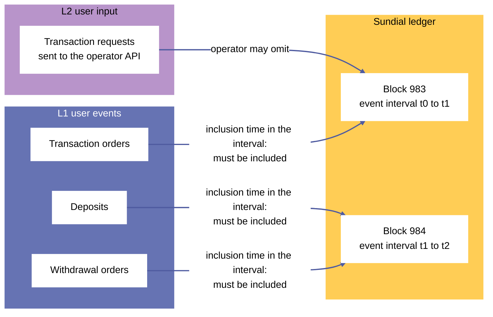

***Figure 6.** Censorship resistance: L1 events carry inclusion times that bind the block whose event interval contains them; an L2 transaction request that an operator ignores can be escalated to an L1 transaction order.*

### 2.1 Deposit (L1)

A user deposits funds into Sundial by submitting an L1 transaction that performs the following:

1. Spend an input `l1_nonce`, which uniquely identifies this deposit transaction.
2. Register a staking script credential to witness the deposit. The script is parametrized by `l2_id` (which is Blake2b256 hash of `l1_nonce`), and the credential's purpose is to disprove the existence of the deposit whenever the credential is *not* registered.[^c2-1]
3. Total count of tokens in the deposit must not exceed `max_tokens_allowed_in_deposits`, a Sundial protocol parameter.
4. Mint a deposit auth token to verify the following datum:

   $$
   \mathsf{DepositDatum} := \left\{
               \begin{array}{ll}
                   \mathsf{event} : & \mathsf{DepositEvent}, \\
                   \mathsf{inclusion\_time} : & \mathsf{PosixTime}, \\
                   \mathsf{witness} : & \mathsf{ScriptHash}, \\
               \end{array}
               \right\}
   $$
5. Send the user's deposited funds to the Sundial deposit address, along with the deposit auth token and the above datum.

At the time of the L1 deposit transaction, the deposit's `inclusion_time` is set to the sum of the transaction's validity interval upper bound and the `event_wait_duration` Sundial protocol parameter. According to the block-level conditions of [§5.4](#54-block-level-conditions):

- **Deposit inclusion.** A block header must include deposit events with inclusion times falling within the block header's event interval, and it must *not* include any other deposit events.

Furthermore, the state queue enforces that event intervals are adjacent and non-overlapping. Therefore, while operators continue committing valid block headers, every deposit is included in the state queue.

On the other hand, suppose a fraud proof is verified on L1 to prove that a block header in the state queue is fraudulent. The fraudulent header and its descendants are removed from the state queue one header at a time, descendants first ([§3.4.2](#342-minting-policy), Remove Fraudulent Block Header). The next committed block header starts where the last remaining header ends and ends at the time of its own commitment, so its event interval covers all of the removed headers' event intervals, and the block-level conditions require this new header to include all deposit events that should have been included in the removed headers.

The deposit can be absorbed into the Sundial reserve whenever a settlement UTXO is available such that its deposits tree contains the deposit event.

The deposit's `witness` staking credential must be deregistered when the deposit UTXO is spent.

#### 2.1.1 Minting policy

The `deposit` minting policy is statically parametrized on the `hub_oracle` minting policy. It oversees correctness of datums, and registration/unregistration of events' corresponding witness staking scripts.

- **Authenticate Deposit.** Properly record a new deposit event from L1 to L2. Conditions:

  1. Let `l1_nonce` be the output reference of a UTXO on L1 that is spent in the deposit transaction.
  2. Let `l2_id` be the Blake2b256 hash of serialized `l1_nonce`.
  3. An NFT with own policy ID and asset name of `l2_id` must be minted and included in the deposit UTXO.
  4. The witness staking script, instantiated with `l2_id` must be registered in the transaction. Let the hash of this script be `registered_witness`.
  5. `registered_witness` must be stored in the produced deposit UTXO datum under `witness`.
  6. The redeemer used for registering the witness script must be equal to the `deposit` policy ID.
  7. Let `deposit_addr` be the address of the deposit contract from Sundial's hub oracle.
  8. Deposit UTXO must be produced at `deposit_addr`.
  9. Total number of deposited tokens (including ADA) must not exceed `max_tokens_allowed_in_deposits`, a protocol parameter.
  10. Recorded `l1_nonce` in the deposit event must be correct.
  11. The deposit's `inclusion_time` must be equal to transaction's time-validity upper bound (inclusive) plus `event_wait_duration` Sundial protocol parameter.
- **Burn Deposit NFT.** Oversee transfer of a deposit UTXO to reserve by requiring its NFTs to be burnt. Conditions:

  1. Let `l2_id` be the corresponding ID of the target deposit event, provided via the redeemer.
  2. An NFT with own policy ID and asset name of `l2_id` must be burnt.
  3. The witness staking script, instantiated with `l2_id` must be unregistered in the transaction.
  4. The redeemer used for unregistering the witness script must be correct. Namely, it must be equal to `MintOrBurn` carrying `deposit` policy ID.

#### 2.1.2 Spending validator

The `deposit` spending validator is statically parametrized on the `hub_oracle` minting policy. It's responsible for concluding deposits and transferring them to Sundial reserve.

- **Spend.** Transaction for moving funds of finalized deposit events into Sundial reserve. Conditions:

  1. Let `settlement` be the referenced settlement UTXO.
  2. The deposit must be included in the deposit tree of `settlement`.
  3. Let `reserve_addr` be the address of the Sundial reserve retrieved from hub oracle.
  4. The UTXO produced at `reserve_addr` must contain all the tokens from the deposit UTXO, except for the deposit NFT.
  5. The `BurnEventNFT` endpoint of the deposit minting script must be invoked with the corresponding `l2_id` of the deposit UTXO.
  6. No datum and no reference script must be attached to the reserve UTXO.

### 2.2 Transaction request (L2)

A user's primary method of transacting on the Sundial ledger is to submit an L2 transaction directly to the current operator via a web-based API endpoint. Operators serve such APIs publicly and apply denial-of-service mitigation to them.

Users' L2 transactions follow the data structure defined in [§1.6.4](#164-sundial-transaction-types). In particular, users can freely set transaction time-validity intervals according to their preferences. As long as there is a non-empty overlap between a transaction's time-validity interval and a block's event interval, the transaction can be included in the block. Since event intervals are adjacent to each other, a user's valid transaction request can only miss the ledger in two cases:

- The operator censors it (see mitigation in [§2.3](#23-transaction-order-l1)).
- The operator commits the last block overlapping with the transaction before receiving the transaction request.[^c2-2]

By contrast, L1 transactions can fail in several other time-related ways. On L1 ledgers with long block intervals, such as Cardano's (one block per 20 seconds on average), blocks have limited transaction capacity. This means that users often have to set longer transaction validity intervals than they want and wait for many block confirmations of their tx before relying on its outcomes.

However, while on L1 two transactions with non-overlapping validity intervals cannot be included in the same block, the analogous L2 transactions *can* be included in a Sundial block if its event interval overlaps each transaction. Thus, transaction validity intervals on Sundial define only the relation between transactions and blocks but do not necessarily imply a temporal precedence relation between transactions.

### 2.3 Transaction order (L1)

A user who wants to mitigate the risk of censorship by the current operator can submit an L2 transaction as an L1 transaction order. A transaction order is created by an L1 transaction that performs the following:

1. Spend an input `l1_nonce`, which uniquely identifies this transaction order.
2. Register a staking script credential to witness the transaction order. The staking script is parametrized by `l1_nonce`, and the credential's purpose is to disprove the existence of the transaction order whenever the credential is *not* registered.
3. Mint a transaction order token to verify the following datum:

   $$
   \mathsf{TxOrderDatum} := \left\{
               \begin{array}{ll}
                   \mathsf{event} : & \mathsf{TxOrderEvent}, \\
                   \mathsf{inclusion\_time} : & \mathsf{PosixTime}, \\
                   \mathsf{witness} : & \mathsf{ScriptHash}, \\
                   \mathsf{refund\_address}: & \mathsf{Address}, \\
                   \mathsf{refund\_datum}: & \mathsf{Option(Data)}
               \end{array}
               \right\}
   $$
4. Send min-ADA to the Sundial transaction order address, along with the transaction order token and the above datum.

At the time of the L1 transaction order, its `inclusion_time` is set to the sum of the L1 transaction's validity interval upper bound and the `event_wait_duration` Sundial protocol parameter. According to the block-level conditions of [§5.4](#54-block-level-conditions):

- **Transaction order inclusion.** A block header must include transaction orders with inclusion times falling within the block header's event interval, and it must *not* include any other transaction orders.

Analogously to deposits and withdrawals, transaction orders are included in the state queue as long as operators continue committing valid block headers. Furthermore, if any blocks are removed from the state queue, the next committed block starts where the last remaining block ends and ends at the time of its own commitment, so it must include the transaction orders that should have been included in the removed blocks.

The transaction order fulfills its purpose when its inclusion time is within the confirmed header's event interval. Whether or not the outcome of the order's L2 transaction was merged into the confirmed state, nothing more can be achieved with the transaction order, and it can be refunded according to the `refund_address` and `refund_datum`.

The transaction order's `witness` staking credential must be deregistered when the order UTXO is spent.

#### 2.3.1 Minting policy

The `tx_order` minting policy is statically parametrized on the `hub_oracle` minting policy. It oversees correctness of datums, and registration/unregistration of events' corresponding witness staking scripts.

- **Authenticate Order.** Properly record a new L2 transaction order event on L1. Conditions:

  1. Let `l1_nonce` be the output reference of a UTXO on L1 that is spent in the order transaction.
  2. Let `l1_id` be the Blake2b256 hash of serialized `l1_nonce`.
  3. An NFT with own policy ID and asset name of `l1_id` must be minted and included in the transaction order UTXO.
  4. The witness staking script, instantiated with `l1_id` must be registered in the transaction.
  5. The redeemer used for registering the witness script must be equal to the `tx_order` policy ID.
  6. Let `tx_order_addr` be the address of the transaction order contract from Sundial's hub oracle.
  7. Transaction order UTXO must be produced at `tx_order_addr`.
  8. The transaction order's `inclusion_time` must be equal to transaction's time-validity upper bound plus `event_wait_duration` Sundial protocol parameter.
  9. The hash of the witness script must be correctly stored in the datum.
  10. Validity of the order must be set to `TxIsValid`.
- **Burn Transaction Order NFT.** Oversee the conclusion of transaction order by requiring its NFTs to be burnt. Conditions:

  1. Let `l1_id` be the corresponding ID of the target transaction order, provided via the redeemer.
  2. An NFT with own policy ID and asset name of `l1_id` must be burnt.
  3. The witness staking script, instantiated with `l1_id` must be unregistered in the transaction.
  4. The redeemer used for unregistering the witness script must be correct. Namely, it must be equal to the `tx_order` policy ID.

#### 2.3.2 Spending validator

The `tx_order` spending validator is statically parametrized on the `hub_oracle` minting policy. It's responsible for validating conclusion of transaction orders, and sending back included min-ADA to their specified refund addresses.

- **Spend.** Transaction for spending a confirmed transaction order. Conditions:

  1. Let `settlement` be the referenced settlement UTXO.
  2. Let `validity_override` be the expected validity of the transaction order stored in transactions tree of `settlement`, provided via the redeemer.
  3. The transaction order must be included in the transactions tree of `settlement` with its validity set to `validity_override`.
  4. The `BurnEventNFT` endpoint of the transaction order minting script must be invoked with the corresponding `l1_id` of the order UTXO.
  5. Let `refund_address` and `refund_datum` be the refund information retrieved from the transaction order's datum.
  6. The min-ADA of the transaction order UTXO must go to `refund_address`.
  7. The datum attached to this output UTXO must be the same as `refund_datum`.
  8. No reference script must be attached to the output UTXO.

### 2.4 Withdrawal order (L1)

A user initiates a withdrawal from Sundial by submitting an L1 transaction that performs the following:

1. Spend an input `l1_nonce`, which uniquely identifies this withdrawal order.
2. Register a staking script credential to witness the withdrawal order. The staking script is parametrized by `l1_id` (which is simply the hash of the serialized `l1_nonce`), and the credential's purpose is to disprove the existence of the withdrawal order whenever the credential is *not* registered.
3. Mint a withdrawal order token to verify the following datum:

   $$
   \mathsf{WithdrawalOrderDatum} := \left\{
               \begin{array}{ll}
                   \mathsf{event} : & \mathsf{WithdrawalEvent}, \\
                   \mathsf{inclusion\_time} : & \mathsf{PosixTime}, \\
                   \mathsf{witness} : & \mathsf{ScriptHash}, \\
                   \mathsf{refund\_address}: & \mathsf{Address}, \\
                   \mathsf{refund\_datum}: & \mathsf{Option(Data)}
               \end{array}
               \right\}
   $$
4. Send min-ADA to the Sundial withdrawal order address, along with the withdrawal order token and the above datum.

At the time of the L1 withdrawal order, its `inclusion_time` is set to the sum of the L1 transaction's validity interval upper bound and the `event_wait_duration` Sundial protocol parameter. According to the block-level conditions of [§5.4](#54-block-level-conditions):

- **Withdrawal order inclusion.** A block header must include withdrawal orders with inclusion times falling within the block header's event interval, and it must *not* include any other withdrawal orders.

The withdrawal order's outcome is determined as follows:

- If the withdrawal event is included in a settlement UTXO with a `WithdrawalIsValid` validity, its UTXO can be transferred to the payout contract so that it can be funded from the Sundial reserve.
- If the withdrawal event is included in a settlement UTXO with a validity other than `WithdrawalIsValid`, then the withdrawal order UTXO can be refunded to its user according to the `refund_address` and `refund_datum` fields.

The withdrawal order's `witness` staking credential must be deregistered when the withdrawal order UTXO is spent.

#### 2.4.1 Minting policy

The `withdrawal` minting policy is statically parametrized on the `hub_oracle` minting policy. It oversees correctness of datums, and registration/unregistration of events' corresponding witness staking scripts.

- **Authenticate Withdrawal.** Properly record a new withdrawal order event from L2 to L1. Conditions:

  1. Let `l1_nonce` be the output reference of a UTXO on L1 that is spent in the order transaction.
  2. Let `l1_id` be the Blake2b256 hash of serialized `l1_nonce`.
  3. An NFT with own policy ID and asset name of `l1_id` must be minted and included in the withdrawal order UTXO.
  4. The witness staking script, instantiated with `l1_id` must be registered in the transaction.
  5. The redeemer used for registering the witness script must be equal to the `withdrawal` policy ID.
  6. Let `withdrawal_addr` be the address of the withdrawal contract from Sundial's hub oracle.
  7. Withdrawal order UTXO must be produced at `withdrawal_addr`.
  8. The withdrawal order's `inclusion_time` must be equal to transaction's time-validity upper bound plus `event_wait_duration` Sundial protocol parameter.
  9. The hash of the witness script must be correctly stored in the withdrawal datum.
  10. Validity of the withdrawal must be set to `WithdrawalIsValid`.
- **Burn Withdrawal NFT.** Oversee start of the funding for a withdrawal order by requiring its NFTs to be burnt, and having the UTXO reproduced at the `payout` contract. Conditions:

  1. Let `l1_id` be the corresponding ID of the target withdrawal order, provided via the redeemer.
  2. An NFT with own policy ID and asset name of `l1_id` must be burnt.
  3. The witness staking script, instantiated with `l1_id` must be unregistered in the transaction.
  4. The redeemer used for unregistering the witness script must be correct. Namely, it must be equal to the `withdrawal` policy ID.

#### 2.4.2 Spending validator

The `withdrawal` spending validator is statically parametrized on the `hub_oracle` minting policy. It's responsible for initializing the funding phase of a withdrawal order by reproducing its UTXO at the `payout` contract, or refunding invalid withdrawal orders.

- **Initialize Payout.** Transaction for reproducing the order at the payout contract to be filled up from the Sundial reserve. Conditions:

  1. Let `settlement` be the referenced settlement node.
  2. The withdrawal order must be included in the withdrawals tree of `settlement` with a validity of `WithdrawalIsValid`.
  3. Let `payout_addr` be the address of the intermediary payout contract retrieved from hub oracle.
  4. The UTXO produced at `payout_addr` must have the same `value` as the withdrawal order UTXO, without the withdrawal NFT, and with the `payout` NFT (same asset name) added.
  5. The `BurnEventNFT` endpoint of the withdrawal minting script must be invoked with the corresponding `l1_id` of the withdrawal UTXO.
  6. The minting logic from `payout` must be invoked, minting an NFT with the same asset name as the withdrawal NFT being burnt in the transaction.
  7. The datum attached to the payout accumulator UTXO must take over `l2_value`, `l1_address` and `l1_datum` unchanged.
  8. No reference script must be attached to the payout accumulator UTXO.
- **Refund.** Conditions:

  1. Let `settlement` be the referenced settlement node.
  2. Let `validity_override` be the expected validity of the withdrawal stored in withdrawals tree of `settlement`, provided via the redeemer.
  3. The withdrawal order must be included in the withdrawals tree of `settlement` with a validity other than `WithdrawalIsValid`.
  4. Let `refund_address` be the refund address retrieved from the withdrawal order UTXO.
  5. Let `refund_datum` be the datum information for the refund UTXO retrieved from the withdrawal order UTXO.
  6. The UTXO produced at `refund_address` must have the same `value` as the withdrawal order UTXO, without the withdrawal NFT, and with the `refund_datum` attached.
  7. The `BurnEventNFT` endpoint of the withdrawal minting script must be invoked with the corresponding `l1_id` of the withdrawal UTXO.
  8. No reference script must be attached to the refund UTXO.

#### 2.4.3 Staking script

The withdrawal order's witness staking script is the generic `witness` script of [§2.5](#25-witness-staking-script), instantiated with `l1_id` (the Blake2b256 hash of the withdrawal event's `withdrawal_id`, the L1 nonce output reference) and used with the `withdrawal` policy ID as its `target_policy`. [§2.5.1](#251-staking-script) specifies its conditions.

### 2.5 Witness Staking Script

A generic staking script on L1, parameterized by the unique identifier of a user event, whose registration state can be used to prove a falsely stated user event has not happened.

There are 3 logical endpoints this script needs to support:

1. Validating registration for an authentic user event.
2. Validating unregistration for the conclusion of a previously registered user event.
3. Allowing an isolated registration that is immediately followed by an unregistration in the same transaction.[^c2-3] Essentially proving the unregistered state of the staking script, without changing its state.

#### 2.5.1 Staking script

The `witness` script is parameterized by the unique ID of a corresponding user event (deposit, withdrawal, or transaction order). Let `event_id` be this identifier, which is the Blake2b256 hash of an L1 nonce output-reference spent in the user event's first transaction.

- **Mint or Burn.** Script invocation to be included in the first transaction of a user event. Conditions:

  1. Let `target_policy` be the policy ID of the user event NFT, accessed via the redeemer.
  2. Registration/unregistration of this witness script is respectively tied to the `target_policy`'s mint/burn logic.

     - Registration is allowed if a user event NFT with asset name of `event_id` is minted.
     - Unregistration is allowed if a user event NFT with asset name of `event_id` is burnt.
- **Register to Prove Not Registered.** Redeemer for proving the unregistered state of the witness script instance. Conditions:

  1. Let `redeemer_index` be the positional index of the current redeemer (`RegisterCredential` certificate) within the `redeemers` field of the transaction.
  2. The redeemer pair that comes after `redeemer_index` must be of the same credential under an `UnregisterCredential` certificate.
  3. Redeemer data of this following redeemer must be a `UnregisterToProveNotRegistered`, such that the index it carries is equal to `redeemer_index`.
- **Unregister to Prove Not Registered.** Redeemer to follow `RegisterToProveNotRegistered`. Conditions:

  1. Let `redeemer_index` be the positional index of the `RegisterToProveNotRegistered` redeemer (`RegisterCredential` certificate) within the `redeemers` field of the transaction.
  2. Current certificate must be an `UnregisterCredential`, and its underlying credential must be equal to the one retrieved using `redeemer_index`.
  3. Redeemer data at `redeemer_index` must be a `RegisterToProveNotRegistered`, such that the index it carries is equal to `redeemer_index`.

[^c2-1]: Cardano's ledger lacks a more direct method to disprove the existence of a UTXO to a Plutus script.

[^c2-2]: Note that this case does not preclude transactions with short time-validity intervals from succeeding. For example, a transaction post-dated a couple of minutes in the future can still be included in a block even if its validity interval's duration is one millisecond.

[^c2-3]: The Cardano ledger applies a transaction's certificates in the order in which they appear, and redeemers reference certificates by position. A registration immediately followed by an unregistration of the same credential therefore leaves the registration state unchanged, while the transaction still evidences the unregistered state at its start.

## 3 Consensus protocol

This chapter describes Sundial's L1 contract-based consensus protocol, which establishes the canonical chain of valid blocks. It consists of the following components:

- The time model defines the operator shifts and the event intervals of blocks.
- The operator directory is an onchain data structure that tracks active, retired, and newly registered Sundial operators.
- The scheduler is an onchain mechanism that assigns evenly sized time windows to operators on a rotating schedule.
- The state queue is an onchain data structure that holds operators' committed block headers until they are merged into the confirmed state or disqualified by fraud proofs.
- When operators aren't committing blocks for a long time, the escape-hatch mechanism temporarily lowers the bond requirement for new operators.
- Settlement tracks the deposits, withdrawal orders, and transaction orders of merged blocks, and the operators' claims that they have been resolved.
- The reserve and payout contracts hold the funds of absorbed deposits and pay out confirmed withdrawal orders.
- The Sundial hub oracle wires all the onchain components together by storing their minting policy IDs and spending validator addresses for easy reference.

The proof protocol that removes fraudulent block headers from the state queue (the fraud proof catalogue, computation threads, and fraud proof tokens) is specified in [Chapter 4](#4-proof-protocol).

### 3.1 Time model

Sundial partitions time in two different ways:

- **Operator shifts.** Predefined, non-overlapping time intervals assigned to operators by the Sundial scheduler. The scheduler UTXO names the operator of the current shift, and the state queue accepts a block commitment, and the settlement contract a resolution claim, only from that appointed operator. If an operator fails to commit blocks regularly in their shift, the next operator can take over.
- **Event intervals.** Emergent, non-overlapping time intervals claimed by operators' committed blocks. Each operator block must include all user events with inclusion times within its event interval and must exclude all other user events. For L1 user events (deposits, transaction orders, withdrawal orders), this is one of the block-level conditions of [§5.4](#54-block-level-conditions).

Operator shifts are evenly sized according to the `shift_duration` Sundial protocol parameter. The scheduler assigns operators to shifts by iterating over the list of active operators in key-descending order, allowing new operators into the list at the end of each cycle. The shift interval is used only to advance the scheduler: the state queue does not require a commitment transaction's validity range to lie within the shift ([§3.3.1](#331-utxo-representation)).

A block's event interval is `[start_time, end_time)`. The state queue requires a new header's `end_time` to equal the inclusive upper bound of its commitment transaction's validity range, which must be bounded on both ends and no longer than the `max_validity_range_length` protocol parameter. It also requires the header's `start_time` to equal the previous header's `end_time` (the confirmed state's `end_time`, for the first header in the queue) and to be strictly below its own `end_time` ([§3.4.2](#342-minting-policy), Commit Block Header, conditions 8 to 10). Consecutive event intervals therefore tile time without gaps or overlaps, from the genesis time (the upper bound of the validity range of the Init transaction, [§3.4.2](#342-minting-policy)) to the `end_time` of the last header in the queue.

Event intervals follow L1 time. A commitment transaction is valid only while L1 time lies in its validity range, so an interval ends between the time of the commitment and `max_validity_range_length` after it. An operator can neither claim an interval that reaches far beyond the present, which would cover events that do not yet exist, nor let `end_time` lag behind the clock, which would leave events outside every interval. Because an event's inclusion time exceeds the upper bound of its creating transaction by `event_wait_duration` ([§2](#2-user-event-protocol)), every event that an interval obliges a block to include was already on L1 when the operator built the block, provided that `max_validity_range_length` does not exceed `event_wait_duration`; [Table 20](#table-20) states this constraint. Consecutive blocks need strictly increasing upper bounds, so the cadence of blocks is limited only by the resolution of validity ranges.

Shifts and event intervals are independent: an interval can span a shift boundary ([Figure 7](#figure-7)). The causal order of blocks is given by the forward links between state queue nodes and the backward links between block headers, and the lower bound of a commitment transaction's validity range plays no part in it. An operator is free to submit blocks at a rapid cadence during their shift. [^c3-1]

<a id="figure-7"></a>

```text
operator shifts   |---------------- Operator A -----------------|--- Operator B ----|
                  0                                             46                  66

event intervals   |    E47    |     E48     |      E49      |          E50          |
                  0           12            26              42                      66
                  start 0     start 12      start 26        start 42
                  end 12      end 26        end 42          end 66
```

***Figure 7.** The time model. The top row shows the operator shifts. The bottom row shows the event intervals of four consecutive blocks: each block's `end_time` is the upper bound of the validity range of its commitment transaction, and its `start_time` is the previous block's `end_time`, so the intervals tile time. Shifts and event intervals are independent: block 50's interval, [42, 66), spans the shift boundary at 46.*

### 3.2 Operator directory

Sundial operators receive and process L2 events from users, collate them into blocks, publish the full block contents on the data availability layer, and commit the block headers to Sundial's state queue on L1. This responsibility is shared among the operators on a rotating schedule, with each operator getting a turn to exclusively process L2 events and then commit their blocks of events until the end of their turn.

Anyone can register to become a Sundial operator if they post the required ADA bond (a reduced bond, while an escape hatch emergency period is in force, [§3.5](#35-escape-hatch)). Registrants must wait a prescribed period of time before they activate as an operator. If the active operator set is empty, the earliest registered operator can activate immediately, regardless of its activation time, to restore liveness. An active operator can retire to remove themself from the rotating schedule. Retired operators must wait until all their committed block headers mature before recovering their ADA bond.

An operator's ADA bond collateralizes their promise to faithfully process L2 events and commit valid blocks to L1. If an operator's block header is proven to be fraudulent, then the operator is disqualified and forfeits their bond. Similarly, an operator that submits duplicate registrations forfeits the bonds placed in the duplicates.

Every forfeited bond is split into a reward paid to the fraud prover and a slashing penalty paid (via transaction fees) to the L1 treasury, if exists. Among the Sundial protocol parameters, the `fraud_prover_reward` and `slashing_penalty` parameters must sum up to the `required_bond` parameter.

To ensure liveness, a penalty mechanism gives strikes to inactive operators. After enough strikes, a violating operator's bond can be partially slashed and their remaining bond transferred to the retired operators set.

Partially slashed operators can recover the remainder of their bond after maturity of their latest commitment. They can only register again after recovering from the retired operators set, as a fresh registration.

<a id="figure-8"></a>

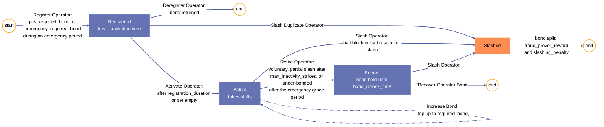

***Figure 8.** Operator lifecycle: registration, activation, retirement, bond recovery, and slashing, with the transitions that post, hold, and release the bond. The reduced-bond registration, the bond top-up, and the forced retirement of under-bonded operators belong to the escape hatch ([§3.5](#35-escape-hatch)).*

#### 3.2.1 UTXO representation

The Operator Directory keeps track of all Sundial operators and stores their bond deposits. It separates operators into three groups based on their status, primarily using operators' public key hashes (PKHs) as identifiers:

- `registered_operators` is a first-in-first-out (FIFO) queue that tracks operators who have posted their ADA bonds and are waiting to activate. It is implemented as a key-descending linked list with operators' activation times as keys, where each new registrant is prepended to the beginning of the list. This means that the earliest registrant to become eligible for activation is always at the last node of the list.
- `active_operators` is a set that tracks active operators participating in the rotating schedule, implemented as a key-ascending linked list with operator PKHs as node keys. Each node stores the time after which operators can recover their bonds, along with the strikes given to inactive operators.
- `retired_operators` is a set that tracks retired operators waiting to recover their ADA bonds, implemented as a key-ascending linked list with operator PKHs as node keys. Operators that are partially slashed due to inactivity are also stored in this set.

The Operator Directory keeps track of the activation time of every registered operator in their node keys, which indicates when the operator becomes eligible for activation. The active and retired operator sets also keep track of any holds on the ADA bonds of operators, which prevent those operators from recovering their bonds until their latest committed blocks and latest settlement resolution claims mature.

$$
\begin{aligned}
\mathsf{RegisteredOperator}    &:= \Bigl( \mathsf{operator}:
        \mathsf{PubKeyHash} \Bigr) \\
    \mathsf{ActiveOperator}     &:={} \left\{
      \begin{array}{ll}
        \mathsf{bond\_unlock\_time} : & \mathsf{Option}(\mathsf{PosixTime}) \\
        \mathsf{inactivity\_strikes} : & \mathsf{Integer}
      \end{array} \right\} \\
    \mathsf{RetiredOperator}    &:= \Bigl( \mathsf{bond\_unlock\_time}:
        \mathsf{Option}(\mathsf{PosixTime}) \Bigr)
\end{aligned}
$$

The above are app-specific types for the `node_data` of their respective lists' `Element`s. All operator lists have null `root_data`, i.e. `Empty`.[^c3-2] For example, the `Element` of `registered_operators` is:

$$
\mathsf{RegisteredOperatorDatum} := \mathsf{Element} (\mathsf{Empty}, \mathsf{RegisteredOperator})
$$

#### 3.2.2 Operator inactivity

If a shift's assigned operator neglects their duty to commit blocks regularly to the state queue, they can be given an inactivity strike. Enough strikes renders the operator eligible for partial slashing, where they are transferred to the retired operators set, and have a portion of their bond sent to the L1 treasury, or designated account, as penalty.[^c3-3]

Three protocol parameters govern how operators can be considered inactive.

1. `max_inactivity_between_block_commitments` dictates a minimum frequency in block commitments. Operators are required to submit block commitments at this rate, regardless of the block containing any transactions or user events.
2. `user_events_negligence_timeout` determines how long operators can ignore user events slated for inclusion within their shifts. By referring to a user event UTXO that's been awaiting inclusion in a block commitment long enough, an operator can be proven inactive.
3. `new_shift_inactivity_grace_period` protects newly appointed operators who take over from inactive operators.

`max_inactivity_between_block_commitments` is the largest of the three. Therefore, the longest inactivity period without consequences for operators would be the sum of `max_inactivity_between_block_commitments` and `new_shift_inactivity_grace_period`.

The point of time after which an operator can be given an inactivity strike can be found as below:

$$
t_a = max(t_0 + T_0, min(t_b + T_b, t_u + T_u))
$$

Where:

- $t_0$ is the shift start time
- $T_0$ is the `new_shift_inactivity_grace_period` parameter
- $t_b$ is the end time of latest block commitment
- $T_b$ is the `max_inactivity_between_block_commitments` parameter
- $t_u$ is the inclusion time of the earliest user event larger than $t_b$
- $T_u$ is the `user_events_negligence_timeout` parameter

As long as it can be shown that $t_a$ falls within the current operator's shift interval ($t_a < t_0 + T$, where $T$ is the shift duration), the operator can be considered inactive.

Inactivity strikes are accumulated in active operators set nodes, and are cleared for each operator on retirement. Partially slashed operators cannot be transferred back to the registered operators set. They must wait until their latest commitment matures, recover their remaining bond from the retired operators set, and only then register again.

#### 3.2.3 Operator slashing

There are four ways for operators to get slashed of their ADA bonds, either fully or partially:

1. Committing a bad block.
2. Incorrectly claiming a settlement UTXO as fully resolved.
3. Registering while already present in any of the operator directory sets.
4. Being proven inactive multiple times.

Operators can be slashed from the active or retired operators set for bad blocks or settlement resolution claims. This is enforced through the active and retired set minting policies with dedicated endpoints. Conditions:

1. Let `slashed_operator` be a redeemer argument indicating the operator being slashed.
2. The transaction must Remove a node from the source active or retired operator directory set. Let that node be `removed_node`.
3. `slashed_operator` must match the key of `removed_node`.
4. Lovelaces of the anchor element of `removed_node` must be preserved.
5. Slashing penalty must be paid through transaction fees. For partially slashed operators, this penalty is attained by `slashing_penalty` minus `inactivity_slashing_penalty`, as the latter is already deduced from their bonds. For operators with their bonds fully intact, this penalty is `slashing_penalty`.
6. The transaction must include the Sundial hub oracle NFT in a reference input.
7. Depending on the slashing reason (bad block or bad resolution claim), hub oracle's datum must be used to retrieve corresponding script hashes:

   - If the operator is getting slashed for a bad block commitment, the transaction must verify the state queue's mint script is invoked via the `RemoveFraudulentBlockHeader` redeemer, with a matching operator key.
   - If the reason is a bad settlement resolution claim, verify the expenditure of a settlement UTXO via the `DisproveResolutionClaim` with a matching operator key.

Throughout this section we refer to the above conditions as **Slashed** for short.

#### 3.2.4 Registered operators

The `registered_operators` queue keeps track of operators after registering and before activating or de-registering them.

##### 3.2.4.1 Minting policy

The `registered_operators` minting policy implements state transitions for its key-descending linked list. It is statically parametrized on the `hub_oracle` and `retired_operators` minting policies. Redeemers:

- **Init.** Initialize the `registered_operators` queue via the Sundial hub oracle. Conditions:

  1. The transaction must mint the Sundial hub oracle NFT.
  2. The transaction must Init the `registered_operators` queue.
- **Register Operator.** Insert a key-descending node into the `registered_operators` queue with the operator's ADA bond, the activation time as key, and storing the operator's pub key hash. Grouped conditions:

  - Verify operator consent:

    1. Let `registering_operator` be a redeemer argument, indicating the operator being added to the list.
    2. `registering_operator` must sign the transaction.
  - Verify operator's non-membership in the active operators set:

    3. The transaction must include the Sundial hub oracle NFT in a reference input to retrieve the policy ID of the active operators set.
    4. The transaction must reference an element UTXO from the active operators set. Let that element be `active_element`.
    5. If `active_element` is a node, its key must be smaller than `registering_operator`.
    6. If `active_element` has a link, it must be larger than `registering_operator`.
  - Verify descending insertion of a new node in the registered operators set (see [Appendix A.5](#a5-minting-helpers)):

    7. Let `registering_lovelace`, `registering_key`, `registering_data`, and `anchor_lovelace_change` be corresponding values of the inserted node and its anchor.
    8. `anchor_lovelace_change` must be greater than or equal to 0. This ensures registration cannot drain ADA from an existing registered operator node when insertion does not happen at the root.
    9. Either `registering_lovelace` must be greater than or equal to the `required_bond` protocol parameter, or all of the following must hold ([§3.5](#35-escape-hatch)): `registering_lovelace` is greater than or equal to the `emergency_required_bond` protocol parameter; the transaction includes the escape hatch UTXO (the UTXO holding the NFT of the `escape_hatch` policy ID from the hub oracle) as a reference input; and the `emergency_end_time` of its datum is later than the inclusive upper bound of the transaction's validity range, which is to say that the emergency period is in force.
    10. Let `activation_time` be equal to the sum of the Sundial `registration_duration` protocol parameter and the inclusive upper bound of the transaction's validity interval.
    11. `registering_key` must equal the big-endian encoding of `activation_time` in as few bytes as possible.
    12. The transaction must reference an element UTXO from the retired operators set. Let that element be `retired_element`.
    13. If `retired_element` is a node, its key must be smaller than `registering_operator`.
    14. If `retired_element` has a link, it must be larger than `registering_operator`.
    15. `registering_data` must carry only `registering_operator` as its `operator`.
- **Activate Operator.** Transfer an operator node from the `registered_operators` queue to the `active_operators` set. Grouped conditions:

  - Verify that the registrant is being added to active operators:

    1. The transaction must include the Sundial hub oracle NFT in a reference input.
    2. Let `active_operators` be the policy ID in the corresponding field of the Sundial hub oracle.
    3. The transaction must Insert a node into the `active_operators` set, as evidenced by minting an `active_operators` node NFT for the activating operator key via the Activate Operator redeemer.
    4. The active operators Activate Operator redeemer must indicate whether the `active_operators` set was empty before the insertion.
  - Verify that the registrant is not already retired (non-membership in `retired_operators` set, similar to above).
  - Remove the registrant from the registered operators if it is eligible to activate:

    5. The transaction must Remove a node from the `registered_operators` queue. Let that node be `registered_node`.
    6. Let `activation_time` be the big-endian decoding of `registered_node`'s key.
    7. Either the transaction's validity interval must be entirely after `activation_time`, or the `active_operators` set must have been empty before insertion and `registered_node` must be the last node of the `registered_operators` queue. Since the queue is ordered descending by activation time, the last node is the earliest registered operator.
    8. The operator stored in the underlying data of `registered_node` must match the activating operator key.
- **Deregister Operator.** Remove a node from the `registered_operators` queue, with the operator's consent, and return the ADA bond to the operator. Conditions:

  1. The transaction must Remove a node from the `registered_operators` queue. Let `removed_node` be that node.
  2. The operator key of `removed_node` must correspond to a PKH that signed the transaction. This is needed so the ADA bond can be assumed to return to the operator's control.
- **Slash Duplicate Operator.** Remove a node from the `registered_operators` queue if its operator key duplicates the key of any other node among the registered, active, or retired operators. Does *not* return the duplicate node's ADA bond to its operator. Conditions:

  1. The transaction must Remove a node from the `registered_operators` queue. Let that node be `duplicate_node`, and its operator key be `duplicate_operator`.
  2. The transaction fees must meet or exceed the `slashing_penalty` protocol parameter, denominated in Lovelaces.
  3. Let `witness_status` be one of: `Registered`, `Active`, or `Retired`.
  4. If `witness_status` is `Registered`:

     1. The transaction must include a reference input of a `registered_operators` node such that its operator key matches `duplicate_operator`.
  5. If `witness_status` is `Active`:

     1. The transaction must include the Sundial hub oracle NFT in a reference input.
     2. Let `active_operators` be the policy ID in the corresponding field of the Sundial hub oracle.
     3. The transaction must include a reference input of an `active_operators` node whose key matches `duplicate_operator`.
  6. If `witness_status` is `Retired`:

     1. The transaction must include a reference input of a `retired_operators` node whose key matches `duplicate_operator`.

  The submitter of the Slash Duplicate Operator transaction is considered to be the fraud prover, so the conditions for that redeemer do not need to explicitly enforce that the `fraud_prover_reward` is paid out because the submitter consents to the transaction.

##### 3.2.4.2 Spending validator

The spending validator of `registered_operators_addr` always forwards to its corresponding minting policy (statically parametrized) and requires the transaction to invoke it. It does not allow any in-place modifications to the `RegisteredOperator` value of the node `data` field. Conditions:

1. The transaction must mint or burn tokens of the `registered_operators` minting policy.

#### 3.2.5 Active operators

The `active_operators` set keeps track of operators after activating and before slashing or retiring them.

##### 3.2.5.1 Minting policy

The `active_operators` minting policy implements state transitions for its key-ordered linked list. It is statically parametrized on the `hub_oracle`, `registered_operators`, and `retired_operators` minting policies. Redeemers:

- **Init.** Initialize the `active_operators` set via the Sundial hub oracle. Conditions:

  1. The transaction must mint the Sundial hub oracle NFT.
  2. The transaction must Init the `active_operators` set.
- **Activate Operator.** Transfer an operator node from the `registered_operators` queue to the `active_operators` set. Conditions:

  1. The transaction must Insert a node into the `active_operators` set. Let that node be `active_node`.
  2. The transaction must Remove a node from the `registered_operators` queue, as evidenced by burning a `registered_operators` node NFT through the matching Activate Operator redeemer. Let this node be `removed_node`.
  3. The `bond_unlock_time` field of `active_node` must be `None`.
  4. The `inactivity_strikes` field of `active_node` must be `0`.
  5. The `active_operators_set_was_empty` redeemer field must be true if and only if the insertion shows that the set had no active operators before `active_node` was inserted. The registered operators minting policy uses this signal to allow the earliest registered operator to activate before its `activation_time` when the active set is empty.
- **Retire Operator.** Transfer an operator node from the `active_operators` set to the `retired_operators` set. Grouped conditions:

  - Verify addition of the retiring operator node to the `retired_operators` set:

    1. Minting script of `retired_operators` set must be invoked with a matching Retire Operator redeemer.
    2. Let `retired_bond_unlock_time` be an argument from this redeemer.
  - Verify operator removal from the `active_operators` set:

    3. The transaction must Remove a node from the `active_operators` set. Let `removed_key` be the removed node's key, `removed_data` its underlying data, `removed_link` its link, `removed_lovelace` its Lovelace, and `anchor_lovelace_change` be the difference of Lovelace between its anchor element's output and input.
    4. Let `active_operator` be a redeemer argument.
    5. `active_operator` and `removed_key` must be equal.
    6. `anchor_lovelace_change` must be greater than or equal to 0 to ensure the parent element's ADA is preserved.
    7. The `bond_unlock_time` field of `removed_data` must match `retired_bond_unlock_time`.
    8. Let `inactivity_strikes` be another value extracted from `removed_data`.
    9. Let `retirement_reason` be a redeemer argument which signals other contracts why the operator is retired. It is `Voluntary`, `Inactivity` (partial slashing), or `UnderBonded` (after an escape hatch emergency period):

       - If `retirement_reason` is `Inactivity`, `inactivity_strikes` must be greater than or equal to the `max_inactivity_strikes` protocol parameter. Transaction fee must also match or exceed the `inactivity_slashing_penalty` parameter.
       - If `retirement_reason` is `Voluntary`, `inactivity_strikes` must be less than `max_inactivity_strikes`, and the transaction must be signed by `active_operator`.
       - If `retirement_reason` is `UnderBonded`, `inactivity_strikes` must be less than `max_inactivity_strikes`, and the operator's signature is not required. The transaction must include the Sundial hub oracle NFT and the escape hatch UTXO in reference inputs. The lower bound of the transaction's validity range must be greater than or equal to the sum of the `emergency_end_time` of the escape hatch datum and the `emergency_grace_period` protocol parameter. `removed_lovelace` must be less than the `required_bond` protocol parameter. The node produced in the `retired_operators` set must hold at least `removed_lovelace` minus the `emergency_retirement_penalty` protocol parameter, and the difference goes to the submitter of the transaction, so no condition needs to enforce that it is paid out.
  - Verify involvement of the scheduler UTXO:

    10. If `active_operator` is not currently appointed active, the transaction must reference the authentic scheduler UTXO, and show that its datum is either `NoActiveOperators`, or `ActiveOperator` with a key underneath that is different from `active_operator`.
    11. Otherwise, expenditure of the scheduler UTXO must be shown with either of the Operator Removal redeemers, with an `ActiveOperator` datum that its `operator` matches `active_operator`.
    12. Let `removing_operator_is_the_last_member` be a redeemer argument.
    13. If `removed_link` points to a child node, `removing_operator_is_the_last_member` must be false. True otherwise. This value is used by the scheduler spending script (Rewind – Operator Removal).
- **Slash Operator.** Remove an operator's node from the `active_operators` set without returning the operator's ADA bond to the operator, as a consequence of committing a fraudulent block to the state queue, or attaching a fraudulent resolution claim to a settlement UTXO. Grouped conditions:

  - The operator must be Slashed.
  - Verify involvement of the scheduler UTXO (similar to above).

##### 3.2.5.2 Spending validator

The spending validator of `active_operators_addr` forwards to its corresponding minting policy (statically parametrized) when the transaction invokes it. When the minting policy isn't invoked, the spending validator updates the bond unlock time of an operator that commits a new block to the state queue or attaches a resolution claim to a settlement UTXO. Redeemers:

- **List State Transition.** Forward to minting policy. Conditions:

  1. The transaction must mint or burn tokens of the `active_operators` minting policy.
- **Update Bond Hold New State.** Update an operator's bond unlock time when they commit a block to the state queue. Grouped conditions:

  - Update the bond unlock time of an operator:

    1. The transaction must *not* mint or burn tokens of the `active_operators` minting policy.
    2. Let `active_node` be an output of the transaction indicated by a redeemer argument.
    3. `active_node` must be an `active_operators` node that matches the datum argument of the spending validator on the `key` and `link` fields.
    4. Let `fresh_bond_unlock_time` be the sum of the Sundial `maturity_duration` parameter and the upper bound of the transaction validity interval.
    5. If the operator has prior commitments, let `old_bond_unlock_time` be its value.
    6. The `bond_unlock_time` field of `active_node` must be the bigger value between `old_bond_unlock_time` and `fresh_bond_unlock_time`.
    7. The `inactivity_strikes` field of `active_node` must remain unchanged.
  - Verify that the operator is currently committing a block header to the state queue:

    8. The transaction must include the Sundial hub oracle NFT in a reference input.
    9. Let `state_queue` be the policy ID in the corresponding field of the Sundial hub oracle.
    10. The transaction must Append a node into the `state_queue` via the Commit Block Header redeemer. The redeemer's `operator` field must match the `key` field of the `active_node`.
- **Update Bond Hold New Settlement.** Update an operator's bond unlock time when they attach a resolution claim to a settlement UTXO. Grouped conditions:

  - Update the bond unlock time of an operator:

    1. The transaction must *not* mint or burn tokens of the `active_operators` minting policy.
    2. Let `active_node` be an output of the transaction indicated by a redeemer argument.
    3. `active_node` must be an `active_operators` node that matches the datum argument of the spending validator on the `key` and `link` fields.
    4. Let `resolution_time` be a redeemer argument.
    5. Let `fresh_bond_unlock_time` be the sum of the Sundial `maturity_duration` parameter and the upper bound of the transaction validity interval.
    6. `resolution_time` must match `fresh_bond_unlock_time`. This value is used by the settlement validator as the resolution claim's `resolution_time`.
    7. If the operator has prior commitments, let `old_bond_unlock_time` be its value.
    8. The `bond_unlock_time` field of `active_node` must be the bigger value between `old_bond_unlock_time` and `fresh_bond_unlock_time`.
    9. The `inactivity_strikes` field of `active_node` must remain unchanged.
  - Verify that the operator is currently attaching a resolution claim to a settlement UTXO:

    10. The transaction must include the Sundial hub oracle NFT in a reference input.
    11. Let `settlement_addr` be the script address in the corresponding field of the Sundial hub oracle.
    12. The transaction must spend a settlement UTXO with the Attach Resolution Claim redeemer. The redeemer's `operator` field must match the `key` field of the `active_node`.
- **Increase Bond.** Raise an operator's bond to the regular requirement, typically after an escape hatch emergency period ([§3.5](#35-escape-hatch)). Anyone can pay for the increase. Conditions:

  1. The transaction must *not* mint or burn tokens of the `active_operators` minting policy.
  2. Let `active_node` be an output of the transaction indicated by a redeemer argument.
  3. `active_node` must be an `active_operators` node that matches the datum argument of the spending validator on the `key`, `link`, and underlying data.
  4. `active_node` must hold at least the `required_bond` protocol parameter in Lovelace, and at least as much Lovelace as the spent node, so that nobody can use this redeemer to withdraw part of a bond.
- **Strike for Inactivity.** Increment an operator's strike count if they can be proven inactive. Conditions:

  1. The transaction must include the Sundial hub oracle NFT in a reference input.
  2. Let `scheduler_addr` be the script address in the corresponding field of the Sundial hub oracle.
  3. The transaction must spend the scheduler UTXO via either of the Skipped Operator redeemers. The indices provided through both redeemers (scheduler's and active operators') must be validated against each other.
  4. The conditions for spending an element UTXO without modifying the list structure must satisfy (see [Appendix A.6](#a6-spending-helpers)). This spent element must be a node with a key that matches the `operator` redeemer argument. Let `inactive_node` be this node.
  5. ADA of `inactive_node` must be preserved.
  6. The `active_node_link` redeemer argument must be equal to the link of `inactive_node` to validate its correctness.
  7. Underlying data of `inactive_node` must have its `inactivity_strikes` incremented by 1 with no other changes. The new `inactivity_strikes` must be less than or equal the `max_inactivity_strikes` protocol parameter.[^c3-4]

#### 3.2.6 Retired operators

The `retired_operators` set keeps track of operators after retiring and before slashing or returning their ADA bonds.

##### 3.2.6.1 Minting policy

The `retired_operators` minting policy implements structural operations for its key-ordered linked list. It is statically parametrized on the `hub_oracle` minting policy. There is no re-registration redeemer; operators must recover their bond after maturity before using the Register Operator path again. Redeemers:

- **Init.** Initialize the `retired_operators` set via the Sundial hub oracle. Conditions:

  1. The transaction must mint the Sundial hub oracle NFT.
  2. The transaction must Init the `retired_operators` set.
- **Retire Operator.** Transfer an operator node, unchanged, from the `active_operators` set to the `retired_operators` set. Conditions:

  1. The transaction must Insert a node into the `retired_operators` set. Let that node be `retired_node`.
  2. The transaction must include the Sundial hub oracle NFT in a reference input.
  3. Let `active_operators` be the policy ID in the corresponding field of the Sundial hub oracle.
  4. The transaction must Remove a node from the `active_operators` set, as evidence by the burning of an `active_operators` node NFT corresponding to the `retired_node` key.

  The active operators' minting policy ensures that the operator node's contents remain unchanged during the transfer, except that its Lovelace can fall by the penalties of the `Inactivity` and `UnderBonded` reasons.
- **Recover Operator Bond.** Remove an operator's node from the `retired_operators` set, with the operator's consent, and return the ADA bond to the operator. Grouped conditions:

  - The transaction must Remove a node from the `retired_operators` set. Let that node be `retired_node`.
  - If the `bond_unlock_time` field of `retired_node` is *not* `None`, then the lower bound of the transaction validity interval must meet or exceed the `bond_unlock_time`.

  The operator consents to the transaction, so the ADA bond is assumed to be returned to the operator's control.
- **Slash Operator.** Remove an operator's node from the `retired_operators` set without returning the operator's ADA bond to the operator, as a consequence of committing a fraudulent block to the state queue, or attaching a fraudulent resolution claim to a settlement UTXO. The only condition is for the operator to be Slashed (see [§3.2.3](#323-operator-slashing)).

##### 3.2.6.2 Spending validator

The spending validator of `retired_operators_addr` always forwards to its corresponding minting policy (statically parametrized) and requires the transaction to invoke it. It does not allow any in-place modifications to the `RetiredOperator` value of the node `data` field. Conditions:

1. The transaction must mint or burn tokens of the `retired_operators` minting policy.

### 3.3 Scheduler

The Sundial scheduler is an L1 mechanism that indicates which operator is assigned to the current shift and controls the transitions to the next shift and next operator. Whenever the current shift must advance, the next operator in key-descending order from the `active_operators` list can be picked to take over the next shift.

When the root element of `active_operators` is reached, the scheduler rewinds to start a new cycle. However, the scheduler requires the `registered_operators` queue to be checked to see if any registered operators are eligible to activate. If so, all eligible registered operators must activate before the new cycle can begin.

Active operators can either retire or get slashed during their shift. The scheduler is ensured to remain in sync with the active operators set.

#### 3.3.1 UTXO representation

The scheduler state consists of a single UTXO that holds the scheduler NFT, minted when Sundial is initialized via the hub oracle. That UTXO's datum type is as follows:

$$
\begin{aligned}
\mathsf{SchedulerDatum} :=\;& \mathsf{NoActiveOperators} \\
                           \mid\;& \mathsf{ActiveOperator} \\
    \mathsf{ActiveOperator} &:={} \left\{
        \begin{array}{ll}
            \mathsf{operator} : & \mathsf{PubKeyHash} \\
            \mathsf{start\_time} : & \mathsf{PosixTime}
        \end{array} \right\}
\end{aligned}
$$

When an active operator is appointed, the shift's inclusive lower bound is `shift_start`, and its exclusive upper bound is the sum of `shift_start` and the `shift_duration` Sundial protocol parameter.

The shift interval is used only for scheduler advancement; block commitments and settlement resolution claims validate only the appointed operator. This allows the current operator to continue committing when the next scheduled operator is inactive, and relieves the current operator of the need to advance the scheduler before an active successor takes over.

#### 3.3.2 State consistency

The scheduler is essentially a cursor for the active operators set, which means it has to have a local representation of the set's state. In order to keep this local state in sync with the active operators set, the scheduler must advance for any actions that affect the appointed operator.

We can define three reasons for advancing the scheduler:

1. **End of shift.** Picking the next operator in set, or updating the shift start time of the current one if no other operators are available.
2. **Skipping.** Operators who can be deemed inactive (see [§3.2.2](#322-operator-inactivity)) can be skipped to preserve liveness of the network.
3. **Removal from active set.** If the operator is currently active and is being removed from the active operators set, either for retiring or slashing, the scheduler must advance.

#### 3.3.3 Minting policy

The `scheduler` minting policy initializes the scheduler state. It is statically parametrized on the `hub_oracle` minting policy. Redeemers:

- **Init.** Initialize the `scheduler` via the Sundial hub oracle. Conditions:

  1. The transaction must mint the Sundial hub oracle token.
  2. The transaction must mint the `scheduler` NFT.

#### 3.3.4 Spending validator

The spending validator of `scheduler_addr` controls the evolution of the scheduler state. It is statically parametrized on the `active_operators`, `registered_operators` and `hub_oracle` minting policies, along with `active_operators_addr` for cross validation of node expenditures.

As mentioned above, there are three reasons for the scheduler to advance. Additionally, depending on the position of the cursor, advancement can either be traversal towards the root (key-descending), or rewinding to the end of the list. This results in 6 different paths for advancing the scheduler.

Prerequisites shared by all redeemers:

- Let `scheduler_input` and `scheduler_output` be the spent UTXO and its reproduction respectively.
- Both `scheduler_input` and `scheduler_output` must carry the singular scheduler NFT, min ADA and no other tokens.
- Let `input_datum` be the inline datum of `scheduler_input` and `output_datum` be the inline datum of `scheduler_output`.

Redeemers:

- **Go to Next – End Of Shift.** The next operator in key-descending order is appointed to the next shift. Grouped conditions:

  - Verify end of shift:

    1. Both `input_datum` and `output_datum` must have appointed operators. Let `prev_op` and `next_op` be their operators, and `prev_shift` and `next_shift` be their shift start times in order.
    2. `next_shift` must equal `prev_shift` plus the `shift_duration` protocol parameter.
    3. Either of the following must hold:

       1. `next_shift` must lie in the past. This allows anyone to advance the scheduler and potentially give an inactivity strike to `next_op` in a subsequent transaction.
       2. The validity range of the transaction must be short (governed by `max_validity_range_length` protocol parameter), and it must contain `next_shift`. The transaction must also be signed by `next_op` as consent for readiness.
  - Verify operators follow correctly:

    4. Let `active_node` be a referenced node UTXO from the active operators set.
    5. The key of `active_node` must match `next_op`, and its link must point to `prev_op`.
- **Rewind – End Of Shift.** The scheduler advances to the next shift and assigns the highest-key active operator, provided that no registered operators are eligible to activate. This includes updating the shift interval of the active operator if no other operators are present in the set. Grouped conditions:

  - Verify end of shift (same as above).
  - Verify the root of the active operators set is reached:

    6. Let `active_root` be the referenced root element of the active operators set.
    7. `active_root` must point to `prev_op` as its link.
  - Verify there are no registered operators that can be activated:

    8. Let `registered_element` be the referenced element from registered operators set.
    9. `registered_element` must not have a link, i.e. it must be the last element of the list.
    10. `registered_element` must either be the root element, or its key must correspond to an activation time in the future.
  - Verify the new operator is also the last node of the active operators set:

    11. Let `active_node` be the referenced node element from the active operators set.
    12. `active_node` must link to no other node.
    13. The key of `active_node` must match `next_op`.
- **Go to Next – Skipped Operator.** If inactivity criteria passes for the currently appointed operator, advances the scheduler to the next key-descending operator. Grouped conditions:

  - Verify input and output datums:

    1. Both `input_datum` and `output_datum` must have appointed operators. Let `prev_op` and `next_op` be their operators, and `prev_shift` and `next_shift` be their shift start times in order.
  - Verify operator inactivity:

    2. Let `operator` be a redeemer argument retrieved from spending a node UTXO of the active operators set via the `StrikeForInactivity` endpoint.
    3. `operator` must be the same as `prev_op`.
    4. The transaction must reference the authentic hub oracle UTXO. Let its datum be `hub_datum`.
    5. Let `state_queue_element` be a reference UTXO from the state queue.
    6. `state_queue_element` must have no link.
    7. Let `last_end_time` be the exclusive upper bound retrieved from `state_queue_element` datum (either `ConfirmedState` if it's root, or `Header` if it's a node).
    8. Let `commitment_inactivity` be a point in time after the latest activity. It must be found as the following:

       - Let `neglected_user_event` be a redeemer argument that may point to a user event.
       - If `neglected_user_event` points to no UTXOs, `commitment_inactivity` is equal to the sum of `last_end_time` and `max_inactivity_between_block_commitments`.
       - Otherwise, `commitment_inactivity` must equal the inclusion time of the reference user event, plus the `user_events_negligence_timeout` protocol parameter. Additionally, the inclusion time of the event must be greater than or equal `last_end_time`.
    9. Let `inactivity_threshold` be the point in time that can determine inactivity of `prev_op`. It must be found as the following:

       - Let `allowed_init_inactivity` be the sum of `prev_shift` and the `new_shift_inactivity_grace_period` protocol parameter.
       - `inactivity_threshold` is the larger value between `allowed_init_inactivity` and `commitment_inactivity`.
    10. Let `prev_shift_end` be equal to `prev_shift` plus `shift_duration`.
    11. `inactivity_threshold` must be smaller than `prev_shift_end`.
    12. Transaction's validity range must be entirely after `inactivity_threshold`.
  - Verify new shift's start time for an unscheduled advancement:

    13. Transaction's validity range must be shorter than or equal the `max_validity_range_length` protocol parameter.
    14. `next_shift` must equal the inclusive upper bound of transaction validity range.
  - Verify operators follow correctly (same as **Go to Next** above).
- **Rewind – Skipped Operator.** If the appointed operator is at the head of the active operators list and can be proven inactive, rewinds the scheduler to appoint the last active operator node, or updates the shift start time of the inactive operator if no other operators are available. Grouped conditions:

  - Verify input and output datums (same as above).
  - Verify the root of the active operators set is reached (same as **Rewind** above).
  - Verify there are no registered operators that can be activated (same as **Rewind** above).
  - Verify operator inactivity. Same as above, with the difference that the spending active operator node's link must also be retrieved from the `StrikeForInactivity` redeemer. Let `inactive_operator_link` be this value.
  - Verify new shift's start time for an unscheduled advancement (same as above).
  - Verify the next operator:

    1. Let `last_node_index` be a redeemer argument that may carry an index to reference the last node in the active operators set.
    2. If `last_node_index` provides an index, the referenced UTXO must be the last node in the active operators set, and its key must match `next_op`. Otherwise, `inactive_operator_link` must not point to another node, and `prev_op` and `next_op` must be identical.
- **Go to Next – Operator Removal.** If the currently appointed operator is removed from the active operators set, either for slashing or retirement, advances the scheduler to the next key-descending operator. Grouped conditions:

  - Verify input and output datums (same as above).
  - Verify new shift's start time for an unscheduled advancement (same as above).
  - Verify operator node's removal from the active set:

    1. Let `removed_operator` be a redeemer argument retrieved from either the `SlashOperator` or `RetireOperator` mint redeemer of the active operators set.
    2. `removed_operator` must match `prev_op`.
    3. Let `anchor` be the parent element to the removed node element.
    4. `anchor` must be a node with a key that matches `next_op`.
- **Rewind – Operator Removal.** If the appointed operator is at the head of the active operators list and is being slashed or retired, rewinds the scheduler to appoint the last active operator node, or sets the scheduler to `NoActiveOperators` if no other nodes remain in the active operators set after removal. Grouped conditions:

  - Input datum must have an appointed operator. Let its key be `prev_op`.
  - Verify there are no registered operators that can be activated (same as **Rewind** above).
  - Verify operator node's removal from the active set:

    1. Let `removed_operator` be a redeemer argument retrieved from either the `SlashOperator` or `RetireOperator` mint redeemer of the active operators set.
    2. Let `last_node_is_removed` be another redeemer argument retrieved along `removed_operator`. A boolean that indicates whether the active operators set empties after removal or not.
    3. `removed_operator` must match `prev_op`.
    4. Let `anchor` be the parent element to the removed node element.
    5. `anchor` must be root.
  - Let `last_node_index` be an index of the reference inputs for the last node of the active operators set that may or may not be provided:

    - If it is provided:

      6. `last_node_is_removed` must be false, showing that active operators redeemer has verified `remove_operator` did have a link.
      7. Scheduler's output datum must carry the new operator. Let its shift start time be `next_shift`.
      8. Verify `next_shift` for an unscheduled advancement (same as above).
      9. Verify the new operator is also the last node of the active operators set (same as **Rewind – End Of Shift** above).
    - If an index is not provided:

      10. `last_node_is_removed` must be true. This shows the active operators set has verified that `removed_operator` linked to no other operator.
      11. Scheduler's output datum for scheduler must be `NoActiveOperators`.
- **Appoint First Operator.** Appoints the last operator in the active operators set when there are no registered operators eligible for activation. Grouped conditions:

  - Input datum must not have an appointed operator (`NoActiveOperators`).
  - Output datum must carry the new operator. Let its key be `next_op` and its shift start time be `next_shift`.
  - Verify new shift's start time for an unscheduled advancement (same as above).
  - Verify the new operator is also the last node of the active operators set (same as above).
  - Verify there are no registered operators that can be activated (same as above).

### 3.4 State queue

The state queue is an L1 data structure that stores Sundial operators' committed block headers until they are confirmed. Active operators from the operator directory (see [§3.2](#32-operator-directory)) take turns committing block headers to the state queue according to the rotating schedule enforced by the scheduler (see [§3.3](#33-scheduler)).

#### 3.4.1 UTXO representation

The `state_queue` is implemented as a key-unordered linked list of block headers (see [§1.1](#11-block)). Each `state_queue` node's key is its block header's hash.

$$
\begin{aligned}
\mathsf{StateQueueDatum} &:= \mathsf{NodeDatum}(\mathsf{Header}) \\
    \mathsf{valid\_key}(\mathsf{scd} : \mathsf{StateQueueDatum}) &:=
        \Bigl( \mathsf{scd.key} \equiv \mathsf{Some}(\mathsf{hash}(\mathsf{scd.data})) \Bigr)
\end{aligned}
$$

Committing a block header to the `state_queue` means appending a node containing the block header to the end of the queue. After staying there for the `maturity_duration` (a protocol parameter), it is merged to the confirmed state (held at the `state_queue` root node) in the first-in-first-out (FIFO) order.

#### 3.4.2 Minting policy

The `state_queue` minting policy controls the structural changes to the state queue. It is statically parametrized on the `hub_oracle`, `active_operators`, `retired_operators`, `scheduler`, and `fraud_proof` minting policies. Redeemers:

- **Init.** Initialize the `state_queue` via the Sundial hub oracle. Conditions:

  1. The transaction must mint the Sundial hub oracle token.
  2. The transaction must Init the `state_queue`.
  3. The validity range of the transaction must be bounded on both ends, and must not be longer than the `max_validity_range_length` protocol parameter.
  4. The inclusive upper bound of the validity range must be used as both the `start_time` and `end_time` of the produced confirmed state data.
  5. `header_hash` and `prev_header_hash` must have genesis values (28 zero bytes).
  6. `utxo_root` must be set to the root of an empty Merkle tree.
  7. `protocol_version` must be set to `0`, the genesis protocol version.
- **Commit Block Header.** An operator commits a block header to the state queue if it is the operator's turn according to the rotating schedule. Grouped conditions:

  - Commit the block header to the state queue, with the operator's consent:

    1. Let `operator` be a redeemer argument indicating the key of the operator committing the block header.
    2. The transaction must be signed by `operator`.
    3. The transaction must Append a node to the `state_queue`. Among the transaction outputs, let that node be `header_node` and its predecessor node be `previous_element` (this can be either the confirmed state, or a previous block).
    4. `operator` must be the operator of `header_node`.
    5. The key of `header_node` must be the hash of its underlying `Node` data.
  - Verify that it is the operator's turn to commit according to the scheduler:

    6. The transaction must include a reference input with the scheduler NFT. Let that input be the `scheduler_state`.
    7. `scheduler_state` must have an appointed operator with a PKH that matches `operator`. Neither the transaction validity range nor the committed block interval needs to be contained within the appointed operator's nominal shift interval (see [§3.3.1](#331-utxo-representation)).
  - Verify block timestamps:

    8. The validity range of the transaction must be bounded on both ends, and must not be longer than the `max_validity_range_length` protocol parameter.
    9. The `end_time` of `header_node` must be equal to the inclusive upper bound of the transaction's validity range.
    10. The `start_time` of `header_node` must be equal to the `end_time` of the `previous_element`, and must be strictly less than the `end_time` of `header_node`.
  - Update the operator's timestamp in the active operators set:

    11. The transaction must include an input, spent via the Update Bond Hold New State redeemer, of an `active_operators` node with a key matching the `operator`.
  - New block must carry over data from `previous_element` properly:

    12. Its `header_hash` must be preserved under new node's `prev_header_hash`.
    13. Its ledger must be preserved under new node's `prev_utxos_root`.
    14. Its `protocol_version` must be preserved from `previous_element`.
- **Merge To Confirmed State.** If a block header is mature, merge it to the confirmed state of the `state_queue`. Conditions:

  1. The transaction must Fold the first node of `state_queue` into its root. Let `header_node` be the folded node, `confirmed_state_node_input` be its predecessor node before removal, and `confirmed_state_node_output` be the remaining node after removal.
  2. `confirmed_state_node_input` and `confirmed_state_node_output` must both be root nodes of `state_queue`.
  3. `header_node` must be mature—the lower bound of the transaction validity interval meets or exceeds the sum of the `end_time` field of `header_node` and the Sundial `maturity_duration` protocol parameter.
  4. `confirmed_state_node_output` must match:

     1. `start_time` and `header_hash` from `confirmed_state_node_input` under `start_time` and `prev_header_hash` respectively.
     2. Key of `header_node` under `header_hash`, along with its ledger, `end_time`, and protocol version under `utxo_root`, `end_time`, and `protocol_version` respectively.
  5. If either the `deposits_root`, `withdrawals_root` or `transactions_root` of `header_node` is *not* the MPT root hash of the empty set, a `settlement` UTXO must be produced via the Spawn redeemer. The redeemer must mention `settlement_id` equal to `header_node` as a coupling medium.
  6. Otherwise no settlement minting must be present in the transaction.
- **Remove Fraudulent Block Header.** Remove a fraudulent block header or its link from the state queue and slash its operator's ADA bond. Grouped conditions:

  - Slash the fraudulent operator. Let `fraudulent_operator` be a redeemer argument indicating the operator who committed the fraudulent block header:

    1. If the operator is active:

       1. The transaction must Remove a node from the `active_operators` set via the Slash Operator redeemer with the bad-block reason. The `slashed_operator` argument provided to that redeemer must match `fraudulent_operator`.
    2. If the operator is retired:

       1. The transaction must Remove a node from the `retired_operators` set via the Slash Operator redeemer with the bad-block reason. The `slashed_operator` argument provided to that redeemer must match `fraudulent_operator`.
    3. Otherwise, if the operator is already slashed:

       1. The transaction must refer to elements from both the `active_operators` and `retired_operators` sets and show that neither lists include the fraudulent operator.
  - Let `fraudulent_block_header_hash` be a redeemer argument specifying the header hash of the fraudulent block with a minted proof token.
  - Remove the fraudulent block header or its link. Two routes are allowed. A fraudulent header that has a successor stays in place while its successors are removed, one per transaction: a successor was appended to a fraudulent block and is itself considered fraudulent, so it needs no fraud proof token of its own, and the operator slashed by such a transaction is the removed successor's operator. Once the fraudulent header has no successor, the second route removes it and slashes its own operator:

    - Fraudulent block has a link and that link node is being removed.

      1. Let `fraudulent_node` be the anchor node, and `removed_node` be its child node that is being removed.
      2. Key of `fraudulent_node` must be equal to `fraudulent_block_header_hash`.
      3. `operator_vkey` from the `removed_node` must match `fraudulent_operator`.
    - Fraudulent block is the last node in state queue and is being removed.

      1. Let `fraudulent_node` be the removing node, and `anchor_element` be its parent element.
      2. Key of `fraudulent_node` must be equal to `fraudulent_block_header_hash`.
      3. `operator_vkey` from the `fraudulent_node` must match `fraudulent_operator`.
      4. `fraudulent_node` must not link to a child node.
  - Verify that fraud has been proved for the removed node or its predecessor:

    1. The transaction must include a reference input holding a `fraud_proof` token.
    2. Let `fraud_proof_block_hash` be the last 28 bytes of the `fraud_proof` token.
    3. `fraud_proof_block_hash` must match `fraudulent_block_header_hash` from the redeemer.

#### 3.4.3 Spending validator

The spending validator of `state_queue_addr` always forwards to its corresponding minting policy (statically parametrized) and requires the transaction to invoke it. It does not allow any in-place modifications to the `data` field of nodes in `state_queue`. Conditions:

1. The transaction must mint or burn tokens of the `state_queue` minting policy.

### 3.5 Escape hatch

The escape hatch restores block production when the active operators have stopped committing blocks. It passes through three phases:

1. **Trigger.** Anyone can trigger the escape hatch once the last block header in the state queue has aged beyond the `escape_hatch_block_age` protocol parameter relative to the current time. The trigger is possible only when the active operators have completely stopped committing blocks.
2. **Emergency period.** The trigger opens an emergency period of `emergency_duration`. While the emergency period is in force, the Operator Directory ([§3.2](#32-operator-directory)) accepts new operator registrations with a bond of at least `emergency_required_bond`, which is below `required_bond`, so that honest actors can become operators cheaply and restart block production. Registered operators activate under the ordinary rules of [§3.2.4](#324-registered-operators); when the active operator set is empty, the earliest registered operator activates immediately.
3. **Recovery.** When the emergency period is over, a grace period of `emergency_grace_period` begins. During it, a reduced-bond operator can retire voluntarily, or increase its bond to `required_bond` and remain as a regular operator. After the grace period, anyone can retire any active operator whose bond is still below `required_bond`, applying a minor penalty of `emergency_retirement_penalty` to the bond and claiming it as a reward.

The escape hatch adds three protocol parameters ([Table 20](#table-20)): `emergency_required_bond`, the bond that a registration must post while the emergency period is in force; `emergency_grace_period`, the length of the recovery phase; and `emergency_retirement_penalty`, the part of an under-bonded operator's bond that the party retiring it claims. The operator directory's redeemers implement the phases. Register Operator ([§3.2.4.1](#3241-minting-policy)) admits a registration at `emergency_required_bond` while the emergency period is in force. Increase Bond ([§3.2.5.2](#3252-spending-validator)) lets an operator raise its bond to `required_bond`. Retire Operator with the `UnderBonded` reason ([§3.2.5.1](#3251-minting-policy)) lets anyone retire an operator whose bond is below `required_bond` once the grace period is over. An operator's bond is the lovelace that its node UTXO holds, so an operator with fewer than `required_bond` lovelace is under-bonded, and no separate marker is needed.

The escape hatch trades security for liveness: while it is in force, an operator's bond can be smaller than the value of the fraud it could commit. The exposure is bounded by the emergency period and the grace period, and [§19.3](#193-threat-model) discusses the calibration.

The escape hatch does not alter the time model ([§3.1](#31-time-model)). The event interval of the first block committed after an outage starts at the `end_time` of the last block in the state queue and ends at the upper bound of the validity range of its own commitment transaction ([§3.4.2](#342-minting-policy), Commit Block Header), so that block's interval spans the whole outage: every deposit, transaction order, and withdrawal order created during the outage falls inside it, and the block must include them. User funds are therefore not stranded by an operator outage of any length.

<a id="figure-9"></a>

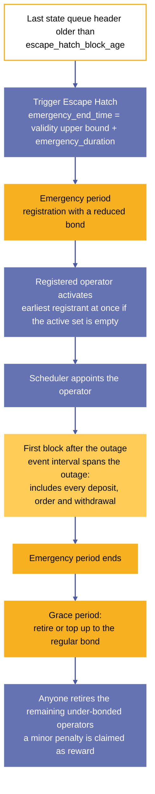

***Figure 9.** Escape hatch flow: a stale state queue triggers an emergency period; reduced-bond operators restart block production; after the emergency the reduced-bond operators retire or top up, and anyone retires the rest.*

#### 3.5.1 UTXO representation

The escape hatch is represented onchain by a single UTXO holding an NFT with this datum:

$$
\mathsf{EscapeHatchDatum} := \left\{
  \begin{array}{ll}
    \mathsf{emergency\_end\_time}: & \mathsf{PosixTime}
  \end{array}\right\}
$$

The datum is set to zero when Sundial is initialized. When the escape hatch is triggered, it is set to the time at which the emergency period ends. The emergency period is in force for a transaction whose validity interval upper bound is earlier than `emergency_end_time`.

#### 3.5.2 Minting policy

The `escape_hatch` minting policy initializes the escape hatch state. It is statically parametrized on the `hub_oracle` minting policy. Redeemers:

- **Init.** Conditions:

  1. The transaction must mint the Sundial hub oracle token.
  2. The transaction must mint the `escape_hatch` NFT and send it to `escape_hatch_addr` with an `EscapeHatchDatum` whose `emergency_end_time` is zero.

#### 3.5.3 Spending validator

The spending validator of `escape_hatch_addr` controls the escape hatch trigger. Redeemers:

- **Trigger Escape Hatch.** Conditions:

  1. Let `last_header_node` be the last node in the `state_queue`, or the root (the confirmed state) if the queue holds no header.
  2. The transaction's time-validity lower bound must exceed `last_header_node.end_time` by `escape_hatch_block_age`.
  3. The transaction's time-validity interval duration must not exceed `escape_hatch_trigger_duration`.
  4. Let `escape_hatch_output` be the transaction output that holds the `escape_hatch` token.
  5. The `emergency_end_time` of `escape_hatch_output` must match the transaction's time-validity upper bound, moved forward by `emergency_duration`.

### 3.6 Settlement

The settlement contract tracks deposit events, withdrawal orders, and forced L2 transaction orders until they are spent. Each settlement UTXO is created whenever a block merges into the confirmed state and includes any deposits, withdrawals, or transaction orders. The settlement contains the block's deposits root hash, withdrawals root hash, and the transactions root hash (including both the requests and orders). Users must reference a settlement UTXO to spend its confirmed deposits, withdrawals, or transaction orders.

The current operator can optimistically resolve any settlement UTXO, claiming that its confirmed user events have all been spent. To do so, the operator attaches a resolution claim to the settlement datum for the `maturity_duration` (a protocol parameter). During this maturity period, if the operator's resolution claim is proven fraudulent, the prover can slash the operator's bond and remove the resolution claim from the settlement datum. After the maturity period, the settlement UTXO can be spent if the resolution claim is intact.

The bond unlock time in the operator's node in the Operator Directory is advanced whenever an operator optimistically marks a settlement as resolved, in the same way as when the operator commits a block to the state queue ([§3.2.5](#325-active-operators), Update Bond Hold New Settlement). This update ensures that the operator cannot recover their bond until all their resolution claims have matured in the settlement queue. If the operator already has a later bond unlock time from another unresolved obligation, that later timestamp must be preserved.

#### 3.6.1 Minting policy

The `settlement` minting policy is statically parametrized on the `hub_oracle` minting policy. It's responsible for authenticating spawned UTXOs at the `settlement_addr` contract, and also conclusion of its UTXOs.

- **Spawn.** Create a settlement UTXO to store a merged block's deposits, withdrawals and transactions. Conditions:

  1. The transaction must include the Sundial hub oracle NFT in a reference input.
  2. Let `state_queue` be the policy ID in the corresponding field of the Sundial hub oracle.
  3. The transaction must Fold a `state_queue` node via the Merge To Confirmed State redeemer. Let `merged_block` be the block being merged to the confirmed state, and let `header_hash` be its header-hash key.
  4. The transaction must produce a UTXO at the settlement contract containing an NFT with `header_hash` as its asset name. Let `new_settlement` be the new UTXO.
  5. `merged_block` and `new_settlement` must match on all of these fields:

     - `deposits_root`
     - `withdrawals_root`
     - `transactions_root`
  6. The `resolution_claim` of `new_settlement` must be empty.
- **Remove.** Remove a settlement UTXO if its resolution claim has matured. Conditions:

  1. The transaction must spend a UTXO from the `settlement_addr` contract. Let `removed_settlement` be this UTXO.
  2. The redeemer used for spending `removed_settlement` must carry the same `settlement_id` as the one provided to this policy script.
  3. The `resolution_claim` of `removed_settlement` must not be empty.
  4. The transaction must be signed by the `operator` of the `resolution_claim`.
  5. The transaction's time-validity lower bound must match or exceed the `resolution_time` of the `resolution_claim`.

#### 3.6.2 Spending validator

The spending validator of `settlement_addr` is statically parametrized on the `settlement` and `hub_oracle` minting policy. Conditions:

- **Attach Resolution Claim.** The current operator attaches a resolution claim to a settlement UTXO. Conditions:

  1. The spent input must not have a resolution claim.
  2. The spent input must be reproduced with a resolution claim.
  3. The transaction must be signed by the resolution claim's operator.
  4. The transaction must include the Sundial hub oracle NFT in a reference input.
  5. Let `active_operators` and `scheduler` be the corresponding policy IDs in the Sundial hub oracle.
  6. The transaction must include an input (`operator_node`), spent via the Update Bond Hold New Settlement redeemer, of an `active_operators` node with a key matching the resolution claim's operator.
  7. The Update Bond Hold New Settlement redeemer must provide a `resolution_time` value.
  8. The `resolution_time` of the attached resolution claim must match this redeemer value. The active operators validator ensures this value equals the current claim's maturity time and that the operator node's `bond_unlock_time` is advanced to at least this value without shortening any previous hold.
  9. The transaction must include the `scheduler` UTXO as a reference input, indicating that the current operator matches the resolution claim's operator.
- **Disprove Resolution Claim.** Disprove and detach a settlement UTXO's resolution claim, slashing the claimant operator. Conditions:

  1. The spent input must have a resolution claim. Let `operator` be the operator of that claim.
  2. The spent input must be reproduced without a resolution claim.
  3. The transaction must include the Sundial hub oracle NFT in a reference input.
  4. Let `active_operators`, `deposit`, `withdrawal`, and `tx_order` be the corresponding policy IDs in the Sundial hub oracle.
  5. The transaction must include either a deposit, a withdrawal, or a transaction order as a reference input. Let that reference input be `unprocessed_event`.
  6. A valid membership proof must be provided, proving that `unprocessed_event` is a member of the corresponding tree in the settlement. Note that the validity flag for optimistic events (i.e. withdrawals and transaction orders) must be provided via the redeemer.
  7. The transaction's time-validity upper bound must be earlier than the resolution claim's `resolution_time`.
  8. Let `operator_status` be a redeemer argument indicating whether `operator` is active or retired.
  9. If `operator_status` is active:

     1. The transaction must Remove a node from the `active_operators` set via the Slash Operator redeemer with the bad-resolution-claim reason. The `slashed_operator` argument provided to that redeemer must match `operator`.
  10. Otherwise:

      1. The transaction must Remove a node from the `retired_operators` set via the Slash Operator redeemer with the bad-resolution-claim reason. The `slashed_operator` argument provided to that redeemer must match `operator`.
- **Resolve.** Allows expenditure of settlement UTXOs for burning their state NFTs. Conditions:

  1. An NFT with policy ID `settlement` and asset name `settlement_id` (provided via the redeemer) must be burnt.

### 3.7 Reserve and payout

Sundial's reserve safeguards funds absorbed from confirmed deposits until Sundial's payout accumulator UTXOs collect them. Sundial's payout accumulators collect funds from Sundial's reserve in order to pay out confirmed withdrawal orders in full.

When a deposit is absorbed into Sundial's reserve, its funds (excluding the deposit ID token) are sent to a single UTXO at the reserve address without a datum, without a reference script attached, and without being merged with the funds from any other deposits (see [§2.1.2](#212-spending-validator)). In other words, the deposit UTXO is reproduced one-to-one at the reserve address after removing the datum and ID token that identified the deposit.

Each payout accumulator UTXO is initialized by proving that its corresponding withdrawal order is present in a settlement UTXO's withdrawals tree (marked as valid), burning the withdrawal order's ID token, and minting the corresponding payout ID token (see [§2.4.2](#242-spending-validator)). The payout accumulator's datum is:

$$
\mathsf{PayoutDatum} := \left\{
  \begin{array}{ll}
    \mathsf{l1\_address}: & \mathsf{Address} \\
    \mathsf{l1\_datum}: & \mathsf{Option}(\mathsf{Data}) \\
    \mathsf{l2\_value}: & \mathsf{Value}
  \end{array}\right\}
$$

The payout accumulator collects funds from the reserve until it contains sufficient funds for the withdrawal's payout, sending any excess funds back to the reserve. When the payout accumulator contains sufficient funds, it sends the funds to the withdrawal's destination address and datum.

#### 3.7.1 Reserve spending validator

The spending validator of `reserve_addr` implements the logic of Sundial's reserve. Redeemers:

- **Spend.** Spend a reserve UTXO to transfer some of its funds into a payout accumulator.

  1. The transaction must spend an input from the `payout_addr` via the `Collect_Reserve_Funds` redeemer.

#### 3.7.2 Payout minting policy

The `payout` minting policy ensures that only a single payout accumulator can be initialized or payout can be completed per transaction. Redeemers:

- **Mint.** Mint a single payout token. Conditions:

  1. The transaction must mint exactly one token of `payout`.
  2. The transaction must burn exactly one token of `withdrawal`.
  3. The minted and burned tokens must match on token name.
  4. The transaction must not mint or burn any other tokens.
- **Burn.** Burn a single payout token. Conditions:

  1. The transaction must burn exactly one token of `payout`.
  2. The transaction must not mint or burn any other tokens.

#### 3.7.3 Payout spending validator

The spending validator of `payout_addr` is responsible for collecting funds from the Sundial reserve until a complete payout can be sent to its destination.

- **Collect Reserve Funds.** Collect funds from the Sundial reserve. Conditions:

  1. Let `payout_input` be the transaction input being spent. Let `payout_datum` be its datum.
  2. Let `reserve_input` be the sole transaction input from `reserve_addr`.
  3. Let `payout_output` be a transaction output.
  4. `payout_input` and `payout_output` must each hold exactly one `payout` token and it must match between them.
  5. Let `value_diff` be the sum of values of `payout_input` and `reserve_input`, minus the value of `payout`.
  6. `value_diff` must not be negative.
  7. If `value_diff` is positive:

     - The transaction must send a change output to `reserve_addr` with a value that matches or exceeds `value_diff`.
  8. The transaction must not mint or burn any tokens.
- **Complete Payout.** When the payout accumulator contains sufficient funds, complete the payout to the destination address and datum. Conditions:

  1. Let `payout_input` be the transaction input being spent. Let `payout_datum` be its datum.
  2. `payout_input` must hold exactly one token of `payout`, which must be the only `payout` burned in the transaction.
  3. Let `payout_output` be a transaction output.
  4. `payout_output.address` must match `payout_datum.l1_address`.
  5. `payout_output.datum` must match `payout_datum.l1_datum`.
  6. `payout_output.value` must match or exceed `payout_datum.l2_value`, excluding the burned token.
  7. The transaction must not mint or burn any other tokens.

### 3.8 Sundial hub oracle

This oracle keeps track of minting policy IDs and spending validator addresses for the lists used in the operator directory, the state queue, and the fraud proof set, and for the scheduler, escape hatch, user event, settlement, reserve, and payout contracts of the Sundial protocol. It consists of a single UTXO holding the hub oracle NFT and a datum of the following type:

$$
\mathsf{HubOracleDatum} := \left\{
    \begin{array}{ll}
        \mathsf{registered\_operators} : & \mathsf{PolicyId} \\
        \mathsf{active\_operators} : & \mathsf{PolicyId} \\
        \mathsf{retired\_operators} : & \mathsf{PolicyId} \\
        \mathsf{scheduler} : & \mathsf{PolicyId} \\
        \mathsf{state\_queue} : & \mathsf{PolicyId} \\
        \mathsf{fraud\_proof\_catalogue} : & \mathsf{PolicyId} \\
        \mathsf{fraud\_proof} : & \mathsf{PolicyId} \\
        \mathsf{deposit} : & \mathsf{PolicyId} \\
        \mathsf{withdrawal} : & \mathsf{PolicyId} \\
        \mathsf{tx\_order} : & \mathsf{PolicyId} \\
        \mathsf{settlement} : & \mathsf{PolicyId} \\
        \mathsf{payout} : & \mathsf{PolicyId} \\
        \mathsf{escape\_hatch} : & \mathsf{PolicyId} \\
        \\
        \mathsf{registered\_operators\_addr} : & \mathsf{Address} \\
        \mathsf{active\_operators\_addr} : & \mathsf{Address} \\
        \mathsf{retired\_operators\_addr} : & \mathsf{Address} \\
        \mathsf{scheduler\_addr} : & \mathsf{Address} \\
        \mathsf{state\_queue\_addr} : & \mathsf{Address} \\
        \mathsf{fraud\_proof\_catalogue\_addr} : & \mathsf{Address} \\
        \mathsf{fraud\_proof\_addr} : & \mathsf{Address} \\
        \mathsf{deposit\_addr} : & \mathsf{Address} \\
        \mathsf{withdrawal\_addr} : & \mathsf{Address} \\
        \mathsf{tx\_order\_addr} : & \mathsf{Address} \\
        \mathsf{settlement\_addr} : & \mathsf{Address} \\
        \mathsf{reserve\_addr} : & \mathsf{Address} \\ 
        \mathsf{payout\_addr} : & \mathsf{Address} \\
        \mathsf{escape\_hatch\_addr} : & \mathsf{Address}
    \end{array} \right\}
$$

#### 3.8.1 Minting policy

The `hub_oracle` minting policy ensures that all Sundial lists are initialized together and sent to their respective spending validator addresses. Redeemers:

- **Init.** Initialize all Sundial lists and send their root nodes to their respective validator addresses. Conditions:

  1. Let `nonce_utxo` be a static parameter of the `hub_oracle` minting policy.
  2. `nonce_utxo` must be spent.
  3. The hub oracle NFT must be minted.
  4. Let `hub_oracle_output` be the transaction output with the hub oracle NFT.
  5. `hub_oracle_output` must *not* contain any other non-ADA tokens.
  6. `hub_oracle_output` must be sent to the hub oracle's spending validator address, whose validator allows no spend ([§3.8.2](#382-spending-validator)).
  7. The root node NFT of every linked list policy ID in `hub_oracle_output` must be minted and sent to the corresponding spending validator address in `hub_oracle`.
  8. The NFT of the `scheduler` policy ID in `hub_oracle_output` must be minted and sent to the `scheduler_addr`.
  9. The NFT of the `escape_hatch` policy ID in `hub_oracle_output` must be minted and sent to the `escape_hatch_addr`, with the datum of [§3.5.1](#351-utxo-representation).
  10. No other tokens must be minted or burned.

  The nonce UTXO proves authority for initialization — whoever controls it is authorized to initialize the Sundial L1 data structures.

#### 3.8.2 Spending validator

The spending validator of `hub_oracle` does not allow its UTXO to be spent.

[^c3-1]: Indeed, an operator may commit blocks without waiting for L1 confirmation. As long as the blocks are valid, no one can interfere with the operator's chain of block commitment transactions. Moreover, if operators coordinate their activity offchain, this rapid cadence can be mostly maintained across shift boundaries.

[^c3-2]: We're using `Empty` to represent a bytearray of length zero.

[^c3-3]: The reason for sending all the slashed portion to the L1 treasury is to avoid potential incentivization of DDoS attacks against active operators.

[^c3-4]: This prevents limitless expenditure of the node UTXO which would halt the scheduler if there is only one operator available to be appointed active.

## 4 Proof protocol

The proof protocol defines how a violation of the ledger rules is proven onchain. A fraud proof catalogue lists the categories of proof; computation threads split each verification into steps that fit within L1's limits on transaction size, computation, and memory; and a fraud proof token records a successful proof, which lets the state queue remove the offending block and slash its operator.

### 4.1 Fraud proof catalogue

Each category of Sundial's fraud proof catalogue is an onchain procedure (see [§4.3](#43-fraud-proof-computation-threads)) that verifies whether a given fraud proof demonstrates a violation of Sundial's ledger rules (see [§5](#5-ledger-rules-and-fraud-proofs)) in a given block. The catalogue of the reference instance defines four categories ([§4.1.3](#413-catalogue-entries)).

Sundial's fraud proof catalogue defines the universe of fraud proof verification procedures. It maps a unique 4-byte integer ($\mathcal{B}_4$) index to the first step of each procedure. [^c4-1] On UTXO-based L1, the Merkle Patricia Trie (MPT) root hash ($\mathcal{RH}$) of this map is stored in a single designated UTXO created at Sundial's initialization.

$$
\begin{aligned}
\mathsf{FraudProofCatalogueDatum}
      &:= \mathcal{RH}\Bigl( \mathsf{Map}(\mathcal{B}_4, \mathsf{ScriptHash}) \Bigr) \\
      &:= \mathcal{RH}\Bigl(\Bigl\{
        (k_i: \mathcal{B}_4, v_i: \mathsf{ScriptHash}) \mid \forall i \neq j.\; k_i \neq k_j
    \Bigr\}\Bigr)
\end{aligned}
$$

#### 4.1.1 Minting policy

The `fraud_proof_catalogue` minting policy is statically parametrized on the `hub_oracle` minting policy. Redeemers:

- **Mint.** Initialize the `fraud_proof_catalogue` via the Sundial hub oracle. Conditions:

  1. The transaction must mint the Sundial hub oracle NFT.

#### 4.1.2 Spending validator

The spending validator of `fraud_proof_catalogue_addr` does *not* allow its UTXO to be spent. Sundial's fraud proof verification procedures are defined once and for all at initialization.

#### 4.1.3 Catalogue entries

The catalogue committed at initialization holds one entry per fraud proof category. Each key is the category index encoded as a big-endian 4-byte integer, and each value is the script hash of the first step of that category's computation thread ([§4.3](#43-fraud-proof-computation-threads)). The 4-byte index space holds up to $2^{32}$ categories, which exceeds the violation set of Chapter 5 by orders of magnitude. The catalogue of the reference instance defines four categories:

<a id="table-1"></a>

**Table 1.** Fraud proof catalogue of the reference instance

| Index | Category | Violation proven | Ledger rule | Step validators | Steps |
|:--:|---|---|:--:|---|:--:|
| 0 | `double_spend` | [DOUBLE-SPEND](#5114-double-spend-violation) | [§5.1.1](#511-rule-all-inputs-must-be-valid) | `step-01`, `step-02`, `step-03` | 3 |
| 1 | `non_existent_input` | [NO-INPUT](#5111-no-input-violation) | [§5.1.1](#511-rule-all-inputs-must-be-valid) | `step-01`, `step-02` | 2 |
| 2 | `non_existent_input_no_index` | [INPUT-NO-IDX](#5112-input-no-idx-violation) | [§5.1.1](#511-rule-all-inputs-must-be-valid) | `step-01`, `step-02`, `step-03`, `step-04` | 4 |
| 3 | `invalid_range` | [INVALID-RANGE](#5121-invalid-range-violation) | [§5.1.2](#512-rule-transaction-validity-range) | `step-01`, `step-02` | 2 |

The step validators live under `onchain/aiken/validators/fraud-proofs/<category>/`, and the shared step types under `onchain/aiken/lib/midgard/fraud-proofs/`. [§5.3](#53-rule-enforcement-map) lists, for every ledger rule, the category that proves its violations.

### 4.2 Fraud proof tokens

Fraud proof tokens represent fraud proof computations that have successfully concluded.

#### 4.2.1 Minting policy

The `fraud_proof` minting policy is statically parametrized on the `computation_thread` and `hub_oracle` minting policies. Redeemers:

- **Mint.** Mint a new fraud proof token whenever a fraud proof computation succeeds. Conditions:

  1. The transaction must burn a `computation_thread` token via the Success redeemer.
  2. The transaction must mint a `fraud_proof` token with the same token name as the `computation_thread` token.
  3. The `fraud_proof` token must be sent to an address whose payment part is the same script as the token's policy ID.
  4. The transaction must *not* mint or burn any other tokens.

#### 4.2.2 Spending validator

The spending validator of `fraud_proof` does *not* allow its UTXO to be spent. Sundial fraud proofs last forever.

### 4.3 Fraud proof computation threads

A computation thread splits up a large computation into a series of steps, passing control between the steps in the continuation-passing style (CPS). In other words, the computation thread is a state machine (see [Appendix B](#appendix-b-single-threaded-state-machine)) with a linear state graph.

Each step is a spending validator that executes the following sequence:

1. Parses the computation state from its datum.
2. Optionally receives arguments from its redeemer to guide the computation step.
3. Advances the computation by the step, producing a new computation state.
4. Suspends the computation by serializing the new computation state into a new datum that it sends to the spending validator of the next step.

All steps in a computation thread parametrize the same datum type:

$$
\mathsf{StepDatum} (\mathsf{state\_data}) := \left\{
    \begin{array}{ll}
        \mathsf{fraud\_prover}  : & \mathsf{PubKeyHash} \\
        \mathsf{data} : & \mathsf{Option(state\_data)}
    \end{array} \right\}
$$

#### 4.3.1 Minting policy

The `computation_thread` minting policy initializes its state machine. It is statically parametrized on the `fraud_proof_catalogue` and `hub_oracle` minting policies. Redeemers:

- **Init.** Conditions:

  1. The transaction must include the `fraud_proof_catalogue` NFT in a reference input.
  2. Let `fraud_category_id` and `fraud_category` be a four-byte key and its corresponding value (a script hash) in the MPT root hash stored in the `fraud_proof_catalogue`.
  3. The transaction must include the Sundial hub oracle NFT in a reference input.
  4. Let `state_queue` be the policy ID in the corresponding field of the Sundial hub oracle.
  5. The transaction must reference a `state_queue` node. Let `fraud_node` be that node.
  6. The transaction must mint a single token of the `computation_thread` minting policy. The token name must concatenate `fraud_category_id` and the 28-byte block header hash in the key of `fraud_node`.
  7. The computation thread token must be sent to the spending validator address of `fraud_category`. Let `output_state` be that transaction output.
  8. The `output_state` datum type must be `StepDatum(Data)`, with its `data` being `None` (meaning there should be no data in the initial state).
  9. The transaction must be signed by the `fraud_prover` pub-key hash of `output_state`.
  10. Other than ADA, `output_state` must *not* hold any other tokens.
  11. The transaction must *not* mint or burn any other tokens.
- **Success.** Terminate the state machine normally from the final spending validator in the computation. Relies on fraud proofs' last steps to couple it with the fraud proof's minting. Condition:

  1. Let `successful_computation_thread_token` be the asset name of the computation thread that has successfully completed, provided via the redeemer.
  2. The transaction must burn exactly 1 computation thread token with asset name `successful_computation_thread_token`.
- **BurnForCancellation.** Terminate the state machine exceptionally from any spending validator in the computation. Conditions:

  1. Let `burning_computation_thread_token` be the asset name of the computation thread being canceled, provided via the redeemer.
  2. The transaction must burn the computation thread token with asset name `burning_computation_thread_token`.
  3. The transaction must *not* mint or burn any other tokens.

#### 4.3.2 Spending validators

A fraud-proof computation succeeds if its thread token passes through all the steps' spending validator addresses. In that case, the last step's spending validator reifies the successful fraud-proof by requiring a fraud-proof token to be minted. The fraud-proof minting policy requires the computation thread token to be burned, specifically via the Success redeemer.

On the other hand, at any step, the person who initiated the computation thread can cancel the computation instead of advancing it. In that case, the step's spending validator requires the computation thread token to be burned via the `BurnForCancellation` redeemer of the computation thread policy. Thus, while there is typically only one path for a computation thread to reach success via the sequential steps,[^c4-2] there may be multiple opportunities for the computation to be canceled along the way.

For each fraud-proof category, each spending validator is custom-written to express the specific logic of that computation step, and it is statically parametrized on the next step's spending validator (if any). One of the custom conditions of the computation step must verify the transition between the input state and output state of the thread:

$$
\begin{aligned}
\mathsf{verify\_transition} &: (\mathsf{Input}, \mathsf{Output}, ..\mathsf{Args}) -> \mathsf{Bool} \\
    \mathsf{verify\_transition(i, o, ..args)} &:=
        \Bigl( \mathsf{transition(i, ..args) \equiv \mathsf{o}} \Bigr) \\
    \mathsf{transition} &: (\mathsf{Input}, ..\mathsf{Args}) -> \mathsf{Output}
\end{aligned}
$$

All of the spending validators share the same parametric redeemer type, but each spending validator can parametrize the Continue redeemer by a different type to hold the custom instructions needed to guide the computation step:

$$
\mathsf{StepRedeemer} (\mathsf{instructions}) :=
        \mathsf{Continue}(\mathsf{instructions}) \;|\;
        \mathsf{Cancel}
$$

The redeemers follow this general pattern:

- **Continue.** Advance the computation. Conditions:

  1. If this is the last step of the computation:

     - Mint the fraud token, which implicitly burns the computation thread token with the Success redeemer. Let `output_state` be that transaction output.
     - The `output_state` datum type must be `StepDatum(Data)`, with its `data` being `None`.
     - The `fraud_prover` field must match between the `output_state` and the input datum.
  2. Otherwise:

     - The computation thread token must be sent to the next step's spending validator. Let `output_state` be that transaction output.
     - The `fraud_prover` field must match between the `output_state` and the input datum.
  3. Evaluate the custom conditions of the computation step, including verifying the state transition.
  4. The custom conditions may require the transaction to reference a state queue with a key hash matching the last 28 bytes of the computation thread token name.
  5. The transaction must *not* mint or burn any other tokens.
- **Cancel.** Cancel the computation. Conditions:

  1. Validate that the `BurnForCancellation` redeemer of the computation thread policy is invoked (this in turn validates the burning of the specified computation thread token).
  2. The transaction must be signed by the fraud prover pub-key defined in the input datum.
  3. The transaction must *not* mint or burn any other tokens.

#### 4.3.3 Category shapes

The four categories differ only in the custom conditions of their steps; all share the step datum, the Continue/Cancel redeemer pattern, and the token discipline of [§4.3.1](#431-minting-policy)–[§4.3.2](#432-spending-validators).

- **`double_spend` (3 steps).** Step 1 runs twice, once per conflicting transaction: it verifies that the transaction is a member of the block named in the thread token and records the root of its input set. The second run also requires that the two transaction ids differ. Step 2 verifies that a claimed input is a member of the first transaction's input set and carries it forward. Step 3 verifies that the same input is a member of the second transaction's input set and mints the fraud proof token.
- **`non_existent_input` (2 steps).** Step 1 verifies that the transaction is a member of the block and records its input-set root together with the block's `prev_utxos_root`. Step 2 verifies that a claimed input is a member of the transaction's input set and is *not* a member of the previous UTXO set, then mints the fraud proof token.
- **`non_existent_input_no_index` (4 steps).** The transaction spends an input whose transaction id exists in the block but whose output index exceeds that transaction's outputs. Step 1 verifies the spending transaction's inclusion. Step 2 verifies the claimed input's membership in the spending transaction's input set. Step 3 verifies that a provided transaction hashes to the id named by the input and carries its output-set root forward. Step 4 is recursive: it deletes the outputs of that transaction from its Merkle Patricia Trie one index at a time, each `Recurse` transaction removing output `k` and advancing the counter to `k + 1`, until the trie is empty; `Finalize` then requires that the claimed output index is at least the number of deleted outputs and mints the fraud proof token. The recursion counts outputs without materializing them, at one L1 transaction per output.
- **`invalid_range` (2 steps).** Step 1 verifies the transaction's inclusion and records the block's event interval together with the transaction's validity interval, normalized to one of *always*, *from −∞*, *to +∞*, *closed*, or *invalid*. Step 2 succeeds when the normalized interval is *invalid* (lower bound not below upper bound) or when it is bounded on a side and that bound falls outside the block's event interval; it fails for an *always* interval.

#### 4.3.4 Membership and non-membership by helper scripts

Every step that verifies a Merkle Patricia Trie proof does so through a *withdraw-zero* helper script: the step validator requires the transaction to withdraw zero ADA from a designated staking script whose redeemer carries `(root, key, value, proof)`, and compares that redeemer with the values in its own state. The helper scripts verify membership (`phas`), non-membership (`pexcludes`), and deletion (`pdelete`) with the Aiken Merkle Patricia Forestry algorithms [[8]](#references); their script hashes are parameters of the step validators. Each helper is invoked at most once per transaction, which is why a step verifies at most one proof of each kind.

#### 4.3.5 Worked example: a double spend

Alice's output `UTXO#123` holds 10 ADA. Operator Bob commits block `#456` whose transaction set contains two transactions, `Tx#781` and `Tx#782`, that both spend `UTXO#123`. Watcher Charley retrieves block `#456` from the data availability layer and detects that two of its transactions spend `UTXO#123`. <a id="figure-10"></a>

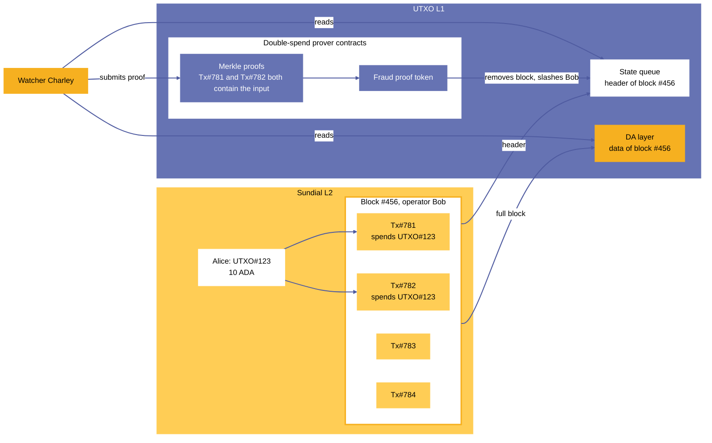

***Figure 10.** Worked example of a double-spend fraud proof: operator Bob's block #456 contains two transactions that spend Alice's UTXO#123; watcher Charley reads the header and the block data, proves the conflict with Merkle proofs, and the block is removed.*

Charley proves the violation with the `double_spend` category (catalogue index 0) in six L1 transactions (five to build the proof, one to use it):

1. **Init.** Charley references the catalogue and the state queue node of block `#456`, mints one `computation_thread` token named `0x00000000 ‖ header_hash(#456)`, and sends it to the `step-01` validator address with an empty state. He signs the transaction, which records him as `fraud_prover`.
2. **Step 1, first run.** Charley presents `Tx#781`, its body, and a membership proof of `Tx#781` in the block's `transactions_root`. The step verifies the proof and reproduces the thread UTXO at its own address with state `{ verified_tx1_id = Tx#781, verified_tx1_inputs_root }`.
3. **Step 1, second run.** Charley presents `Tx#782` with its membership proof. The step verifies it, requires `Tx#782 ≠ Tx#781`, and sends the thread to `step-02` with state `{ verified_tx1_inputs_root, verified_tx2_inputs_root }`.
4. **Step 2.** Charley names the input `UTXO#123` and proves that it is a member of `verified_tx1_inputs_root`. The step sends the thread to `step-03` with state `{ verified_tx2_inputs_root, double_spent_input }`.
5. **Step 3.** Charley proves that `UTXO#123` is also a member of `verified_tx2_inputs_root`. The step mints the `fraud_proof` token named `0x00000000 ‖ header_hash(#456)`, burning the thread token through the Success redeemer.
6. **Removal.** Charley references the fraud proof token in a Remove Fraudulent Block Header transaction ([§3.4.2](#342-minting-policy)). If block `#456` is the newest block in the queue, the transaction removes it and slashes Bob's bond: `fraud_prover_reward` goes to Charley and `slashing_penalty` is paid as transaction fees ([§3.2.3](#323-operator-slashing)). If later blocks have been appended to `#456`, Charley first removes them, one Remove Fraudulent Block Header transaction each, and each of those transactions slashes the operator of the block it removes; the last transaction then removes `#456` itself and slashes Bob.

Until transaction 5 completes the proof, Charley can cancel the thread and recover its ADA; nobody else can advance or cancel it, because every step requires the `fraud_prover` recorded at Init.

<a id="figure-11"></a>

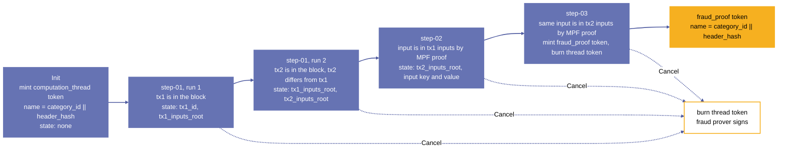

***Figure 11.** The double-spend computation thread: step 1 runs twice, once per conflicting transaction; the state that each step passes on is shown in its node.*

[^c4-1]: The 4-byte index space holds up to $2^{32}$ procedures, far more than Sundial's ledger rules require.

[^c4-2]: Technically, if there are multiple instances of the same fraud category in a fraudulent block, then there is a corresponding number of paths to prove the occurrence of that fraud category in the block. The redeemer arguments provided to the computation steps collectively select one of these paths.

## 5 Ledger rules and fraud proofs

This chapter states the ledger rules that every Sundial block satisfies. Each rule has a formal specification, one or more named violations, and, for every violation, the construction of a fraud proof that demonstrates it. Rules 5.1.1–5.1.16 follow L1's ledger rules; rules 5.1.17–5.1.21 state the admissibility conditions of Sundial's transaction type. Section 5.2 states the rules that bind block data to the roots of a header, and Section 5.3 maps every rule to the rule that the node's engine uses to enforce it. Section 5.4 states three block-level conditions of block validity.

### 5.1 Sundial Ledger Rules and Fraud Proofs

In the following sections the following premises are used:

$$
\begin{aligned}
           b & \in Blocks          \\
         txs & := transactions(b)  \\
 utxos_{pre} & := prev\_utxos(b)   \\
utxos_{post} & := utxos(b)         \\
        wtxs & := withdrawals(b)
\end{aligned}
$$

For a transaction $t$, $spent(t)$ is the set of pairs $(r, u)$ such that $r \in spend\_inputs(t)$ and $u$ is the output that $r$ references: an entry of $utxos_{pre}$, or an output of another transaction of the block. Because $utxos_{post}$ no longer contains outputs that the block spends, rules about the outputs that a transaction spends are stated over $spent(t)$.

#### 5.1.1 Rule: All inputs must be valid

A transaction cannot spend a non-existing (or an already spent) UTXO. Formal specification:

$$
\boxed{
\begin{aligned}
  &\forall t \in Ledger,\; \forall i \in spend\_inputs(t): \\
    &\quad(
      \exists t_1 \in Ledger,\;
        t \neq t_1 \;\land\;
        i \in outputs(t_1) 
    ) \;\land\\
    &\quad(
      \nexists t_2 \in Ledger,\;
        t \neq t_2 \;\land\;
        i \in spend\_inputs(t_2)
    )
\end{aligned}
}
$$

This ledger rule is violated if any of the following violations occur:

- [NO-INPUT](#5111-no-input-violation)
- [INPUT-NO-IDX](#5112-input-no-idx-violation)
- [WITHDRAWN-INPUT](#5113-withdrawn-input-violation)
- [DOUBLE-SPEND](#5114-double-spend-violation)
- [DOUBLE-WITHDRAW](#5115-double-withdraw-violation)

##### 5.1.1.1 NO-INPUT violation

A transaction $t$ attempted to spend the UTXO $i$ that does not exist or was spent in a previous block. Formal specification:

$$
\begin{aligned}
  &\exists t \in txs,\; \exists i \in spend\_inputs(t): \\
    &\quad(
      i \notin utxos_{pre}
    ) \;\land\\
    &\quad(
      \nexists t_1 \in txs,\;
      t \neq t_1 \;\land\; tx\_hash(t_1) = tx\_hash(i)
    )
\end{aligned}
$$

Fraud proof construction:

1. Let $t$ be the transaction alleged to violate the ledger rule.
2. A membership proof must be provided for $t$ that shows that the transaction is included in the block ($t \in txs$).
3. A membership proof for input $i$ must be specified such that $i \in spend\_inputs(t)$.
4. A non-membership proof must be created to show that $i$ is not in $utxos_{pre}$.
5. A non-membership proof must also be generated that shows that there are no transactions in $txs$ that have id $tx\_hash(i)$.

##### 5.1.1.2 INPUT-NO-IDX violation

A transaction $t$ attempted to spend the input $i$, which did not exist at all. Formal specification:

$$
\begin{aligned}
  &\exists t \in txs,\; \exists i \in spend\_inputs(t),\; \exists t_1 \in txs: \\
    &\quad
      tx\_hash(t_1) = tx\_hash(i) \;\land\;
      i \notin outputs(t_1)
\end{aligned}
$$

Fraud proof construction:

1. Let $t$ be the transaction alleged to violate the ledger rule.
2. A membership proof must be provided for $t$ that shows that the transaction is included in the block ($t \in txs$)
3. A membership proof must be presented for input $i$ such that $i \in spend\_inputs(t)$
4. A membership proof must be created for $t_1$ such that $tx\_hash(t_1) = tx\_hash(i)$
5. A DA layer proof must be presented that certifies that $length(outputs(t_1)) \le index(i)$ (output indices start at 0, so an index equal to the number of outputs is already out of range)

##### 5.1.1.3 WITHDRAWN-INPUT violation

A transaction $t$ attempted to spend the input $i$, which was spent in a withdraw transaction. Formal specification:

$$
\begin{aligned}
  &\exists t \in txs,\; \exists i \in spend\_inputs(t),\; \exists w \in wtxs:\\
    &\quad i = l2\_outref(w)
\end{aligned}
$$

Fraud proof construction:

1. Let $t$ be the transaction alleged to violate the ledger rule.
2. A membership proof must be provided for $t$ that shows that the transaction is included in the block ($t \in txs$)
3. A membership proof must be generated for input $i$ such that $i \in spend\_inputs(t)$
4. A membership proof must be created to show that $w$ is in $wtxs$, which also spends input $i$

##### 5.1.1.4 DOUBLE-SPEND violation

A transaction $t$ attempted to spend the input $i$, which was spent in another transaction. Formal specification:

$$
\begin{aligned}
  &\exists t \in txs,\; \exists i \in spend\_inputs(t),\; \exists t_1 \in txs:\\
    &\quad
      t \neq t_1 \;\land\;
      i \in spend\_inputs(t_1)
\end{aligned}
$$

Fraud proof construction:

1. Let $t$ be the transaction alleged to violate the ledger rule.
2. A membership proof must be provided for $t$ that shows that the transaction is included in the block ($t \in txs$)
3. A membership proof must be generated for input $i$ such that $i \in spend\_inputs(t)$
4. A membership proof must be created to show that $t_1$ is in $txs$
5. A membership proof must be given that verifies that $i \in spend\_inputs(t_1)$

##### 5.1.1.5 DOUBLE-WITHDRAW violation

A withdrawal $w$ attempted to spend the same input, which was already withdrawn by $w_1$. Formal specification:

$$
\begin{aligned}
  &\exists w,\; w_1 \in wtxs:\\
    &\quad
      w \neq w_1 \;\land\;
      l2\_outref(w) = l2\_outref(w_1)
\end{aligned}
$$

Fraud proof construction:

1. Let $w$ be the withdrawal alleged to violate the ledger rule.
2. A membership proof must be provided for $w$ that shows that the withdraw transaction is included in the block ($w \in wtxs$)
3. A membership proof must be created to show that $w_1$ is in $wtxs$

#### 5.1.2 Rule: Transaction validity range

Every valid transaction in the ledger has a well-formed validity interval, and its validity interval overlaps the event interval of the block that includes it. A block's event interval is the half-open interval from the block's `start_time` (inclusive) to its `end_time` (exclusive) ([§3.1](#31-time-model)). Formal specification:

$$
\boxed{
\begin{aligned}
  &\forall t \in Ledger:\\
    &\quad wellformed(validity\_interval(t)) \;\land\;\\
    &\quad validity\_interval(t) \cap time\_range(block(t)) \neq \varnothing
\end{aligned}
}
$$

where an interval is well-formed when it is unbounded on at least one side or its lower bound is strictly below its upper bound. Because event intervals tile time, a transaction whose validity interval is non-empty and overlaps a block's event interval is includable in that block, and a transaction with a short validity interval succeeds whenever some block's event interval overlaps it ([§2.2](#22-transaction-request-l2)).

This ledger rule is violated if any of the following violations occur:

- [INVALID-RANGE](#5121-invalid-range-violation)

##### 5.1.2.1 INVALID-RANGE violation

A transaction $t$ has an ill-formed validity interval, or a validity interval that does not overlap its block's event interval. Formal specification:

$$
\begin{aligned}
  &\exists t \in txs:\\
    &\quad \lnot wellformed(validity\_interval(t)) \;\lor\;\\
    &\quad validity\_interval(t) \cap time\_range(b) = \varnothing
\end{aligned}
$$

Fraud proof construction:

1. Let $t$ be the transaction alleged to violate the ledger rule.
2. A membership proof must be provided that proves that transaction $t$ is included in the block $b$.
3. The validity interval of $t$ is taken from $t$'s body, and the event interval of $b$ from its header. The interval predicate of the violation must hold.

#### 5.1.3 Rule: At least one input

Every valid transaction in the ledger must spend at least one UTXO. Formal specification:

$$
\boxed{
\begin{aligned}
  &\forall t \in Ledger:\\
    &\quad |spend\_inputs(t)| > 0
\end{aligned}
}
$$

This ledger rule is violated if any of the following violations occur:

- [ZERO-INPUT](#5131-zero-input-violation)

##### 5.1.3.1 ZERO-INPUT violation

A transaction $t$ is in the ledger and spends no inputs. Formal specification:

$$
\begin{aligned}
  &\exists t \in txs:\\
    &\quad |spend\_inputs(t)| = 0
\end{aligned}
$$

Fraud proof construction:

1. Let $t$ be the transaction alleged to violate the ledger rule.
2. A membership proof must be provided that shows that the transaction is included in the ledger
3. A DA layer proof must be presented that certifies that $length(spend\_inputs(t)) = 0$

#### 5.1.4 Rule: Minimum fee

Every valid transaction in the ledger must pay the fees for inclusion. Formal specification:

$$
\boxed{
\begin{aligned}
  &\forall t \in Ledger:\\
    &\quad tx\_fee(t) \geq min\_fee(t)
\end{aligned}
}
$$

The minimum fee is the L1 linear fee function applied to the size of the transaction's CBOR encoding:

$$
min\_fee(t) = \mathit{min\_fee\_a} \cdot |\mathrm{cbor}(t)| + \mathit{min\_fee\_b}
$$

where $|\mathrm{cbor}(t)|$ is the byte length of the Conway-era CBOR serialization of $t$ (body, witness set, validity flag, and auxiliary-data slot), and $\mathit{min\_fee\_a}$ and $\mathit{min\_fee\_b}$ are the `min_fee_a` and `min_fee_b` ledger parameters ([Appendix C](#appendix-c-protocol-parameters)). The measure is the CBOR size, not the size of any internal Sundial encoding, so a transaction that pays the textbook L1 minimum fee for its wire size satisfies the rule.

This ledger rule is violated if any of the following violations occur:

- [MIN-FEE](#5141-min-fee-violation)

##### 5.1.4.1 MIN-FEE violation

A transaction $t$ is in the ledger, while $fee(t) < min\_fee(t)$. Formal specification:

$$
\begin{aligned}
  &\exists t \in txs:\\
    &\quad fee(t) < min\_fee(t)
\end{aligned}
$$

Fraud proof construction:

1. Let $t$ be the transaction alleged to violate the ledger rule.
2. A membership proof must be provided that shows that the transaction is included in the ledger

#### 5.1.5 Rule: Required signatures are correct

Every valid transaction in the ledger must correctly show the required signers. Formal specification:

$$
\boxed{
\begin{aligned}
  &\forall t \in Ledger:\\
    &\quad required\_signer\_hashes(t) = \left\{
        paymentHK(addr(u))
        \;\middle|\;
        \begin{array}{l}
           (r, u) \in spent(t) \\
           addr(u) \in Addr^{vkey}
        \end{array}
    \right\}
\end{aligned}
}
$$

The rule makes `required_signer_hashes` the exact set of key hashes at the addresses of the spent inputs, and rule [§5.1.7](#517-rule-every-needed-signature-is-provided) requires a signature for each of them. Together they split the requirement that every spent key-hash input is signed into two statements that a watcher can prove separately: the declared list against the inputs (this rule), and the witnesses against the declared list (§5.1.7). A builder of Sundial transactions declares the key hash of every spent key-hash input as a required signer, and no other.

This ledger rule is violated if any of the following violations occur:

- [MISSING-REQ-SIGNER-TX](#5151-missing-req-signer-tx-violation)
- [MISSING-REQ-SIGNER-UTXO](#5152-missing-req-signer-utxo-violation)
- [NON-REQ-SIGNER](#5153-non-req-signer-violation)

##### 5.1.5.1 MISSING-REQ-SIGNER-TX violation

A transaction $t_1$ spends a UTXO $u$, produced in the block by transaction $t_2$ at a public key address, without providing the required signature as a witness. Formal specification:

$$
\begin{aligned}
  &\exists t_1, t_2 \in txs,\; \exists i \in spend\_inputs(t_1)\; \exists u \in outputs(t_2) : \\
    &(tx\_hash(i) = tx\_hash(t_2)) \;\land\\
    &(u = elem\_at(outputs(t_2), i.index)) \;\land\\
    &\quad paymentHK(addr(u)) \notin required\_signer\_hashes(t_1) \;\land\\
    &\quad addr(u) \in Addr^{vkey}
\end{aligned}
$$

Fraud proof construction:

1. Let $t_1$ be the transaction alleged to violate the ledger rule.
2. A membership proof must be provided that shows that $t_1$ is included in the block.
3. Let $t_2$ be another transaction in the block.
4. A membership proof must be provided that shows that $t_2$ is included in the block.
5. Verify that $i \in spend\_inputs(t_1)$.
6. Verify that $i$ matches $t_2$ on transaction hash.
7. Let $u$ be the $t_2$ output indexed by $i$.
8. Verify that the payment credential of $u$ is a public key hash and that it is *not* included in the required signers of $t_1$.

##### 5.1.5.2 MISSING-REQ-SIGNER-UTXO violation

A transaction $t_1$ spends a UTXO $u$ from the previous block's UTXO set without providing the required signature as a witness. Formal specification:

$$
\begin{aligned}
  &\exists t_1 \in txs,\; \exists i \in spend\_inputs(t_1)\; \exists (j,u) \in utxos_{pre} : \\
    &(i = j) \;\land\\
    &\quad paymentHK(addr(u)) \notin required\_signer\_hashes(t_1) \;\land\\
    &\quad addr(u) \in Addr^{vkey}
\end{aligned}
$$

Fraud proof construction:

1. Let $t_1$ be the transaction alleged to violate the ledger rule.
2. A membership proof must be provided that shows that $t_1$ is included in the block.
3. Verify that $i \in spend\_inputs(t_1)$.
4. Let $u$ be a UTXO and $j$ be an output reference, and verify that $i = j$.
5. A membership proof must be provided that $(j,u) \in utxos_{pre}$.
6. Verify that the payment credential of $u$ is a public key hash and that it is *not* included in the required signers of $t_1$.

##### 5.1.5.3 NON-REQ-SIGNER violation

A transaction $t$ is in the ledger, and it violates the "Required signatures" property. Formal specification:

$$
\begin{aligned}
  &\exists t \in txs,\; \exists vkey \in required\_signer\_hashes(t),\;
    \nexists (r, u) \in spent(t): \\
    &\quad paymentHK(addr(u)) = vkey \;\land\\
    &\quad addr(u) \in Addr^{vkey}
\end{aligned}
$$

Fraud proof construction:

1. Let $t$ be the transaction alleged to violate the ledger rule.
2. A membership proof must be provided that shows that the transaction $t$ is included in the ledger
3. A DA layer proof must be presented that shows that for a specified $vkey$ there is no UTXO $u$ spent by $t$ (no $(r, u) \in spent(t)$) such that the address of $u$ corresponds to $vkey$

#### 5.1.6 Rule: Signatures are valid

Every provided signature must be valid. Formal specification:

$$
\boxed{
\begin{aligned}
  &\forall t \in Ledger,\; \forall (v, s, h) \in addr\_tx\_wits(t):\\
    &\quad is\_valid\_signature(v, s, h)
\end{aligned}
}
$$

This ledger rule is violated if any of the following violations occur:

- [INVALID-SIGNATURE](#5161-invalid-signature-violation)

##### 5.1.6.1 INVALID-SIGNATURE violation

There exists an invalid signature for transaction $t$ (if indeed the signature $(v, s, h)$ is not valid). Formal specification:

$$
\begin{aligned}
  &\exists t \in txs,\; \exists (v, s, h) \in addr\_tx\_wits(t):\\
    &\quad \lnot is\_valid\_signature(v, s, h)
\end{aligned}
$$

Fraud proof construction:

1. Let $t$ be the transaction alleged to violate the ledger rule.
2. A membership proof must be provided that shows that the transaction $t$ is included in the ledger
3. A membership proof must be shown that states that $(v, s, h) \in addr\_tx\_wits(t)$

#### 5.1.7 Rule: Every needed signature is provided

Every required signature is provided. Formal specification:

$$
\boxed{
\begin{aligned}
  &\forall t \in Ledger,\; \forall h \in required\_signer\_hashes(t):\\
    &\quad \exists (v, s, h) \in addr\_tx\_wits(t)
\end{aligned}
}
$$

This ledger rule is violated if any of the following violations occur:

- [MISSING-SIGNATURE](#5171-missing-signature-violation)

##### 5.1.7.1 MISSING-SIGNATURE violation

A required signature, corresponding to $h$ is missing. Formal specification:

$$
\begin{aligned}
  &\exists t \in txs,\; \exists h \in required\_signer\_hashes(t):\\
    &\quad h \notin \{ h_p \;|\; (v, s, h_p) \in addr\_tx\_wits(t) \}
\end{aligned}
$$

Fraud proof construction:

1. Let $t$ be the transaction alleged to violate the ledger rule.
2. A membership proof must be provided that shows that the transaction $t$ is included in the ledger
3. A DA layer proof must be shown that states that $h \in required\_signer\_hashes(t)$
4. A DA layer proof must be presented that shows that a signature with $h$ does not exist

#### 5.1.8 Rule: Native scripts are available

The native script that guards each spent input is provided. Formal specification:

$$
\boxed{
\begin{aligned}
  &\forall t \in Ledger,\; \forall (r, u) \in spent(t):\\
    &\quad
      addr(u) \in Addr^{native}_{v2} \implies \bigl(
        \exists (h, s) \in script\_tx\_wits(t),\; script\_hash(addr(u)) = h 
      \bigr)
\end{aligned}
}
$$

This ledger rule is violated if any of the following violations occur:

- [MISSING-NATIVE-SCRIPT](#5181-missing-native-script-violation)

##### 5.1.8.1 MISSING-NATIVE-SCRIPT violation

A required script, corresponding to $h$ is missing. Formal specification:

$$
\begin{aligned}
  &\exists t \in txs,\; \exists (r, u) \in spent(t):\\
    &\quad addr(u) \in Addr^{native}_{v2} \;\land\\
    &\quad \bigl(
        \nexists (h, s) \in script\_tx\_wits(t),\; script\_hash(addr(u)) = h
      \bigr)
\end{aligned}
$$

Fraud proof construction:

1. Let $t$ be the transaction alleged to violate the ledger rule.
2. A membership proof must be provided that shows that the transaction $t$ is included in the ledger.
3. A membership proof must be generated that proves that $r$ is in $spend\_inputs(t)$, and $u$ must be shown to be the output that $r$ references, as in [5.1.5.1](#5151-missing-req-signer-tx-violation) or [5.1.5.2](#5152-missing-req-signer-utxo-violation).
4. A DA layer proof must be shown that certifies that there is no $(h, s)$ corresponding to $script\_hash(addr(u)) = h$ in $script\_tx\_wits(t)$.

#### 5.1.9 Rule: Native scripts validated

All native scripts validations pass. Formal specification:

$$
\boxed{
\begin{aligned}
  &\forall t \in Ledger,\; \forall (h, s) \in script\_tx\_wits(t):\\
    &\quad native\_validation\_succeeds(s, t)
\end{aligned}
}
$$

$native\_validation\_succeeds(s, t)$ evaluates the native script $s$ in the L1 timelock language: a key-hash script succeeds iff the key hash is in the set of key hashes of $t$'s verified verification-key witnesses; `all`, `any`, and `n-of-k` combine their sub-scripts; `invalid-before` and `invalid-hereafter` compare their bounds against $t$'s validity interval, where a script bound is satisfied only if the interval is bounded on the corresponding side and lies within it. A native script forwards to an observer script when it names one in `required_observers` ([§1.6.3](#163-sundial-simplified-transaction-types)); the forwarded observer's success is then part of the script's outcome.

This ledger rule is violated if any of the following violations occur:

- [NATIVE-SCRIPT-INVALID](#5191-native-script-invalid-violation)

##### 5.1.9.1 NATIVE-SCRIPT-INVALID violation

A native script $s$ validation fails. Formal specification:

$$
\begin{aligned}
  &\exists t \in txs,\; \exists (h, s) \in script\_tx\_wits(t):\\
    &\quad \lnot native\_validation\_succeeds(s, t)
\end{aligned}
$$

Fraud proof construction:

1. Let $t$ be the transaction alleged to violate the ledger rule.
2. A membership proof must be provided that shows that the transaction $t$ is included in the ledger.
3. A DA layer proof must be shown that certifies that $(h, s)$ exists in $script\_tx\_wits(t)$.
4. The $native\_validation\_succeeds(s, t)$ fails.

#### 5.1.10 Rule: Value preservation

The total value must be preserved. Formal specification:

$$
\boxed{
\begin{aligned}
  &\forall t \in Ledger : \\
    &\quad
      mint(t) \;+\;
      \sum value \bigl(  spend\_inputs(t) \bigr) \;=\;
      fee(t) \;+\;
      \sum value \bigl(  outputs(t) \bigr)
\end{aligned}
}
$$

This ledger rule is violated if any of the following violations occur:

- [VALUE-NOT-PRESERVED](#51101-value-not-preserved-violation)

##### 5.1.10.1 VALUE-NOT-PRESERVED violation

Value is not preserved in transaction $t$. Formal specification:

$$
\begin{aligned}
  &\exists t \in txs : \\
    &\quad
      mint(t) \;+\;
      \sum value \bigl(  spend\_inputs(t) \bigr) \;\neq\;
      fee(t) \;+\;
      \sum value \bigl(  outputs(t) \bigr)
\end{aligned}
$$

Fraud proof construction:

1. Let $t$ be the transaction alleged to violate the ledger rule.
2. A membership proof must be provided that shows that the transaction $t$ is included in the ledger.
3. A DA layer proof must be shown that certifies the value of $sum(spend\_inputs(t))$.
4. A DA layer proof must be created that states the value of $sum(outputs(t))$.
5. The sums in the calculation must show a discrepancy.

#### 5.1.11 Rule: No Ada minted

Ada must not be minted. Formal specification:

$$
\boxed{
\begin{aligned}
  &\forall t \in Ledger:\\
    &\quad lovelaces(mint(t)) = 0
\end{aligned}
}
$$

This ledger rule is violated if any of the following violations occur:

- [ADA-MINTED](#51111-ada-minted-violation)

##### 5.1.11.1 ADA-MINTED violation

Ada is minted in transaction $t$. Formal specification:

$$
\begin{aligned}
  &\exists t \in txs:\\
    &\quad lovelaces(mint(t)) \neq 0
\end{aligned}
$$

Fraud proof construction:

1. Let $t$ be the transaction alleged to violate the ledger rule.
2. A membership proof must be provided that shows that the transaction $t$ is included in the ledger.
3. $lovelaces(mint(t)) \neq 0$

#### 5.1.12 Rule: No negative value

All output values must be greater or equal to zero. Formal specification:

$$
\boxed{
\begin{aligned}
  &\forall t \in Ledger:\\
    &\quad \bigl(
        \forall o \in outputs(t),\; value(o) \geq \mathbf{0}
      \bigr)
\end{aligned}
}
$$

This ledger rule is violated if any of the following violations occur:

- [NEGATIVE-OUTPUT-VALUE](#51121-negative-output-value-violation)

##### 5.1.12.1 NEGATIVE-OUTPUT-VALUE violation

An output of a transaction $t$ carries a negative quantity of some asset. Formal specification:

$$
\begin{aligned}
  &\exists t \in txs,\; \exists o \in outputs(t),\; \exists m \in Policy,\;
    \exists tn \in TokenName:\\
    &\quad value(o)_{m,\, tn} < 0
\end{aligned}
$$

Fraud proof construction:

1. Let $t$ be the transaction alleged to violate the ledger rule.
2. A membership proof must be provided that shows that the transaction $t$ is included in the ledger.
3. A membership proof must be generated that states that $o \in outputs(t)$.
4. A minting policy id $m$ and a token name $tn$ must be shown, such that the quantity of $(m, tn)$ tokens in $o$ is negative.

#### 5.1.13 Rule: Minimum UTXO value

All output values must adhere to the same minimum ada value requirement as on L1. Formal specification:

$$
\boxed{
\begin{aligned}
  &\forall t \in Ledger,\; \forall o \in outputs(t):\\
    &\quad lovelaces(value(o)) \geq min\_ada\_value(o)
\end{aligned}
}
$$

The minimum is the Babbage/Conway per-byte rule: $min\_ada\_value(o) = \mathit{coins\_per\_utxo\_byte} \cdot (160 + |\mathrm{cbor}(o)|)$, where $|\mathrm{cbor}(o)|$ is the byte length of the CBOR serialization of the output and $\mathit{coins\_per\_utxo\_byte}$ is the ledger parameter of that name ([Appendix C](#appendix-c-protocol-parameters)). The rule applies to the outputs of every transaction and to every UTXO in a block's UTXO set.

This ledger rule is violated if any of the following violations occur:

- [MIN-ADA-TX](#51131-min-ada-tx-violation)
- [MIN-ADA-UTXO](#51132-min-ada-utxo-violation)

##### 5.1.13.1 MIN-ADA-TX violation

An output of a transaction $t$ does not satisfy the minimum Ada value requirement. Formal specification:

$$
\begin{aligned}
  &\exists t \in txs,\; \exists o \in outputs(t):\\
    &\quad lovelaces(value(o)) < min\_ada\_value(o)
\end{aligned}
$$

Fraud proof construction:

1. Let $t$ be the transaction alleged to violate the ledger rule.
2. A membership proof must be provided that shows that $t \in txs$.
3. A membership proof must be provided that shows that $o \in outputs(t)$.
4. $lovelaces(value(o)) < min\_ada\_value(o)$ must hold.

##### 5.1.13.2 MIN-ADA-UTXO violation

A UTXO $u$ in a block's UTXO set does not satisfy the minimum Ada value requirement. Formal specification:

$$
\begin{aligned}
  &\exists u \in utxos_{post}:\\
    &\quad lovelaces(value(u)) < min\_ada\_value(u)
\end{aligned}
$$

Fraud proof construction:

1. Let $u$ be the UTXO alleged to violate the ledger rule.
2. A membership proof must be provided that shows that $u \in utxos_{post}$.
3. $lovelaces(value(u)) < min\_ada\_value(u)$ must hold.

#### 5.1.14 Rule: Network id of outputs

All output addresses must have the correct network id. Formal specification:

$$
\boxed{
\begin{aligned}
  &\forall t \in Ledger,\; \forall o \in outputs(t):\\
    &\quad network\_id(addr(o)) = network\_id_{Sundial}
\end{aligned}
}
$$

This ledger rule is violated if any of the following violations occur:

- [OUTPUT-NETWORK-UTXO](#51142-output-network-utxo-violation)
- [OUTPUT-NETWORK-TX](#51141-output-network-tx-violation)

##### 5.1.14.1 OUTPUT-NETWORK-TX violation

An output of a transaction $t$ has a wrong network id. Formal specification:

$$
\begin{aligned}
  &\exists t \in txs,\; \exists o \in outputs(t):\\
    &\quad network\_id(addr(o)) \neq network\_id_{Sundial}
\end{aligned}
$$

Fraud proof construction:

1. Let $t$ be the transaction alleged to violate the ledger rule.
2. A membership proof must be provided that shows that $t \in txs$.
3. A membership proof must be provided that $o \in outputs(t)$.
4. $network\_id(addr(o)) \neq network\_id_{Sundial}$ must hold.

##### 5.1.14.2 OUTPUT-NETWORK-UTXO violation

A UTXO $u$ address has a wrong network id. Formal specification:

$$
\begin{aligned}
  &\exists u \in utxos_{post}:\\
    &\quad network\_id(addr(u)) \neq network\_id_{Sundial}
\end{aligned}
$$

Fraud proof construction:

1. Let $u$ be the output alleged to violate the ledger rule.
2. A membership proof must be provided that shows that $u \in utxos_{post}$.
3. $network\_id(addr(u)) \neq network\_id_{Sundial}$ must hold.

#### 5.1.15 Rule: Network id of transaction

All transactions must have the correct network id. Formal specification:

$$
\boxed{
\begin{aligned}
  &\forall t \in Ledger:\\
    &\quad network\_id(t) = network\_id_{Sundial}
\end{aligned}
}
$$

This ledger rule is violated if any of the following violations occur:

- [TRANSACTION-NETWORK](#51151-transaction-network-violation)

##### 5.1.15.1 TRANSACTION-NETWORK violation

A transaction $t$ has a wrong network ID. Formal specification:

$$
\begin{aligned}
  &\exists t \in txs:\\
    &\quad network\_id(t) \neq network\_id_{Sundial}
\end{aligned}
$$

Fraud proof construction:

1. Let $t$ be the transaction alleged to violate the ledger rule.
2. A membership proof must be provided that shows that $t \in txs$.
3. $network\_id(t) \neq network\_id_{Sundial}$ must hold.

#### 5.1.16 Rule: All reference inputs must be valid

A transaction can only reference UTXOs that exist: an entry of the previous block's UTXO set, or an output of another transaction of the same block. The rule does not depend on the order of transactions within a block, because a block body stores its transactions sorted by transaction id and records no other order. Formal specification:

$$
\boxed{
\begin{aligned}
  &\forall t \in txs,\; \forall r \in reference\_inputs(t):\\
    &\quad r \in utxos_{pre} \;\lor\;
      \exists t_1 \in txs,\; t_1 \neq t \;\land\; r \in outputs(t_1)
\end{aligned}
}
$$

This ledger rule is violated if any of the following violations occur:

- [NO-REFERENCE-INPUT](#51161-no-reference-input-violation)
- [REFERENCE-INPUT-NO-IDX](#51162-reference-input-no-idx-violation)

##### 5.1.16.1 NO-REFERENCE-INPUT violation

A transaction $t$ attempted to reference the UTXO $i$, which does not exist or was spent in a previous block. Formal specification:

$$
\begin{aligned}
  &\exists t \in txs,\; \exists i \in reference\_inputs(t): \\
    &\quad( i \notin utxos_{pre} ) \;\land\\
    &\quad( \nexists t_1 \in txs,\; t \neq t_1 \land tx\_hash(t_1) = tx\_hash(i) )
\end{aligned}
$$

Fraud proof construction:

1. Let $t$ be the transaction alleged to violate the ledger rule.
2. A membership proof must be provided for $t$ that shows that $t \in txs$.
3. A membership proof for input $i$ must be provided such that $i \in reference\_inputs(t)$.
4. A non-membership proof must be provided to show that $i \notin utxos_{pre}$.
5. A non-membership proof must also be generated that shows that no transactions in the block match the input's tx hash.

##### 5.1.16.2 REFERENCE-INPUT-NO-IDX violation

A transaction $t$ attempted to reference an input $i$ whose output index exceeds the outputs of the transaction matching the tx hash of $i$. Formal specification:

$$
\begin{aligned}
  &\exists t \in txs,\; \exists i \in reference\_inputs(t): \\
    &\quad( \exists t_1 \in txs,\;
      tx\_hash(t_1) = tx\_hash(i) \;\land\;
      length(outputs(t_1)) \le index(i) )
\end{aligned}
$$

Fraud proof construction:

1. Let $t$ be the transaction alleged to violate the ledger rule.
2. A membership proof must be provided for $t$ that shows that the transaction is included in the block ($t \in txs$)
3. A membership proof must be presented for input $i$ such that $i \in reference\_inputs(t)$
4. A membership proof must be created for $t_1$ such that $tx\_hash(t_1) = tx\_hash(i)$
5. A DA layer proof must be presented that certifies that $length(outputs(t_1)) \le index(i)$ (output indices start at 0, so an index equal to the number of outputs is already out of range)

#### 5.1.17 Rule: Transaction hash integrity

Every transaction is stored in a block under the identifier that its body determines. The transaction identifier $tx\_hash(t)$ is the L1 transaction id: the Blake2b-256 hash of the CBOR encoding of the transaction body. Every rule of this chapter uses $tx\_hash$ in this sense. Formal specification:

$$
\boxed{
\begin{aligned}
  &\forall (id, t) \in transactions(b):\\
    &\quad id = tx\_hash(t)
\end{aligned}
}
$$

This ledger rule is violated if any of the following violations occur:

- [TX-HASH-MISMATCH](#51171-tx-hash-mismatch-violation)

##### 5.1.17.1 TX-HASH-MISMATCH violation

A transaction $t$ is stored under an identifier that differs from its transaction hash. Formal specification:

$$
\begin{aligned}
  &\exists (id, t) \in txs:\\
    &\quad id \neq tx\_hash(t)
\end{aligned}
$$

Fraud proof construction:

1. Let $(id, t)$ be the entry alleged to violate the ledger rule.
2. A membership proof must be provided that shows that $(id, t) \in txs$.
3. A DA layer proof must be presented for the preimage of the body of $t$, from which $tx\_hash(t)$ is computed and shown to differ from $id$.

#### 5.1.18 Rule: Field admissibility

Every transaction leaves empty the fields that [§1.6.2](#162-sundial-transaction-type) removes from Sundial's transaction type: collateral inputs, collateral return, total collateral, certificates, withdrawals, voting procedures, proposal procedures, current treasury value, treasury donation, bootstrap witnesses, and datum witnesses. Formal specification:

$$
\boxed{
\begin{aligned}
  &\forall t \in Ledger:\\
    &\quad prohibited\_fields(t) = \varnothing
\end{aligned}
}
$$

This ledger rule is violated if any of the following violations occur:

- [INADMISSIBLE-FIELD](#51181-inadmissible-field-violation)

##### 5.1.18.1 INADMISSIBLE-FIELD violation

A transaction $t$ carries a non-empty prohibited field. Formal specification:

$$
\begin{aligned}
  &\exists t \in txs:\\
    &\quad prohibited\_fields(t) \neq \varnothing
\end{aligned}
$$

Fraud proof construction:

1. Let $t$ be the transaction alleged to violate the ledger rule.
2. A membership proof must be provided that shows that the transaction $t$ is included in the ledger.
3. A DA layer proof must be presented that certifies a non-empty prohibited field of $t$.

#### 5.1.19 Rule: No duplicate inputs

A transaction lists each input at most once. Formal specification:

$$
\boxed{
\begin{aligned}
  &\forall t \in Ledger:\\
    &\quad spend\_inputs(t) \text{ has pairwise distinct elements}
\end{aligned}
}
$$

This ledger rule is violated if any of the following violations occur:

- [DUPLICATE-INPUT](#51191-duplicate-input-violation)

##### 5.1.19.1 DUPLICATE-INPUT violation

A transaction $t$ lists the same input twice. Formal specification:

$$
\begin{aligned}
  &\exists t \in txs,\; \exists j \neq k:\\
    &\quad spend\_inputs(t)_j = spend\_inputs(t)_k
\end{aligned}
$$

Fraud proof construction:

1. Let $t$ be the transaction alleged to violate the ledger rule.
2. A membership proof must be provided that shows that the transaction $t$ is included in the ledger.
3. A DA layer proof must be presented that certifies two distinct positions $j \neq k$ of $spend\_inputs(t)$ that hold the same output reference.

#### 5.1.20 Rule: Validity flag

The `is_valid` flag of every transaction is `True`. Formal specification:

$$
\boxed{
\begin{aligned}
  &\forall t \in Ledger:\\
    &\quad is\_valid(t) = \mathsf{True}
\end{aligned}
}
$$

This ledger rule is violated if any of the following violations occur:

- [INVALID-FLAG](#51201-invalid-flag-violation)

##### 5.1.20.1 INVALID-FLAG violation

A transaction $t$ has its `is_valid` flag set to `False`. Formal specification:

$$
\begin{aligned}
  &\exists t \in txs:\\
    &\quad is\_valid(t) = \mathsf{False}
\end{aligned}
$$

Fraud proof construction:

1. Let $t$ be the transaction alleged to violate the ledger rule.
2. A membership proof must be provided that shows that the transaction $t$ is included in the ledger.
3. A DA layer proof must be presented that certifies $is\_valid(t) = \mathsf{False}$.

#### 5.1.21 Rule: No auxiliary data

Transactions carry no auxiliary data and no auxiliary data hash. Formal specification:

$$
\boxed{
\begin{aligned}
  &\forall t \in Ledger:\\
    &\quad auxiliary\_data(t) = \varnothing \;\land\; auxiliary\_data\_hash(t) = \varnothing
\end{aligned}
}
$$

This ledger rule is violated if any of the following violations occur:

- [AUX-DATA-PRESENT](#51211-aux-data-present-violation)

##### 5.1.21.1 AUX-DATA-PRESENT violation

A transaction $t$ carries auxiliary data or an auxiliary data hash. Formal specification:

$$
\begin{aligned}
  &\exists t \in txs:\\
    &\quad auxiliary\_data(t) \neq \varnothing \;\lor\; auxiliary\_data\_hash(t) \neq \varnothing
\end{aligned}
$$

Fraud proof construction:

1. Let $t$ be the transaction alleged to violate the ledger rule.
2. A membership proof must be provided that shows that the transaction $t$ is included in the ledger.
3. A DA layer proof must be presented that certifies the auxiliary data or auxiliary data hash of $t$.

### 5.2 Data availability rules

The data availability rules bind the block data that watchers retrieve ([§6](#6-data-availability-and-archival)) to the roots that the block header commits on L1. They are the rules that make a block whose data does not correspond to its header provably fraudulent.

#### 5.2.1 Rule: Block roots match block data

Each root in a block header is the Merkle Patricia Trie root of the corresponding set in the block's body. Formal specification:

$$
\boxed{
\begin{aligned}
  &\forall b \in Blocks,\; \forall (r, S) \in \{ (utxos\_root, utxos), (transactions\_root, transactions),\\
  &\qquad\qquad (deposits\_root, deposits), (withdrawals\_root, withdrawals) \}:\\
    &\quad header(b).r = \mathrm{MPTR}\bigl(\mathrm{sort}(S(body(b)))\bigr)
\end{aligned}
}
$$

where $\mathrm{sort}$ orders the elements of the set ascending by key, as in the block's serialization ([§1.1](#11-block)) and $\mathrm{MPTR}$ is the Merkle Patricia Trie root hash of the resulting sequence of key–value pairs. The header field $prev\_utxos\_root$ is not part of this rule: the state queue enforces that it equals the $utxos\_root$ of the previous block at commit time ([§3.4.2](#342-minting-policy), Commit Block Header).

This ledger rule is violated if any of the following violations occur:

- [UTXOS-ROOT-MISMATCH](#5211-utxos-root-mismatch-violation)
- [TRANSACTIONS-ROOT-MISMATCH](#5212-transactions-root-mismatch-violation)
- [DEPOSITS-ROOT-MISMATCH](#5213-deposits-root-mismatch-violation)
- [WITHDRAWALS-ROOT-MISMATCH](#5214-withdrawals-root-mismatch-violation)

##### 5.2.1.1 UTXOS-ROOT-MISMATCH violation

The block header's `utxos_root` differs from the trie root of the block body's UTXO set. Formal specification:

$$
\begin{aligned}
  &\exists b \in Blocks:\\
    &\quad header(b).utxos\_root \neq \mathrm{MPTR}\bigl(\mathrm{sort}(utxos(body(b)))\bigr)
\end{aligned}
$$

Fraud proof construction:

1. Let $b$ be the block alleged to violate the ledger rule.
2. The streaming root verification procedure of [§6.3](#63-root-verification) is run over the block's UTXO set as retrieved from the DA layer.
3. The computed root differs from $header(b).utxos\_root$.

##### 5.2.1.2 TRANSACTIONS-ROOT-MISMATCH violation

The block header's `transactions_root` differs from the trie root of the block body's transaction set. Formal specification, fraud proof construction: as for [UTXOS-ROOT-MISMATCH](#5211-utxos-root-mismatch-violation), with $transactions\_root$ and $transactions(body(b))$ in place of $utxos\_root$ and $utxos(body(b))$.

##### 5.2.1.3 DEPOSITS-ROOT-MISMATCH violation

The block header's `deposits_root` differs from the trie root of the block body's deposit set. Formal specification, fraud proof construction: as for [UTXOS-ROOT-MISMATCH](#5211-utxos-root-mismatch-violation), with $deposits\_root$ and $deposits(body(b))$.

##### 5.2.1.4 WITHDRAWALS-ROOT-MISMATCH violation

The block header's `withdrawals_root` differs from the trie root of the block body's withdrawal set. Formal specification, fraud proof construction: as for [UTXOS-ROOT-MISMATCH](#5211-utxos-root-mismatch-violation), with $withdrawals\_root$ and $withdrawals(body(b))$.

### 5.3 Rule enforcement map

The map below relates every ledger rule of [§5.1](#51-sundial-ledger-rules-and-fraud-proofs) to the rule identifier that the rule engine of [§11](#11-ledger-rule-engine) uses to enforce it at transaction admission and the scope of that enforcement. Engine identifiers are the numbered rules of `demo/midgard-ts/src/validation/`: Phase A checks are stateless ([§11.1](#111-phase-a-stateless-rules)); Phase B checks are stateful ([§11.2](#112-phase-b-stateful-rules)). The engine's reject codes are listed in [Appendix D](#appendix-d-reject-code-reference).

<a id="table-2"></a>

**Table 2.** Ledger rule enforcement map

| Rule | Engine rule | Scope of the engine check |
|---|---|---|
| [§5.1.1](#511-rule-all-inputs-must-be-valid) All inputs valid | R7, R8 | R7: every spent input exists in the ledger view or is produced by an earlier accepted transaction of the batch. R8: no input is spent twice among accepted transactions. |
| [§5.1.2](#512-rule-transaction-validity-range) Validity range | R9, R10 | R9: the interval is well-formed. R10: the interval contains the current time at admission. |
| [§5.1.3](#513-rule-at-least-one-input) At least one input | R4 | Rejects an empty input list. |
| [§5.1.4](#514-rule-minimum-fee) Minimum fee | R11 | `min_fee_a × size(cbor(t)) + min_fee_b`, on the byte size of the CBOR encoding. |
| [§5.1.5](#515-rule-required-signatures-are-correct) Required signatures correct | R16 | Every spent input at a key-hash address has a verification-key witness for that key. |
| [§5.1.6](#516-rule-signatures-are-valid) Signatures valid | R14 | Every verification-key witness verifies against the transaction body hash. |
| [§5.1.7](#517-rule-every-needed-signature-is-provided) Needed signatures provided | R13 | Every entry of `required_signers` has a verification-key witness. |
| [§5.1.8](#518-rule-native-scripts-are-available) Native scripts available | R15, R16 | R15: every provided native script decodes and hashes. R16: every spent input at a script address has a native-script witness. |
| [§5.1.9](#519-rule-native-scripts-validated) Native scripts validated | R15 | Each native script is evaluated against the validity interval and the witness key hashes. |
| [§5.1.10](#5110-rule-value-preservation) Value preservation | R12 | Σ inputs − fee = Σ outputs, over coin and multi-assets. |
| [§5.1.11](#5111-rule-no-ada-minted) No Ada minted | R23 | Rejects any non-empty `mint` field, which includes and exceeds the rule. |
| [§5.1.12](#5112-rule-no-negative-value) No negative value | R6 | Rejects a negative quantity in an output. |
| [§5.1.15](#5115-rule-network-id-of-transaction) Network id of transaction | R24 | The transaction's `network_id`, when present, equals the instance network id. |
| [§5.1.16](#5116-rule-all-reference-inputs-must-be-valid) Reference inputs valid | R8b | Every reference input exists in the ledger view and is not spent by the same transaction. |
| [§5.1.17](#5117-rule-transaction-hash-integrity) Transaction hash integrity | R2 | Recomputes the transaction hash from the decoded body. |
| [§5.1.18](#5118-rule-field-admissibility) Field admissibility | R3, R21, R22 | R21 and R22 hold by construction: the transaction type has no certificates field and no withdrawals field; observer scripts ([CIP-112](https://github.com/cardano-foundation/CIPs/tree/master/CIP-0112)) travel in `required_observers`. |
| [§5.1.19](#5119-rule-no-duplicate-inputs) No duplicate inputs | R5 | Rejects a repeated input reference. |
| [§5.1.20](#5120-rule-validity-flag) Validity flag | R19 | Rejects `is_valid = False`. |
| [§5.1.21](#5121-rule-no-auxiliary-data) No auxiliary data | R20 | Rejects any auxiliary data hash. |

Two engine rules belong to batch execution and not to the ledger rules. R17 rejects transactions that participate in a dependency cycle, and R18 rejects every transaction that depends on a rejected transaction ([§11.3](#113-execution-model)). The map lists the engine rule for each ledger rule that the engine checks at admission. The engine has 22 checks: R2 to R20, R23 and R24, and R8b. R21 and R22 hold by construction.

### 5.4 Block-level conditions

Three conditions of block validity concern a block as a whole and not a single transaction. Chapters 1 to 3 state them where they arise:

1. **Event inclusion** ([§1.1](#11-block), [§2](#2-user-event-protocol), [§3.1](#31-time-model)). A block's deposits, transaction orders, and withdrawal orders are exactly the L1 events of their kind whose inclusion time lies in the block's event interval, and each of them corresponds to an authentic L1 event UTXO. An event with no L1 event UTXO is fabricated; the registration state of its witness staking script proves that it does not exist ([§2.5](#25-witness-staking-script)).
2. **Event application order** ([§1.1](#11-block), [Figure 4](#figure-4)). The block's UTXO set results from applying its withdrawals, then its transaction orders, then its transaction requests, and finally its deposits, to the previous block's UTXO set.
3. **Event validity tags** ([§1.4](#14-withdrawal-event), [§1.5](#15-transaction-order-event)). Each withdrawal order and transaction order carries the validity tag that its content determines. A block that tags a valid event as invalid, or an invalid event as valid, is invalid.

A block that breaks one of these conditions is invalid. The node assembles blocks in the order of condition 2 ([§12.2](#122-block-body-assembly)) and selects the events of condition 1 by inclusion time ([§12.1](#121-commitment-window-and-batching-policy)).

## 6 Data availability and archival

Operators commit only block headers to the L1 state queue ([Figure 2](#figure-2)). They publish each full block to a data availability (DA) backing for at least the maturity period, and confirmed blocks then pass to archive nodes. This chapter specifies what the DA layer must provide, how block data is serialized and retrieved, how block data is bound to the roots in a committed header, which storage backings satisfy the interface, and how archive nodes hold confirmed history.

The DA layer is critical to Sundial's security. A committed block whose contents watchers cannot read cannot be challenged, so an operator that withholds block data can merge an invalid block once its maturity period elapses. The requirements of [§6.1](#61-requirements) therefore bind every backing.

<a id="figure-12"></a>

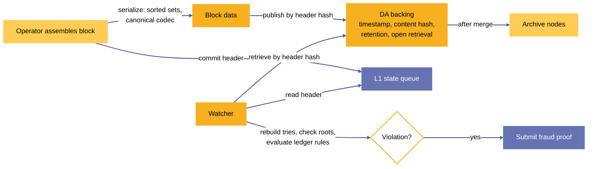

***Figure 12.** Data availability: block serialization, publication to a DA backing, watcher retrieval and verification against the committed header.*

### 6.1 Requirements

A DA backing satisfies Sundial's security model if it provides all of the following for every committed block.

1. **Availability through maturity.** The full block is retrievable from the moment its header is committed to the state queue until the block is merged into the confirmed state, and in any case for at least `maturity_duration` after the header's `end_time`.
2. **Open retrieval.** Any party can retrieve the block without permission and without paying the operator. Retrieval cost, if any, is borne by the retriever at market rates.
3. **Content addressing.** The block is retrievable by its header hash, so a retriever can check the retrieved content against the hash committed on L1 ([§1.1.1](#111-block-header)).
4. **Timestamping.** The backing attests when the block first became retrievable, so that a block published after its maturity period has begun is distinguishable from one published in time.
5. **Reconstructibility.** The retrieved data suffices to reconstruct, off-chain, the Merkelized representation of the block that fraud proofs operate on: the four Merkle Patricia Tries of the block body ([§1.1](#11-block)) and the transaction bodies and witness sets that the hashes in `SundialTx` commit to ([§1.6.4](#164-sundial-transaction-types)).

Requirements 1–3 make fraud detectable; requirement 4 makes withholding attributable; requirement 5 makes every violation of Chapter 5 provable by the fraud proof constructions that name a DA layer proof.

### 6.2 Block serialization and retrieval

**Serialization.** A block is serialized as its header followed by its body. The header hash is the Blake2b-224 hash of the header's Plutus data serialization ([§1.1.1](#111-block-header)). The body is serialized with Sundial's canonical binary codec, whose schema is `cddl-files/codec.cddl` and whose reference implementation is the `midgard-ts` package ([§8](#8-implementation-overview)):

- every field is aligned to an 8-byte boundary, and integers are big-endian, left-padded with zeros to the boundary;
- fixed-size (*static*) fields of a structure are written first, then its variable-size (*dynamic*) fields;
- a sequence writes its length as a 64-bit integer in the static section and its elements in the dynamic section;
- each of the four sets of the block body (`utxos`, `transactions`, `deposits`, `withdrawals`) is written as a sequence of key–value pairs sorted in ascending order on the unique key of each element.

The sort order is part of the serialization: it makes the serialized set canonical, so that every honest party derives the same trie from the same set.

**Trie keys and values.** The Merkle Patricia Trie of each set has one leaf per element:

<a id="table-3"></a>

**Table 3.** Trie keys and values of the block body sets

| Set | Key | Value |
|---|---|---|
| `utxos` | serialized output reference | serialized output |
| `transactions` | transaction id | serialized `SundialTx` |
| `deposits` | deposit id | serialized deposit info |
| `withdrawals` | withdrawal id | serialized withdrawal info |

**Retrieval.** A watcher retrieves a block as follows.

1. Read the state queue from L1 and take a node's key `header_hash` and its `Header` datum.
2. Retrieve the block by `header_hash` from the DA backing. Check that the Blake2b-224 hash of the retrieved header equals `header_hash` and that the retrieved header equals the node's datum.
3. Parse the body's four sorted sets, and rebuild the four tries.
4. Compare each rebuilt root with the corresponding header root using the procedure of [§6.3](#63-root-verification).
5. Reconstruct the block's ledger transition: start from the `utxos` set of the block named by `prev_header_hash` (or from the confirmed state's UTXO set for the first queued block), apply withdrawals, transactions, and deposits in that order ([§1.1](#11-block)), and evaluate the ledger rules of Chapter 5.

A watcher that finds a violation submits the corresponding fraud proof ([§4.3](#43-fraud-proof-computation-threads)) within the block's maturity period.

### 6.3 Root verification

The streaming root verification procedure binds the block data held in the DA layer to the roots in the committed header. It is the mechanism that makes DA fraud provable: whenever a header root differs from the trie root of the data that the DA layer holds, a fraud proof shows the difference onchain.

**Procedure.** The input is a header root $r$ and a sequence of key–value pairs $(k_1, v_1), \dots, (k_n, v_n)$ in ascending key order. The procedure keeps the partially built trie along the path of the most recently inserted key. For each pair in order, it hashes the pair into a leaf, attaches the leaf at its position in the trie, and finalizes every subtrie that the ascending order guarantees complete. After the last pair, it collapses the remaining path into the root $r'$ and accepts iff $r' = r$. Its working state is bounded by the depth of the trie and does not grow with $n$.

**Onchain execution.** The verification splits over the steps of a computation thread ([§4.3](#43-fraud-proof-computation-threads)), so that each L1 transaction processes a bounded chunk of elements within L1's limits on transaction size, computation, and memory. The thread datum carries the partial path between steps. The procedure runs only when a watcher submits a DA fraud proof against a block; honest blocks never invoke it, so its cost falls on the party that proves fraud and is repaid by the fraud prover reward.

**Correspondence checks.** Root verification establishes, for each of the four sets, that the header commits exactly to the DA data. Together with [§5.2.1](#521-rule-block-roots-match-block-data), it makes each of the following provable violations: the UTXO set in the block differs from the header's `utxos_root`, and likewise for the transaction, deposit, and withdrawal sets.

<a id="figure-13"></a>

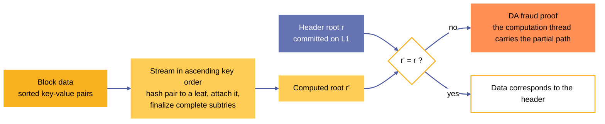

***Figure 13.** Streaming root verification: block data is streamed in ascending key order to compute a root, which is compared with the root committed in the header; a mismatch is proven onchain by a computation thread.*

### 6.4 Storage backing

The protocol requires of a DA backing exactly the interface of [§6.1](#61-requirements): timestamping, content hashing, retention through the maturity period, and open retrieval. The protocol does not bind Sundial to any one substrate. The backings that satisfy the interface are:

- **L1-native transient blob storage.** The settlement L1 stores the block for a bounded retention period, timestamps it, hashes its contents, and serves it to anyone. Retention is secured by the L1's consensus, so every unit of stake that secures the L1 also secures availability. The contents need not be verified by the L1's ledger rules, and the retention period (bounded to the maturity period plus a margin) keeps storage costs orders of magnitude below permanent metadata storage. The correspondence between the stored data and the header roots is verified by the procedure of [§6.3](#63-root-verification); where the L1 exposes blob timestamps and hashes to scripts, the state queue reads them directly.
- **Certified availability.** A stake-weighted quorum of independent parties retrieves each block, checks that it corresponds to the header roots, and signs a certificate, for example with a stake-based threshold multisignature such as Mithril [[5]](#references). The state queue requires every committed header to carry a certificate signed by a quorum of at least `da_multisig_threshold`, so a header whose data has not been published to the quorum cannot be appended. Security rests on the stake represented in the quorum and approaches that of L1 consensus as the quorum's share of total stake approaches one.
- **Operator-served storage.** The operator serves its own blocks over an open interface. It provides content hashing and open retrieval; timestamping and retention are attested by the operator alone. Deployments that select operator-served storage accept that a withholding operator is detectable but not provable onchain.

### 6.5 Archive nodes

Archive nodes store the block data of confirmed blocks. Security properties are easier to achieve for this historical data than for data in the challenge window: at all times, the confirmed state's chained `header_hash` pins the entire history of confirmed blocks, so there is no disagreement about versions of this data. An archive node either stores data that corresponds to the confirmed header hash chain, or it does not.

Every operator keeps a copy of the latest confirmed block's UTXO set, because an operator needs it to create honest blocks and to avoid being slashed for fraudulent ones. Fee revenue on Sundial pays operators for holding it. This UTXO set, together with the block data in the DA layer, is the minimum information required to continue producing blocks. Indexers and other professional service providers store copies of the full historical data and serve historical queries to the extent that users pay for the service. Sundial's security and ongoing block production do not depend on historical data beyond the latest confirmed UTXO set.

## 7 Phase Two Validation

Phase two validation represents the critical stage in Sundial's transaction processing where script evaluation occurs. The scripts are Plutus V3 scripts, which are serialized in the flat format and evaluated as Untyped Plutus Core (UPLC) terms by the CEK machine.

### 7.1 Overview

Phase two validation serves several key purposes:

- Validates the execution of UPLC scripts attached to transactions
- Ensures computational bounds are respected
- Maintains verifiable execution traces for fraud proof construction
- Enables efficient dispute resolution through progressive state hashing

The validation process consists of three main components:

1. State representation and management
2. Off-chain script decoding and preparation
3. Execution validation and fraud proof mechanisms

Each component is designed to maintain verifiability while optimizing for L2 performance constraints. The following sections detail these components and their interactions within the Sundial protocol.

#### 7.1.1 Validation Requirements

For a transaction to pass phase two validation:

- All scripts must be successfully decoded from their byte representation
- Script execution must complete within specified resource bounds
- All state transitions must be cryptographically verifiable
- Execution traces must enable efficient fraud proof construction

### 7.2 State Representation

This section describes how the state is represented during phase two validation, including the data structures and encoding methods used for UPLC evaluation.

#### 7.2.1 Term Representation

The UPLC Term representation uses progressive hashing to maintain compact state while preserving verifiability:

$$
\begin{aligned}
\text{Term} :=&\;
        \text{Variable} (\text{Name}) \\\mid&\;
        \text{Lambda} (\text{Name}, \text{Hash}) \\\mid&\;
        \text{Apply} (\text{Hash}, \text{Hash}) \\\mid&\;
        \text{Constant} (\text{Hash}) \\\mid&\;
        \text{Force} (\text{Hash}) \\\mid&\;
        \text{Delay} (\text{Hash}) \\\mid&\;
        \text{Builtin} (\text{BuiltinFunction})
\end{aligned}
$$

Each Hash in the Term representation refers to another Term that has been previously processed and hashed. This creates a directed acyclic graph (DAG) of Term components where larger structures are decomposed into their constituent parts.

For example, a lambda expression like $\lambda x.\lambda y.[y x]$ would be represented as:

- A Lambda node containing $(x, h_1)$
- Where $h_1$ is the hash of a Lambda node containing $(y, h_2)$
- Where $h_2$ is the hash of an Apply node containing $(h_3, h_4)$
- Where $h_3$ is the hash of a Variable node containing $y$
- Where $h_4$ is the hash of a Variable node containing $x$

#### 7.2.2 Decoding Steps

The conversion from flat-encoded script bytes to the final Term follows a sequence of BytesToTermSteps ([§7.3.3](#733-term-construction-process)). The state that a step transforms is:

$$
\text{DecodingState} := \left\{
    \begin{array}{ll}
        \text{remaining\_bytes} : & \text{ScriptBytes} \\
        \text{partial\_term} : & \text{Term}
    \end{array} \right\}
$$

Each step represents an atomic transformation of one decoding state into the next, with the `transformation_proof` of the step enabling independent verification of that specific step.

#### 7.2.3 Execution Steps

The execution state during UPLC evaluation is represented by the CEK machine state:

$$
\text{CEKState} := \left\{
    \begin{array}{ll}
        \text{term\_hash} : & \text{Hash} \\
        \text{env} : & \text{Environment} \\
        \text{continuation} : & \text{Continuation}
    \end{array} \right\}
$$

Each execution step produces a new CEK state and tracks execution units consumed:

$$
\text{ExecutionStep} := \left\{
    \begin{array}{ll}
        \text{before\_state} : & \text{CEKState} \\
        \text{after\_state} : & \text{CEKState} \\
        \text{execution\_units} : & \text{ExecutionUnits}
    \end{array} \right\}
$$

#### 7.2.4 Execution Trace

The complete execution trace combines the bytes-to-term conversion and CEK machine evaluation. In the following, we use the notation $\mathcal{RH}$ to indicate a root hash of a Merkle-Patricia tree.

$$
\text{ExecutionTrace} := \left\{
    \begin{array}{ll}
        \text{bytes\_to\_term\_steps} : & \mathcal{RH}(\text{[BytesToTermStep]}) \\
        \text{initial\_state} : & \text{CEKState} \\
        \text{steps} : & \mathcal{RH}(\text{[ExecutionStep]})
    \end{array} \right\}
$$

The execution trace is stored in transaction witness sets, as one more field of the `SundialTxWits` record of [§1.6.4](#164-sundial-transaction-types). That section omits the field because it exists only in transactions that carry Plutus scripts:

$$
\text{SundialTxWits} := \left\{
    \begin{array}{ll}
        ... \\
        \text{execution\_traces} : & \quad?\;\mathcal{RH}(\text{Map(RdmrPtr, ExecutionTrace)})
    \end{array} \right\}
$$

This representation allows any step of the trace to be independently verified without requiring access to the complete execution history, enabling efficient fraud proof construction and validation.

### 7.3 Off-chain Decoding

This section details the process of decoding UPLC script bytes into executable Terms during phase two validation.

#### 7.3.1 Byte Format Specification

UPLC scripts are serialized using the flat format, which provides a compact binary representation optimized for blockchain storage. The format consists of:

- Version number (major.minor.patch) encoded as three natural numbers
- Term structure encoded as tagged bit sequences
- Constants encoded based on their type (integers, bytestrings, etc.)
- Built-in functions encoded as 7-bit tags
- De Bruijn indices for variable references
- Padding bits to ensure byte alignment

#### 7.3.2 Decoding Process

The decoding process follows these key steps:

1. Read and validate the version number
2. Parse the term structure by interpreting tag bits:

   - 0011 - Application
   - 0100 - Constants
   - 0111 - Built-in functions
   - etc.
3. Decode constants according to their type tags
4. Resolve built-in function references via their 7-bit tags
5. Construct the final term tree

#### 7.3.3 Term Construction Process

The decoder maintains a `DecodingState` ([§7.2.2](#722-decoding-steps)) during term construction and records each transformation of it as a step:

$$
\text{BytesToTermStep} := \left\{
    \begin{array}{ll}
        \text{step\_type} : & \text{DecodingStepType} \\
        \text{input\_bytes} : & \text{ScriptBytes} \\
        \text{remaining\_bytes} : & \text{ScriptBytes} \\
        \text{partial\_term} : & \text{Term} \\
        \text{transformation\_proof} : & \text{Hash}
    \end{array} \right\}
$$

#### 7.3.4 Decoding Step Types

The DecodingStepType represents the specific transformation being performed:

$$
\text{DecodingStepType} := \left\{
    \begin{array}{ll}
        \text{VersionDecode} : & \text{(major, minor, patch)} \\
        \text{TermTagDecode} : & \text{TagBits} \\
        \text{TypeTagDecode} : & \text{[TypeTag]} \\
        \text{ConstantDecode} : & \text{Type} \times \text{Value} \\
        \text{BuiltinDecode} : & \text{BuiltinTag} \\
        \text{PaddingValidate} : & \text{PaddingBits}
    \end{array} \right\}
$$

#### 7.3.5 Transformation Proofs

Each step's transformation_proof must demonstrate:

- Valid consumption of input bytes according to the format specification
- Correct interpretation of decoded values
- Proper handling of any padding or alignment requirements
- Maintenance of the well-formed term structure

For example, a ConstantDecode proof must show:

- The type tag list was properly terminated
- The constant value matches its declared type
- Any required padding was correctly handled
- The remaining bytes are properly aligned

#### 7.3.6 Validation Chain

The complete decoding process produces a sequence of BytesToTermSteps that can be independently verified. This enables:

- Detection of malformed script bytes
- Identification of specific decoding failures
- Construction of fraud proofs for invalid transformations
- Verification of the complete decoding process

#### 7.3.7 Transformation Types

Different term types require specific decoding transformations:

- Constants - Decoded based on type tags and specific encoding rules
- Applications - Recursively decode function and argument terms
- Built-ins - Lookup via 7-bit tag table
- Variables - Convert de Bruijn indices to term references

#### 7.3.8 Validation Requirements

The decoder must enforce several validation rules:

- Version compatibility check
- Well-formed term structure
- Valid constant values
- Recognized built-in functions
- Proper scope for de Bruijn indices
- Complete byte consumption (no trailing data)

### 7.4 Fraud Proofs in UPLC Evaluation

This section details the fraud proofs involved in UPLC evaluation, focusing on single-step verification of state transitions.

#### 7.4.1 Types of Fraud Proofs

The system supports these categories of fraud proofs:

- **Decoding Fraud** Proofs of invalid script byte decoding:

  - Invalid byte format
  - Size limit violations
  - Reference resolution failures
- **Execution Fraud** Proofs of invalid UPLC execution:

  - Resource limit violations
  - Invalid state transitions
  - Incorrect execution results

#### 7.4.2 Single-Step Verification

The fraud proof system verifies individual state transitions:

$$
\begin{aligned}
    \forall s_1, s_2 \in \text{CEKState}: & \text{ claimed\_transition}(s_1 \rightarrow s_2) \text{ valid } \iff \\
    & \text{compute\_next\_state}(s_1) = s_2
\end{aligned}
$$

To prove a violation:

- The challenger presents the claimed before state ($s_1$) and after state ($s_2$), with membership proofs against the trace root that the operator committed to, taken from the data availability layer
- The onchain verifier computes the actual next state from $s_1$
- If the computed state differs from $s_2$, the transition is invalid
- No additional trace information is required

#### 7.4.3 Proof Data Structure

The fraud proof structure is minimal:

$$
\text{FraudProof} := \left\{
    \begin{array}{ll}
        \text{step\_number} : & \mathbb{N} \\
        \text{before\_state} : & \text{CEKState} \\
        \text{claimed\_after\_state} : & \text{CEKState} \\
        \text{actual\_after\_state} : & \text{CEKState}
    \end{array} \right\}
$$

#### 7.4.4 Verification Process

The verification process is straightforward:

1. Verify the before state matches the operator's claim
2. Compute one step from the before state
3. Compare computed result with operator's claimed after state
4. If they differ, the fraud proof is valid

#### 7.4.5 Security Considerations

The single-step verification approach provides several benefits:

- Minimal proof size
- Constant-time verification
- No complex challenge periods needed
- Deterministic outcomes

Security guarantees include:

- No false positives (valid transitions cannot be proven invalid)
- No trace reconstruction required
- Immediate verification of claims
- Protection against computational waste attacks

### 7.5 Relationship to the transaction type and the rule engine

Phase two validation completes the design that the transaction type and the rule engine begin. The Sundial transaction type carries redeemers, Plutus V3 scripts, and a script data hash ([§1.6.3](#163-sundial-simplified-transaction-types), [§1.6.4](#164-sundial-transaction-types)), and this chapter specifies how the execution of those scripts is validated and disputed. The rules of [§5.1](#51-sundial-ledger-rules-and-fraud-proofs) and the rule engine of [§11](#11-ledger-rule-engine) are the phase one rules: they evaluate a transaction's structure, signatures, fees, value, and native scripts without executing Plutus scripts. A transaction whose validity depends on script execution therefore passes phase one first and is then subject to the fraud proofs of this chapter. An engine that does not evaluate phase two rejects a transaction that carries redeemers, Plutus V3 scripts, or a script data hash at admission (rule R3, [§11.1](#111-phase-a-stateless-rules)), so that no transaction enters a block whose script execution nobody validates.

# Part II — Implementation

Part II describes the node that implements the off-chain half of the protocol. It is written against the packages under `demo/` in the repository.

## 8 Implementation overview

Part I specifies the Sundial protocol. Part II describes the node that realizes the off-chain half of it: the software that receives L2 transactions, validates them against the ledger rules, assembles blocks, commits their headers to the L1 state queue, and merges mature blocks into the confirmed state. It is written against the packages under `demo/` in the repository.

### 8.1 Realization of the protocol

The protocol is realized in three layers of artifacts ([Figure 3](#figure-3)).

<a id="table-4"></a>

**Table 4.** Layers of the protocol realization

| Layer | Artifact | Content |
|---|---|---|
| Formal specification | `technical-spec/Lean4Midgard/` | Lean 4 models of the state machines of the state queue, scheduler, operator directory, settlement, user events, and the fraud proof catalogue; the technical specification of Part I in `technical-spec/`. |
| Validator implementation | `onchain/aiken/`, `onchain/plutarch/` | Aiken (Plutus V3) validators and libraries for the linked-list state queue, operator directory, scheduler, settlement, user events, and multi-step fraud proofs; Plutarch Merkle proof helper scripts. |
| Node implementation | `demo/midgard-node`, `demo/midgard-sdk`, `demo/midgard-ts` | The sequencer, ledger rule engine, block production, L1 commitment, merge, RPC surface, and observability. |

### 8.2 Technology

The node is an Effect-based [[10]](#references) TypeScript application (ESM, Node.js 18 or later). It uses [Lucid Evolution](https://anastasia-labs.github.io/lucid-evolution) [[9]](#references) for L1 access through either a Kupo and Ogmios pair (`L1_PROVIDER=Kupmios`) or a Blockfrost endpoint (`L1_PROVIDER=Blockfrost`); PostgreSQL 15 or later for the relational projection of ledger state; LevelDB-backed Merkle Patricia Tries for the ledger and mempool state roots; and Redis Streams [[11]](#references) for durable transaction ingress. Configuration is read from the environment ([Appendix C](#appendix-c-protocol-parameters)).

### 8.3 Package boundaries

<a id="table-5"></a>

**Table 5.** Packages of the implementation

| Package | Path | Responsibility |
|---|---|---|
| `midgard-node` | `demo/midgard-node` | The runtime: HTTP RPC surface, background fibers, worker threads, PostgreSQL access, block commitment and submission, L1 user-event synchronization, merge, monitoring. |
| `midgard-sdk` | `demo/midgard-sdk` | L1 transaction construction: protocol parameters, ledger-state and datum schemas, linked lists, initialization, state queue, scheduler, operator directories, user events, settlement, fraud proof types. Published to the node as the `@al-ft/midgard-sdk` package. |
| `midgard-ts` | `demo/midgard-ts` | The canonical binary codec for blocks, transactions, outputs, deposits, and withdrawals; the ledger rule engine ([§11](#11-ledger-rule-engine)). |
| `midgard-manager` | `demo/midgard-manager` | The command-line interface, a transaction generator for load, the scalability harness, and the reliability report generator ([§17](#17-observability-and-service-objectives), [§18](#18-performance)). |

The packages keep their `midgard-*` directory names and the `@al-ft/midgard-sdk` package name.

### 8.4 Contract set

The node derives every validator address and policy id it uses from a compiled Plutus blueprint set that it loads at startup. The blueprint set of the reference testnet is `demo/midgard-node/blueprints/always-succeeds`, a compiled Aiken project. There the ledger rules of Chapter 5 are enforced by the node's rule engine ([§11](#11-ledger-rule-engine)) and block production ([§12](#12-block-production)).

## 9 Node architecture

The node is structured as a set of concurrent components that share a small number of stores. This chapter describes the components, the worker threads that run CPU-bound work, the role model that lets each part of the pipeline scale independently, and the startup sequence.

### 9.1 Concurrent components

The node runs its work as concurrent Effect fibers within a single process. Each fiber repeats its action on a fixed spacing (the delay between the end of one run and the start of the next), and a failed run is logged and retried on the next tick without stopping the fiber. [Figure 14](#figure-14) shows the fibers, the worker-thread pools, and the shared stores.

<a id="table-6"></a>

**Table 6.** Node fibers, cadences, and sources

| Fiber | Purpose | Default cadence (variable) | Source |
|---|---|---|---|
| block-commitment | Assembles a block from pending events and stores its L1 commitment. | 500 ms (`WAIT_BETWEEN_BLOCK_COMMITMENTS`) | `src/fibers/block-commitment.ts` |
| block-submission | Submits the earliest unsubmitted block's L1 commitment and advances the ledger projections. | 1,000 ms (`WAIT_BETWEEN_BLOCK_SUBMISSIONS`) | `src/fibers/block-submission.ts` |
| merge | Merges the oldest committed block into the confirmed state. | 10,000 ms (`WAIT_BETWEEN_MERGE_TXS`) | `src/fibers/merge.ts` |
| sync-user-events | Imports deposit, transaction order, and withdrawal order UTXOs from L1. | 10,000 ms (`WAIT_BETWEEN_USER_EVENT_FETCHES`) | `src/fibers/sync-user-events.ts` |
| tx-queue-processor | Consumes the ingress stream, parses and validates transactions, and inserts them into the mempool. | 250 ms (`TX_QUEUE_PROCESSOR_INTERVAL_MS`), one loop per consumer (`TX_QUEUE_CONSUMER_WORKER_COUNT`, default 1) | `src/fibers/tx-queue-processor.ts` |
| monitor-mempool | Publishes the mempool size gauge (runs with monitoring enabled). | 1,000 ms | `src/fibers/monitor-mempool.ts` |

<a id="figure-14"></a>

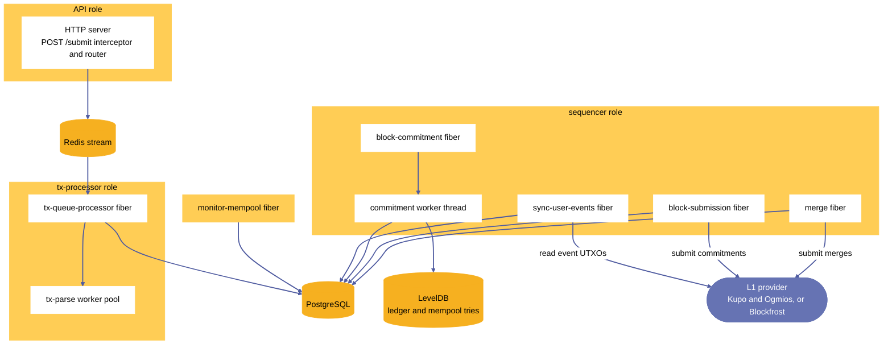

***Figure 14.** Node architecture: six concurrent Effect fibers and two worker-thread pools over the shared Redis, PostgreSQL, and LevelDB Merkle Patricia Trie stores.*

Two auxiliary components complete the set. A metrics-refresh fiber (`txQueueMetricsRefreshFiber`) samples the ingress stream gauges on a node that runs the `api` role without the `tx-processor` role. A seeding routine (`src/fibers/seed-blocks-db-from-chain.ts`) rebuilds the blocks table from the L1 state queue when the node starts against a queue that already holds blocks.

### 9.2 Worker threads

Two components run CPU-bound work in Node.js worker threads so that the event loop that serves HTTP and drives the fibers stays responsive.

- **Block commitment worker** (`src/workers/block-commitment.ts`). A single persistent worker thread holds its database connection, Lucid client, and trie storage open across commitment cycles. A semaphore admits one commitment request at a time. Each request carries a timeout (`COMMITMENT_WORKER_TIMEOUT_MS`, 300,000 ms by default). On timeout, on an error event, or on an unexpected exit, the node terminates the worker, fails the pending request, and spawns a fresh worker for the next cycle.
- **Transaction parse pool** (`src/workers/tx-parse.ts`, `src/fibers/tx-parse-worker-pool.ts`). A pool of worker threads decodes transaction CBOR. Requests are distributed round-robin over the pool's slots, and the pool's concurrency is `TX_PARSE_CONCURRENCY` (8 by default). A worker that exits unexpectedly is replaced in its slot; a deliberate reset or shutdown marks each slot terminated first, so that the replacement logic does not respawn into a pool that is being torn down.

### 9.3 Role model

The `NODE_ROLE` variable selects which components a process runs. The roles let each part of the pipeline scale on its own.

<a id="table-7"></a>

**Table 7.** Node roles

| `NODE_ROLE` | Runs | HTTP routes served |
|---|---|---|
| `all` (default) | API, tx-processor, and sequencer components in one process | All 18 routes |
| `api` | HTTP ingress, health endpoints, ingress-queue producer | `/health/live`, `/health/ready`, `/commit`, `/stateQueue/root-unit-diagnostics`, `/commitment-wallet/balance`, `POST /submit`, `POST /faucet/claims` |
| `tx-processor` | Redis consumer group processing, CBOR parsing, mempool validation and insertion | none |
| `sequencer` | User-event synchronization, block commitment, block submission, merge, genesis programs | none |

PostgreSQL access uses two connection pools with the same credentials. The RPC pool (20 connections at most) serves HTTP queries and the tx-processor. The sequencer pool (5 connections at most) is reserved for the commitment, submission, merge, and synchronization fibers, so that bursts of read traffic cannot exhaust the connections that block production needs.

### 9.4 Startup

At startup the node reads its configuration, creates the ingress consumer group if the role needs it, initializes the PostgreSQL tables, and, when it runs the sequencer role, executes the genesis program. It then starts the HTTP server (API role), the sequencer fibers (sequencer role), the tx-processor and mempool monitor (as the role dictates), and, with the `--with-monitoring` flag, the Prometheus exporter and the OTLP trace exporter ([§17](#17-observability-and-service-objectives)).

## 10 Transaction ingress

Transaction ingress carries an L2 transaction from a client to the mempool with durable, at-least-once delivery. It is the boundary that decides how much load the node accepts, and its behavior under load is what [§18](#18-performance) measures.

<a id="figure-15"></a>

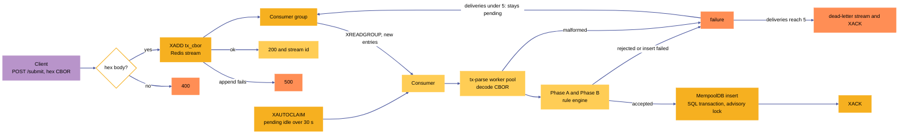

***Figure 15.** Transaction ingress: hex validation, durable queueing on a Redis stream, consumer-group processing with XAUTOCLAIM recovery, a bounded number of delivery attempts, and a dead-letter stream.*

### 10.1 Submission

A client submits a transaction with `POST /submit`. The request body is the transaction's CBOR encoding as a hex string. A raw interceptor attached to the HTTP server handles every `POST /submit` before the router sees it: it reads the body, checks that it is a hex string, appends it to the Redis stream, and answers. The interceptor validates only the hex form; it does not decode the transaction.

| Outcome | Response |
|---|---|
| Body is a hex string and the stream append succeeds | `200`, with the stream entry id in the body |
| Body is not a hex string | `400 {"error":"Invalid CBOR provided"}` |
| The stream append fails | `500 {"error":"Failed to enqueue transaction"}` |

A `200` response confirms that the transaction is durably queued. It does not confirm that the transaction decoded, passed validation, or entered a block. A client observes acceptance with `GET /tx?tx_hash=…` ([§15](#15-node-api)).

### 10.2 Durable queue

The ingress queue is a Redis stream (`REDIS_STREAM_KEY`, default `midgard:tx-submissions`) read through a consumer group (`REDIS_STREAM_CONSUMER_GROUP`, default `midgard-tx-processors`). Each entry has one field, `tx_cbor`. The consumer group gives every entry to exactly one consumer at a time and tracks it as pending until the consumer acknowledges it. Delivery is at-least-once: a transaction that fails or whose consumer stops is delivered again. Resubmission of identical CBOR is safe, because a transaction's hash identifies it and a second copy is recognized as a duplicate.

### 10.3 Consumption and recovery

Each consume cycle of a tx-processor consumer performs the following steps.

1. Sample the stream depth, pending count, and consumer lag for the ingress gauges.
2. Reclaim stalled entries with `XAUTOCLAIM`: entries that another consumer left pending for longer than `TX_QUEUE_CLAIM_IDLE_MS` (30,000 ms) are claimed by this consumer, up to `TX_QUEUE_CLAIM_BATCH_SIZE` (100) per cycle.
3. Read new entries with `XREADGROUP … BLOCK`, blocking up to `REDIS_STREAM_BLOCK_MS` (1,000 ms), so that the cycle fills its batch of `TX_QUEUE_DRAIN_BATCH_SIZE` (100) entries with reclaimed and fresh entries together. A dedicated Redis connection serves the blocking read so that acknowledgements and claims never queue behind it.
4. Process the batch in chunks of 100 entries.

If the consumer group does not exist (`NOGROUP`), the consumer recreates it and returns an empty batch.

### 10.4 Processing

For each chunk, the consumer decodes every transaction in the parse worker pool ([§9.2](#92-worker-threads)) and then validates the decoded transactions together with the ledger rule engine ([§11](#11-ledger-rule-engine)) as one batch against the mempool ledger. `MempoolDB.validateAndInsertMultiple` runs the whole batch in one SQL transaction under a PostgreSQL advisory lock. It canonicalizes duplicates by transaction hash and rejects a second, different CBOR that hashes to an identifier already present (`E_DUPLICATE_TX_ID_CONFLICT`). Accepted transactions are inserted into the mempool together with their effects (spent inputs, produced outputs, touched addresses), which the block commitment path later reads instead of re-parsing the CBOR. Entries are acknowledged only after the insert is durable.

### 10.5 Failure handling

A transaction that cannot be decoded (`malformed_cbor`), that fails validation (`validation_rejected:<code>`), or whose insert fails is not acknowledged. It stays pending and is delivered again after `TX_QUEUE_CLAIM_IDLE_MS`. Once an entry's delivery count reaches `TX_QUEUE_MAX_DELIVERY_ATTEMPTS` (5), the node appends it to the dead-letter stream (`TX_QUEUE_DEAD_LETTER_STREAM`, default `midgard:tx-submissions:dead-letter`) and acknowledges the original entry. A dead-letter entry records the original stream and message id, the transaction CBOR, the delivery count, the failure time in milliseconds, and the reason. A single malformed or invalid transaction therefore never blocks other transactions in its batch or destabilizes the worker pool.

### 10.6 Rejection and backpressure paths

Ingress rejects work on three paths and applies backpressure on a fourth.

1. **Malformed body.** `POST /submit` answers `400` when the body is not a hex string.
2. **Enqueue failure.** `POST /submit` answers `500` when Redis does not accept the append.
3. **Asynchronous rejection.** A queued transaction that fails decoding or validation follows the retry and dead-letter path of [§10.5](#105-failure-handling).
4. **Commitment backpressure.** The commitment fiber skips a cycle while the number of blocks that are committed but not yet submitted exceeds `COMMITMENT_MAX_UNSUBMITTED_BLOCK_BACKLOG` (0 by default, which skips whenever a block awaits submission). Transactions keep entering the mempool during skipped cycles.

Deployments place request-size and rate limits in front of the node ([§19.4](#194-operator-key-custody-and-deployment-controls)).

## 11 Ledger rule engine

The ledger rule engine validates L2 transactions against the ledger rules of Chapter 5 at mempool admission. It lives in `demo/midgard-ts/src/validation/` and runs in two phases over a batch of transactions. [§5.3](#53-rule-enforcement-map) maps each ledger rule to the engine rule that enforces it; this chapter describes the engine's structure and execution.

<a id="figure-16"></a>

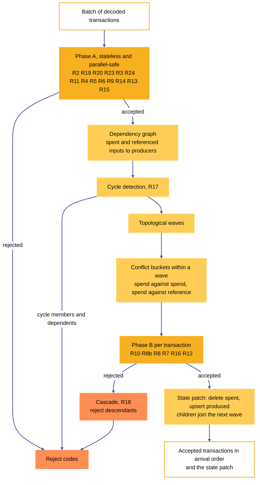

***Figure 16.** The ledger rule engine: stateless Phase A, dependency graph and cycle detection, topological waves with conflict-bucket parallelism, and cascade rejection of descendants.*

### 11.1 Phase A: stateless rules

Phase A validates each transaction on its own. It needs no ledger state, so its checks are independent across transactions and safe to run in parallel. It applies these rules in this order:

<a id="table-8"></a>

**Table 8.** Phase A rules of the engine

| Rule | Check |
|---|---|
| R2 | The transaction's hash, recomputed from the decoded body, equals the identifier under which it was submitted. |
| R19 | `is_valid` is `True`. |
| R20 | No auxiliary data hash is present. |
| R23 | The `mint` field is absent or empty. |
| R3 | Redeemers, Plutus V3 scripts, and a script data hash are absent. |
| R24 | When the body carries a `network_id`, it equals the instance network id. |
| R11 | The fee is at least `min_fee_a × size + min_fee_b`, where `size` is the byte length of the transaction's CBOR encoding. |
| R4 | The transaction has at least one input. |
| R5 | No input appears twice. |
| R6 | Every output has a non-negative coin quantity, and output values sum without overflow. |
| R9 | The validity interval is well-formed. |
| R14 | Every verification-key witness verifies against the transaction body hash. |
| R13 | Every entry of `required_signers` has a verification-key witness. |
| R15 | Every native script decodes, and evaluates to success against the validity interval and the witness key hashes. |

R21 (no certificates) and R22 (no withdrawals) hold by construction, because the transaction type has no certificates field and no withdrawals field; observer scripts travel in `required_observers`. The fee rule measures the CBOR size of the transaction and not the size of the node's internal 8-byte-aligned encoding, which is larger: a transaction that pays the textbook L1 minimum fee for its wire size is accepted.

Phase A returns, for each accepted transaction, the data that Phase B needs: its fee, validity bounds, reference inputs, output value sum, witness key hashes, native script hashes, spent references, and produced entries.

### 11.2 Phase B: stateful rules

Phase B validates the Phase A survivors as a batch against a UTXO pre-state, the mempool ledger. Its rules are:

<a id="table-9"></a>

**Table 9.** Phase B rules of the engine

| Rule | Check |
|---|---|
| R7 | Every spent input exists in the pre-state or is produced by an earlier accepted transaction of the same batch. |
| R8 | No input is spent by two accepted transactions. |
| R8b | Every reference input exists in the pre-state and is not spent by the same transaction. |
| R10 | The validity interval contains the current time. |
| R12 | Value is preserved: (Σ inputs − fee) − Σ outputs = 0 over coin and multi-assets. |
| R16 | Every spent input at a key-hash address has a verification-key witness for that key, and every spent input at a script address has a native-script witness. |
| R17 | No transaction participates in a dependency cycle. |
| R18 | A transaction that depends on a rejected transaction is rejected. |

### 11.3 Execution model

Phase B executes the batch as follows.

1. **Dependency graph.** A transaction is a child of every transaction in the batch that produces an output it spends or references.
2. **Cycle detection (R17).** A topological pass removes nodes with no unresolved parents; any node left over lies on a cycle or depends on one, and is rejected with `E_DEPENDENCY_CYCLE` before validation starts.
3. **Topological waves.** The engine processes the graph in waves: the first wave holds the transactions without pending parents, and accepting a transaction releases its children into the next wave.
4. **Conflict-bucket parallelism.** Within a wave, transactions are partitioned into buckets so that no two transactions in one bucket conflict, where two transactions conflict if one spends an input that the other spends or references. Decisions inside a bucket are independent of each other and can be evaluated in parallel.
5. **State patch.** Accepting a transaction records its spent references as deleted and its produced entries as upserted in a patch that later transactions of the batch read through, so the batch sees its own effects. The engine returns the patch with its result.
6. **Cascade rejection (R18).** Rejecting a transaction rejects, with `E_DEPENDS_ON_REJECTED_TX`, every pending descendant of it. A transaction that remains pending after all waves has an unresolvable ancestor and is rejected the same way.
7. **Order.** Accepted transactions are returned in arrival order.

### 11.4 Reject codes

The engine reports 21 reject codes, listed with their meaning and governing rule in [Appendix D](#appendix-d-reject-code-reference). The node prefixes a code with `validation_rejected:` when it records why a queued transaction was rejected ([§10.5](#105-failure-handling)).

### 11.5 Configuration

The admission configuration fixes `min_fee_a = 44`, `min_fee_b = 155381`, and the expected network id, which is `1` on `Mainnet` and `0` on every other network. [Appendix C](#appendix-c-protocol-parameters) lists these ledger parameters with the protocol parameters.

## 12 Block production

Block production turns the mempool and the imported L1 user events into blocks, commits each block's header to the state queue, and merges mature headers into the confirmed state.

<a id="figure-17"></a>


***Figure 17.** Block lifecycle in the node: a block is created UNSUBMITTED, marked SUBMITTING before any L1 interaction, and SUBMITTED after its commitment; a restart returns a SUBMITTING block to UNSUBMITTED; the merge fiber completes the block on L1.*

### 12.1 Commitment window and batching policy

Each commitment cycle covers a window that starts at the `end_time` of the latest block and ends at the current time. The cycle selects the events of the window:

- the withdrawal orders, transaction orders, and deposits whose inclusion times fall inside the window, imported by the user-event synchronization fiber;
- the transaction requests in the mempool, up to `COMMITMENT_MAX_TX_REQUESTS_PER_BLOCK` (2,000 by default).

A window without events produces no block. A window that holds only transaction requests can be deferred to fill blocks. The batching policy (`src/workers/utils/commitment-batching-policy.ts`) delays a window if and only if all of the following hold: the window holds at least one transaction request; it holds no L1 user event; it holds fewer than `COMMITMENT_MIN_TX_REQUESTS_PER_BLOCK` (1 by default) transaction requests; `COMMITMENT_MAX_WAIT_MS` (0 by default) is positive; and the window is younger than `COMMITMENT_MAX_WAIT_MS`. The maximum wait bounds every deferral, so batching cannot postpone a commitment beyond it.

**A window that contains any L1 user event bypasses batching entirely.** The protocol assigns inclusion times to L1 events so that operators cannot delay them ([§2](#2-user-event-protocol)); the batching policy never trades that timing for fee efficiency.

The worker also records warning thresholds for a window (`COMMITMENT_WINDOW_WARN_TX_REQUESTS`, `COMMITMENT_WINDOW_WARN_TOTAL_EVENTS`, `COMMITMENT_WINDOW_WARN_TOTAL_BYTES`) and logs a warning when a window reaches one.

### 12.2 Block body assembly

The worker applies the window's events to the ledger trie in this order:

1. withdrawals, which remove the withdrawn outputs;
2. transaction orders, which spend their inputs and create their outputs;
3. transaction requests, in the same manner;
4. deposits, which create the deposited outputs.

This is the order of [Figure 4](#figure-4): transaction orders precede transaction requests so that orders, which cost more to create, are not marked invalid in favor of requests. The application is atomic. The worker checkpoints the ledger trie before applying events and reverts it if any step fails, and it writes the block entry and the mempool-ledger projection in one SQL transaction.

### 12.3 Roots

The worker computes the four roots of the header from four tries:

- `utxos_root`, the root of the ledger trie after all events are applied; its keys are output references and its values are outputs;
- `transactions_root`, the root of the trie of the window's transactions, orders and requests together;
- `deposits_root` and `withdrawals_root`, the roots of the tries of the window's deposit and withdrawal events.

The ledger and mempool tries are Merkle Patricia Tries from the `@ethereumjs/mpt` package, persisted in LevelDB under `LEDGER_MPT_DB_PATH` and `MEMPOOL_MPT_DB_PATH`.

### 12.4 Header and L1 commitment

The header takes `prev_utxos_root` and `prev_header_hash` from the previous block, `start_time` from the previous block's `end_time`, the four roots above, `end_time` from the window end, the operator's verification key hash, and the protocol version. The header hash is the Blake2b-224 hash of the header's Plutus data serialization ([§1.1.1](#111-block-header)). The worker builds an L1 transaction that appends the header to the state queue ([§3.4.2](#342-minting-policy), Commit Block Header) and stores the block with that transaction's CBOR and the status `UNSUBMITTED`. The block-commitment operator wallet (`L1_OPERATOR_SEED_PHRASE_FOR_BLOCK_COMMITMENT`) signs the transaction at submission.

### 12.5 Submission

The submission fiber processes the earliest block that has not been submitted.

1. It sets the block's status to `SUBMITTING` before any L1 interaction, so that a restart can tell a block never tried from a block in flight.
2. It checks whether the commitment is already on L1 by looking for any of the transaction's produced UTXOs. A hit means an earlier attempt landed after a timeout; the block then skips submission.
3. It signs the transaction, reusing signed CBOR persisted from an earlier attempt, and submits it, bounded by `SUBMIT_SIGNED_TX_TIMEOUT_MS` (30,000 ms). A submission error whose text shows that the inputs are already spent is treated as a candidate for idempotent success and confirmed by the same produced-UTXO check.
4. On success it applies the block's events to the latest ledger, moves the block's mempool transactions to the immutable table, records the block-to-transaction mapping and address history, and sets the status to `SUBMITTED`. The projection updates run in batches whose size adapts to the block: 250 items for fewer than 1,000, 1,000 up to 5,000, 2,500 up to 20,000, and 5,000 beyond.

### 12.6 Lifecycle and crash recovery

The block status values are `UNSUBMITTED`, `SUBMITTING`, and `SUBMITTED`. The commitment worker creates blocks as `UNSUBMITTED`; the submission fiber moves them through `SUBMITTING` to `SUBMITTED`; and the merge path completes a block by removing its transaction mapping and updating the confirmed ledger ([§12.7](#127-merge)).

On startup the node resets every block left in `SUBMITTING` to `UNSUBMITTED`, so that the submission fiber retries it under the produced-UTXO check of [§12.5](#125-submission). The node observes its own commitments through the idempotency counters `l1_commitment_precheck_confirmed_total` and `l1_commitment_idempotent_recovered_total`.

### 12.7 Merge

The merge fiber advances the confirmed state.

1. It reads the length of the state queue from L1. The reading is cached in memory and refreshed when older than 30 minutes.
2. When the queue holds fewer than 8 blocks, it does nothing. When it holds 8 or more, it fetches the confirmed state and the first block of the queue.
3. It reads the first block's transactions from the block-to-transaction mapping, builds and signs a Merge To Confirmed State transaction ([§3.4.2](#342-minting-policy)) with the merge operator wallet (`L1_OPERATOR_SEED_PHRASE_FOR_MERGE_TX`), and submits it. The state queue validator requires the block to be mature: the transaction's validity lower bound must reach the header's `end_time` plus `maturity_duration` ([Appendix C](#appendix-c-protocol-parameters)).
4. After the submission it applies the block's transactions to the confirmed ledger (deleting spent UTXOs, inserting produced ones) and removes the block's entries from the block-to-transaction mapping.

`GET /merge` runs the same action on demand.

## 13 Data model

The node keeps its state in PostgreSQL tables and two LevelDB-backed Merkle Patricia Tries. The tables are instances of a few reusable shapes: *ledger* tables hold UTXOs (`tx_id`, `outref`, `output`, `address`, and a timestamp), *transaction* tables hold transaction CBOR keyed by hash, and *user-event* tables hold L1 events with their inclusion time.

<a id="figure-18"></a>

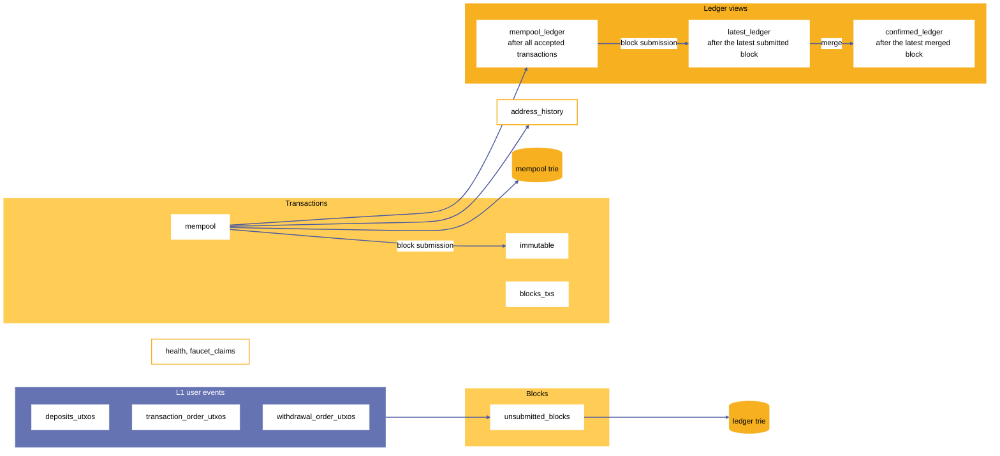

***Figure 18.** Data model: 13 PostgreSQL tables grouped by role, the three ledger views (mempool, latest, confirmed), and the two LevelDB-backed Merkle Patricia Trie stores.*

### 13.1 Tables

<a id="table-10"></a>

**Table 10.** PostgreSQL tables of the node

| Role | Table | Content |
|---|---|---|
| Transactions | `mempool` | Transactions accepted by the rule engine and not yet in a submitted block, with their effects. |
| | `immutable` | Transactions of submitted blocks. |
| | `blocks_txs` | Mapping from block header hash to the hashes of the block's transactions. |
| Ledger views | `mempool_ledger` | The ledger after all accepted mempool transactions. |
| | `latest_ledger` | The ledger after the latest submitted block. |
| | `confirmed_ledger` | The ledger of the confirmed state. |
| Blocks | `unsubmitted_blocks` | Every block the node has committed: height, header hash, event interval, signed L1 commitment CBOR, status, and event counts and sizes. |
| L1 user events | `deposits_utxos` | Deposit UTXOs imported from L1. |
| | `transaction_order_utxos` | Transaction order UTXOs imported from L1. |
| | `withdrawal_order_utxos` | Withdrawal order UTXOs imported from L1. |
| Queries | `address_history` | One row per transaction, withdrawal, or deposit that touches an address, with a status. |
| Operations | `health` | The readiness probe target. |
| | `faucet_claims` | Testnet faucet claims, for idempotency and rate limits. |

### 13.2 Ledger views

Three ledger views coexist because a block passes through several stages between acceptance and confirmation. The **mempool ledger** is the most current view: it contains the effects of every transaction the node has accepted, and it answers `GET /utxos`. The **latest ledger** is the ledger after the newest block whose commitment the node has submitted to L1. The **confirmed ledger** is the ledger after the newest block that the merge fiber has merged. A block's transactions therefore move from `mempool` to `immutable` and from the mempool view into the latest view at submission, and into the confirmed view at merge. A separate ledger trie holds the state after the newest committed block; its root is the `utxos_root` of the next header.

### 13.3 Merkle Patricia Trie stores

Two LevelDB-backed tries persist across restarts: the **ledger trie** (`LEDGER_MPT_DB_PATH`) and the **mempool trie** (`MEMPOOL_MPT_DB_PATH`), the latter accumulating the transactions of the window that the next block contains. After an unclean shutdown, the node checks each store on startup and recovers it. `GET /reset` removes both stores together with the projections.

### 13.4 Address history

`address_history` records, per address, each event that touched it: a transaction (type `TX`), a withdrawal, or a deposit. A row starts as `SLATED` when the transaction enters the mempool and becomes `SUBMITTED` when its block's commitment is submitted. `GET /txs` pages through the rows of an address, at 100 rows by default and at most 500.

## 14 SDK and L1 transaction construction

The SDK (`@al-ft/midgard-sdk`) is the off-chain library that builds L1 transactions for the protocol's validators. It has no HTTP server, database, or queue. Each operation is an Effect program that takes a Lucid Evolution instance and returns a transaction builder (`incomplete…TxProgram`) or a signable transaction (`unsigned…TxProgram`).

### 14.1 Module map

<a id="table-11"></a>

**Table 11.** Modules of the SDK

| Module | Content |
|---|---|
| `protocol-parameters` | Per-network protocol parameters ([Appendix C](#appendix-c-protocol-parameters)). |
| `ledger-state` | Datum schemas for `Header`, `ConfirmedState`, deposit, withdrawal, and transaction events. |
| `linked-list`, `internals`, `common` | The linked-list element schema (Appendix A), authenticated-UTXO types, validator descriptors. |
| `initialization` | The single-transaction protocol initialization ([§14.2](#142-initialization)). |
| `state-queue` | State queue datums, redeemers, fetchers, sorting of queue UTXOs, block header hashing, and the Commit Block Header, Merge To Confirmed State, and Init transactions. |
| `scheduler`, `registered-operators`, `active-operators`, `retired-operators` | Datums, redeemers, fetchers of authenticated UTXOs, and Init transactions. |
| `hub-oracle` | The hub oracle datum, its fetcher, and its Init transaction. |
| `user-events/{deposit,withdrawal,tx-order}` | Event datums, fetchers over an inclusion-time range, and the transactions that create a deposit, a withdrawal order, and a transaction order. |
| `settlement` | The settlement datum, resolution claim, and the Attach Resolution Claim, Disprove Resolution Claim, and Resolve transactions. |
| `fraud-proof` | Catalogue, computation thread, and fraud proof token datum and redeemer schemas. |

### 14.2 Initialization

A single transaction initializes a Sundial instance. It spends a nonce UTXO from the operator wallet, which parametrizes and authorizes the instance ([§3.8](#38-sundial-hub-oracle)). It sets its validity interval to end at the current time plus five minutes, and that upper bound becomes the genesis time. It composes the Init transactions of the hub oracle, the state queue (with the genesis confirmed state), the registered, active, and retired operator lists, the scheduler, and the fraud proof catalogue, whose Merkle Patricia Trie root is computed from the four category validators in catalogue order ([§4.1.3](#413-catalogue-entries)). The node's `GET /init` builds, signs, and submits this transaction.

### 14.3 L1 transaction catalogue

The L1 transactions of the protocol and the validator redeemers that enforce them are:

<a id="table-12"></a>

**Table 12.** L1 transactions of the protocol

| Transaction | Enforced by (redeemers) |
|---|---|
| Initialize the instance | hub oracle Init and the Init redeemers of every list, the scheduler, and the catalogue |
| Register an operator | registered operators: Register Operator |
| De-register an operator | registered operators: Deregister Operator |
| Remove a duplicate registrant | registered operators: Slash Duplicate Operator |
| Activate an operator | registered operators and active operators: Activate Operator |
| Retire an operator | active operators and retired operators: Retire Operator, with the reason `Voluntary`, `Inactivity`, or `UnderBonded` |
| Increase an operator's bond | active operators: Increase Bond |
| Recover an operator bond | retired operators: Recover Operator Bond |
| Advance / rewind the scheduler | scheduler: Go to Next, Rewind |
| Trigger the escape hatch | escape hatch: Trigger Escape Hatch |
| Commit a block header | state queue: Commit Block Header; active operators: Update Bond Hold New State |
| Remove a fraudulent block header | state queue: Remove Fraudulent Block Header; active or retired operators: Slash Operator |
| Merge to the confirmed state | state queue: Merge To Confirmed State; settlement: Spawn |
| Attach a resolution claim | settlement: Attach Resolution Claim; active operators: Update Bond Hold New Settlement |
| Disprove a resolution claim | settlement: Disprove Resolution Claim; active or retired operators: Slash Operator |
| Resolve a settlement UTXO | settlement: Resolve, Remove |
| Create a deposit | deposit: Authenticate Deposit; witness: Mint or Burn |
| Create a transaction order | tx_order: Authenticate Order; witness: Mint or Burn |
| Create a withdrawal order | withdrawal: Authenticate Withdrawal; witness: Mint or Burn |
| Conclude a transaction order | tx_order: Spend, Burn Transaction Order NFT |
| Absorb a deposit into the reserve | deposit: Transfer to Reserve, Burn Deposit NFT |
| Initialize a payout accumulator | withdrawal: Initialize Payout; payout: Mint |
| Refund an invalid withdrawal | withdrawal: Refund |
| Collect reserve funds / complete a payout | payout: Collect Reserve Funds, Complete Payout, Burn; reserve: Spend |
| Initialize / step / conclude / cancel a fraud proof | computation thread: Init, Success, BurnForCancellation; the category's step validators; fraud proof: Mint |

The transactions that the node itself submits are the initialization, block commitment, and merge transactions.

## 15 Node API

The node exposes RPC-style HTTP endpoints. It listens on `PORT` (3000 by default). The route set depends on `NODE_ROLE` ([§9.3](#93-role-model)): a node with role `all` serves every route below, and a node with role `api` serves the subset marked *api*.

### 15.1 Endpoint reference

<a id="table-13"></a>

**Table 13.** Node endpoints

| Method and path | Routers | Purpose |
|---|---|---|
| `GET /health/live` | all, api | Liveness: always `200 {"status":"ok"}`. |
| `GET /health/ready` | all, api | Readiness. Runs three checks concurrently, each bounded to 3 seconds: a PostgreSQL `SELECT 1`, a Redis `PING`, and the L1 provider's protocol-parameters query. `200 {"status":"ready"}`, or `503 {"status":"not_ready","failing":[…]}` naming `database`, `redis`, or `l1Provider`. |
| `POST /submit` | all, api | Queue an L2 transaction ([§10.1](#101-submission)). |
| `GET /tx?tx_hash=<64 hex>` | all | The transaction CBOR, looked up in the mempool and then the immutable table. `200 {"tx":"<hex>"}`, `404` when absent, `400` for a malformed hash. |
| `GET /txs?address=<bech32>&limit=&offset=` | all | Paged address history ([§13.4](#134-address-history)): `{"txs":[…],"limit","offset","hasMore"}`. |
| `GET /utxos?address=<bech32>` | all | The unspent outputs of an address in the mempool ledger: `{"utxos":[{"outref","value"}]}`. |
| `GET /block?header_hash=<56 hex>` | all | The transaction hashes of a block. |
| `POST /faucet/claims` | all, api | Testnet faucet claim; bearer-token authenticated, with a per-address cooldown and a per-IP daily limit. |
| `GET /init` | all | Initialize the instance ([§14.2](#142-initialization)). |
| `GET /commit` | all, api | Run one commitment cycle. |
| `GET /merge` | all | Run one merge cycle. |
| `GET /reset` | all | Reset chain and node state and clear projections. Destructive. |
| `GET /stateQueue` | all | Fetch the state queue and return its header keys. |
| `GET /stateQueue/root-unit-diagnostics` | all, api | Report the health of the state queue's root unit. |
| `GET /stateQueue/repair-root-units` | all | Burn duplicate state queue root units. |
| `GET /commitment-wallet/balance` | all, api | The block-commitment operator wallet's lovelace balance. |
| `GET /logBlocksTxsDB`, `GET /logGlobals` | all | Log block-to-transaction counts and in-memory globals. |

Validation on the read endpoints is uniform: transaction hashes are 64 hex characters, block header hashes are 56, and addresses must parse and carry a payment credential. A generic failure answers `500 {"error":"Something went wrong"}`.

### 15.2 Client flow

A client builds a transaction against the node's own ledger, not against the settlement L1. A Lucid Evolution provider for this purpose takes the spendable UTXOs from `GET /utxos` and submits through `POST /submit`; a wallet is used only to sign. The transaction pays the fee that the rule engine requires (`min_fee_a = 44`, `min_fee_b = 155381`, [§11.5](#115-configuration)). The client then polls `GET /tx?tx_hash=…` to see whether the transaction was accepted, because `POST /submit` confirms only that the transaction is queued.

A separate metrics server listens on `PROM_METRICS_PORT` (9464 by default) when the node runs with monitoring ([§17](#17-observability-and-service-objectives)).

# Part III — Operations

Part III describes how the node is deployed, observed, measured, secured, and verified.

## 16 Deployment architecture

This chapter describes how a Sundial node is deployed: the service topology, the container composition for a single host, the cloud platform module, and the scale-out characteristics of each role.

### 16.1 Topology

A Sundial node deployment consists of the node process or processes, a relational store, a cache tier for the ingress queue, a persistent volume for the Merkle Patricia Trie stores, managed secrets for operator keys, and an observability stack ([Figure 19](#figure-19)). The node's role model ([§9.3](#93-role-model)) lets the same image run as three services that scale independently:

- **`node-api`** serves HTTP ingress and health endpoints and produces to the ingress stream, and it scales horizontally behind a load balancer.
- **`node-tx-processor`** consumes the ingress stream, validates transactions, and inserts them into the mempool. It scales by adding consumers to the consumer group, either as more processes or as more consumer loops in one process (`TX_QUEUE_CONSUMER_WORKER_COUNT`).
- **`node-sequencer`** imports L1 user events, builds and submits block commitments, and merges. It holds the ledger trie on its volume and signs with the operator's commitment and merge keys, so one operator runs one sequencer.

<a id="figure-19"></a>

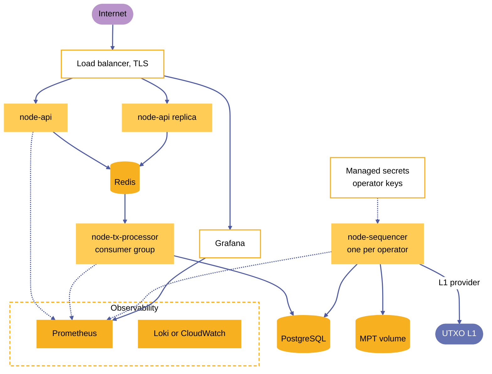

***Figure 19.** Deployment topology: split-role services behind a load balancer, with a relational store, a cache tier, an MPT volume, managed secrets, and the observability stack.*

### 16.2 Container composition

The `demo/midgard-node/docker-compose.yaml` file composes the single-host runtime. Its node services are `node` (all roles), and the split `node-api`, `node-tx-processor`, and `node-sequencer` (selected by Compose profiles). Its infrastructure services are PostgreSQL 15, Redis 7.4 with append-only persistence, Prometheus, Loki, Promtail, cAdvisor, Grafana, and Tempo. A reduced profile (`docker-compose.dev.yaml`) starts only the node and PostgreSQL. Each node service reads its variables from the `.env` file and sets its own `NODE_ROLE` and Redis consumer name.

### 16.3 Cloud deployment

The cloud deployment is defined as an OpenTofu (Terraform-compatible) platform module under `demo/midgard-node/infra/aws/terraform/platform/`. The same module serves every environment; capacity and durability differ by variable file. The reference cloud deployment runs the `sundial-node` service in the `all` role; the Compose file of [§16.2](#162-container-composition) composes the split-role services of [§16.1](#161-topology). The module provisions:

- a VPC with public subnets (the application load balancer and a NAT) and private subnets, across two availability zones;
- an application load balancer that terminates TLS with an ACM certificate and routes by host name to the node and to Grafana;
- an ECS cluster on EC2 hosts that runs the `sundial-node` service and the observability services: Prometheus, Loki, Alloy, Grafana, and a PostgreSQL exporter;
- Amazon RDS for PostgreSQL 16 as the relational store;
- Amazon ElastiCache for Redis as the ingress queue;
- Amazon EFS for the LevelDB Merkle Patricia Trie paths and for Prometheus and Loki data, so that state survives task rescheduling;
- AWS Secrets Manager for the RDS password, the L1 provider credentials, and the operator seed phrases, injected into the task at start and never carried as plain task environment values.

A deployment is applied in two phases. The first phase creates shared resources with the ECS services and HTTPS listener disabled; after ACM validates the certificate through DNS, the second phase enables both. The `package.json` scripts wrap bootstrap, plan, apply, output, validate, logs, restart, and release for each environment.

### 16.4 Scale-out characteristics

<a id="table-14"></a>

**Table 14.** Scale-out characteristics by role

| Role | Scaling unit | State it shares | Constraint |
|---|---|---|---|
| `api` | Additional processes behind the load balancer | Redis | None beyond Redis capacity. |
| `tx-processor` | Additional consumers in the consumer group | Redis, PostgreSQL | Consumers contend on the mempool insert lock, which serializes batches. |
| `sequencer` | Vertical only; one per operator | PostgreSQL, the trie volume, L1 | One writer per operator key and per ledger trie. |

The relational store is the shared bottleneck of the tx-processor and the sequencer, which is why the node separates their connection pools ([§9.3](#93-role-model)).

## 17 Observability and service objectives

This chapter describes how the node is observed and the service objectives that govern it: seven objectives defined as code, the metric families, traces and logs, and the retrospective reliability report.

### 17.1 Service objectives

Seven service objectives are defined as code in `demo/midgard-node/slo/slo.json`, the single source of truth for objectives. A generator (`slo/gen-rules.mjs`) compiles the file into Prometheus recording rules (`rules/slo-recording.rules.yml`) and alert rules (`rules/slo-alerts.rules.yml`); the recording rules, the alerts, and the retrospective reliability report all read the same objectives, so they cannot drift apart.

<a id="table-15"></a>

**Table 15.** Service objectives

| Objective | Kind | Target | Measured by |
|---|---|---|---|
| Submit ingress availability | ratio | 99% | Fraction of `POST /submit` requests answered with a `2xx` status. |
| Transaction end-to-end success | ratio | 99% | Transaction requests included in committed blocks over transactions enqueued at ingress (a long-window signal; clamped to 1). |
| L1 commitment success | ratio | 99.9% | Committed blocks that did not hit a commitment-worker failure (timeout, crash, SDK or CML error). |
| Merge success | ratio | 99.9% | Blocks merged into the confirmed state that did not hit a merge failure. |
| Node availability | gauge average | 99.9% | Prometheus scrape availability of the node exporter. |
| Submit ingress latency | latency | p95 < 1 s | `POST /submit` request duration. |
| Inclusion latency | latency | p95 < 20 s | Time from mempool acceptance to inclusion in a committed block, measured as the commitment-window span of each committed block. |

The error budget window is 30 days. The recording rules cover the windows 5 m, 30 m, 1 h, 6 h, 1 d, 3 d, and 30 d for ratios, and 5 m, 1 h, and 1 d for latency quantiles (p50, p95, p99).

Alerts are multi-window, multi-burn-rate [[14]](#references): a *page* fires when the error budget burns at 14.4 times the sustainable rate over both 1 hour and 5 minutes for at least 2 minutes (2% of the budget in 1 hour); a *ticket* fires at 6 times over both 6 hours and 30 minutes for at least 15 minutes (5% of the budget in 6 hours). Latency and availability objectives carry their own alerts.

**Terms.** *Inclusion* means that a transaction is in a committed block: the node has assembled a block that contains it and built the block's L1 commitment. The inclusion-latency objective is measured to this event, as the commitment-window span of the committed block, and it excludes the submission of the commitment to L1 and the L1 inclusion of the header, which the block-to-L1 hop of [Table 17](#table-17) covers. A block is *submitted* once its header is in the state queue on L1. *Confirmation* means that the block has matured for `maturity_duration` and has been merged into the confirmed state; confirmation takes at least the maturity period ([Appendix C](#appendix-c-protocol-parameters)). The inclusion latency measured against this objective is reported in [§18](#18-performance).

### 17.2 Metrics

The node exports metrics through an OpenTelemetry Prometheus exporter on `PROM_METRICS_PORT` (9464), separate from the API port. Counters carry the `_total` suffix on export. The metric families are:

- **Ingress:** `tx_submissions_enqueued_total`, `tx_submissions_rejected_total`, `tx_submissions_mempool_accepted_total`, and the bounded-label HTTP series `http_server_requests_total` and `http_server_request_duration_seconds` (labels `route`, `method`, `status_class`).
- **Durable ingress stream:** `tx_stream_depth`, `tx_stream_depth_peak`, `tx_stream_pending`, `tx_stream_consumer_lag`, `tx_stream_ack_total`, `tx_stream_fail_total`, `tx_stream_retry_total`, `tx_stream_dead_letter_total`.
- **Block pipeline:** `mempool_tx_count`; `commit_block_count_total`, `commit_block_tx_count_total`, `commit_block_commitment_failures_total`, `commit_block_txs_per_block`, `commit_block_events_size_bytes`, `commit_block_duration_seconds`, `commitment_window_age_seconds`, `tx_ingress_to_commit_duration_seconds`; `submit_block_count_total`, `submit_block_failures_total`, `submit_block_submit_duration_seconds`, `l1_commitment_fees_lovelace_total`, the two L1 idempotency counters ([§12.6](#126-lifecycle-and-crash-recovery)), `unsubmitted_block_backlog`; `merge_block_count_total`, `merge_block_failures_total`.
- **Provenance:** `midgard_node_build_info` (labels `version`, `commit`, `l1_provider`, `network`, `role`) and `midgard_node_start_time_seconds`, which attribute a reporting window to a build and detect restarts.

Metric labels stay low-cardinality. Transaction hashes, block header hashes, UTXO references, addresses, raw CBOR, raw error messages, and arbitrary paths never appear as labels; they belong in logs and trace attributes.

### 17.3 Traces, logs, and dashboards

With `--with-monitoring` the node exports OTLP traces (service name `midgard-node`, root span `midgard`, and fiber spans such as `block-commitment-fiber`, `submit-blocks-fiber`, `sync-user-events-fiber`, and `merge-confirmed-state-fiber`) to Tempo. Container logs flow to Loki through Promtail in the Compose runtime, and to CloudWatch in the cloud deployment. Grafana provisions two dashboards from `demo/midgard-node/grafana/`: an operations dashboard and an SLO and reliability dashboard. cAdvisor supplies container resource metrics.

Prometheus and Loki retain data for 120 days (Prometheus additionally capped at 40 GB). Tempo retains traces for 72 hours in the Compose runtime. In the cloud deployment the Prometheus and Loki data reside on EFS.

### 17.4 Reliability reporting

The `reliability-report` command of the scalability harness produces a dated SLO-compliance report over a closed calendar window from Prometheus and, optionally, Loki. The report covers SLO compliance, transaction success rates, network stability (availability, restarts, block cadence, stream backlog, resource headroom, L1 fees), an incident log with auto-detected gaps and breaches, and error-budget accounting. It ends with a disposition of *Passed*, *Passed with Observations*, or *Failed*. The output is a frozen evidence bundle with a checksum manifest from which the report re-renders byte-identically.

## 18 Performance

This chapter reports the throughput, latency, and cost that the scalability harness measured on the reference node.

### 18.1 Method

The harness (`demo/midgard-manager/packages/scalability-harness`) drives the node through `POST /submit` with a replayable corpus of one-to-one transfer transactions (SHA-256 of the corpus file `4c1485e9…3ca80`), at a fixed target rate for a fixed duration, and then observes a recovery window. It reads node counters from Prometheus, so the figures below distinguish *enqueued* transactions (accepted onto the ingress stream), *durably accepted* transactions (inserted into the mempool), and *committed* transactions (included in a committed block).

**Environment of every run reported here.** The L1 provider was an emulator (`emulator` mode), the wallet mode was `test-wallet`, and the host was a single Linux x64 machine with 6 CPUs and 31.0 GB of memory running the node, PostgreSQL, Redis, and the observability stack. The results are properties of the node on that host against an emulated L1.

A run passes its classification when the node stays available, the mempool recovers within the recovery window, commitment and merge failures stay below the configured policy thresholds, and the queue recovers. The harness reports the inclusion-latency objective separately.

### 18.2 Measured results

The runs of the table were made on 27 to 29 May 2026. Every figure below is taken from the harness report of these runs, `demo/midgard-manager/packages/scalability-harness/benchmark-runs/30eb12b19e9b3e4a3dbf90ee93309d3a5aed7a3c/report.md`, and from the per-run reports and evidence archives beside it. The runs predate the batching policy of [§12.1](#121-commitment-window-and-batching-policy), so they used no batching.

<a id="table-16"></a>

**Table 16.** Measured throughput runs

| Run | Target TPS | Load window | Started (UTC) | Durable accepted tx/s | Committed tx/s | Blocks committed | Latency p50 / p95 | Peak mempool | Classification |
|---|---:|---|---|---:|---:|---:|---|---:|---|
| `baseline-100-800-replay`, tier 1 | 200 | 180 s | | 205.48 | 197.47 | 25 | 15 s / 15 s | 2,255 | completed |
| `baseline-100-800-replay`, tier 2 | 400 | 180 s | | 410.52 | 374.98 | 19 | 15 s / 30 s | 6,886 | completed |
| `baseline-100-800-replay`, tier 3 | 800 | 180 s | | 812.87 | 521.60 | 7 | 45 s / 75 s | 51,600 | completed |
| `initial-800-replay` | 800 | 1,800 s | 2026-05-29 06:10 | 797.92 | 718.03 | 686 | 135 s / 195 s | 153,630 | **Passed** |
| `institutional-1000-replay` | 1,000 | 1,800 s | 2026-05-29 06:51 | 998.29 | 873.17 | 667 | 135 s / 270 s | 226,609 | **Passed** |
| `warmup-replay` | 100 | 600 s | 2026-05-29 07:40 | 99.17 | 96.99 | 245 | 0 s / 15 s | 1,308 | **Passed** |

Every tier of every run ended with an empty mempool and an empty queue after its recovery window. The sustained 800 TPS run committed 1,292,478 transactions, and the sustained 1,000 TPS run committed 1,571,744; both with zero commitment failures and zero merge failures. The sustained runs rejected 370 and 396 submissions at the HTTP boundary (about 0.026% and 0.022% of submissions). An earlier 800 TPS replay (started 2026-05-21) committed 437.60 tx/s. The pipeline changes made since (bulk mempool inserts, a persistent commitment worker, effects computed once at admission, timestamp indexes, a dedicated sequencer connection pool, adaptive submission batching) raised committed throughput at 800 TPS to 718.03 tx/s.

### 18.3 Inclusion latency

The inclusion-latency objective is p95 at or below 20 s ([§17.1](#171-service-objectives)). The measured p95 was 15 s at 100 TPS after warm-up and at 200 TPS, and 30 s at 400 TPS. At 800 TPS it was 75 s in the 180 s tier and 195 s in the sustained run, and at 1,000 TPS it was 270 s in the sustained run. Under sustained load committed throughput follows durable acceptance (718 tx/s against 798 tx/s at the 800 TPS target, and 873 tx/s against 998 tx/s at 1,000), and the backlog of committable transactions (peaks of 153,630 and 226,609) drains during the recovery window. The latency figures come from cohort alignment of Prometheus counters at a scrape step of about 15 s.

### 18.4 L1 cost per committed block

Every L1 commitment transaction costs a fixed fee, independent of the number of L2 transactions in the block. On the emulator each commitment transaction cost 229,155 lovelace (224,403 lovelace in the May runs). The cost per committed L2 transaction therefore falls as blocks fill: 943.87 lovelace at 100 TPS with small blocks, 157.83, 63.17, and 16.73 lovelace across the 200, 400, and 800 TPS tiers of the step ramp, and 119.01 and 95.22 lovelace per transaction in the sustained 800 and 1,000 TPS runs.

The batching policy ([§12.1](#121-commitment-window-and-batching-policy)) makes the effect deliberate. In a paired 100 TPS run (a run without batching and a run with it, both on 2026-06-23 with the same corpus and host, reported in the `fee-baseline-100-replay` report of the harness), the batching run committed 92,742 transactions in 91 blocks (1,019.14 transactions per block) against 92,015 transactions in 508 blocks (181.13 per block) without it. Total L1 commitment fees fell from 116,410,740 to 20,853,105 lovelace, and the fee per committed L2 transaction fell from 1,265.13 to 224.85 lovelace (−82.2%), at unchanged throughput. The saving comes from fewer, fuller commitments; the per-commitment fee did not change. The fees are those of the emulated L1.

### 18.5 Resource use

The harness raised no load-driver saturation flag in any run, and its bottleneck analysis identified no structural bottleneck. Container CPU, memory, and network series for each run are part of the run's evidence archive (`benchmark-runs/<directory>/<run>/…zip`).

### 18.6 Latency budget by pipeline hop

A transaction that enters through `POST /submit` passes through five hops from submission to confirmation. The first three (ingress, queue to mempool, and mempool to block) come before inclusion in a committed block; the fourth puts the block's header on L1, and the fifth confirms the block. The hops and their cadences are:

<a id="table-17"></a>

**Table 17.** Pipeline hops and their timing

| Hop | Mechanism | Timing |
|---|---|---|
| Ingress | `POST /submit` appends to the Redis stream and answers | request latency objective p95 < 1 s ([§17.1](#171-service-objectives)) |
| Queue to mempool | The tx-processor consumer reads, decodes, validates, and inserts | consume cycle of at most 250 ms plus the 1 s blocking read; batches of 100 |
| Mempool to block | The next commitment cycle that selects the transaction | 500 ms between cycles, plus any batching deferral up to `COMMITMENT_MAX_WAIT_MS` |
| Block to L1 | The submission fiber signs and submits the commitment | 1 s between runs, plus L1 inclusion time |
| L1 to confirmation | The block matures and the merge fiber merges it | `maturity_duration` plus at most 10 s between merge runs |

<a id="figure-20"></a>

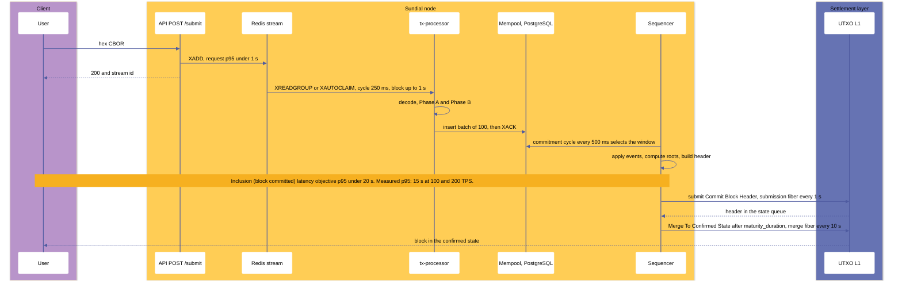

***Figure 20.** End-to-end transaction lifecycle from submission to confirmation, with the timing of each hop.*

## 19 Security

This chapter states the properties the protocol guarantees, the trust model of the reference deployment, the threat model, the handling of keys, the independent reviews on record, and guidance for integrators.

### 19.1 Protocol guarantees

The protocol guarantees six invariants. Auditors are encouraged to test each of them.

- **Block merging order.** Each valid block is merged to the confirmed state before its descendants. If it failed, a block that was valid at commitment could become invalid through an out-of-order merge, and users could not rely on a block's validity holding during its maturity period. The state queue's linked list appends at the end and merges from the beginning ([§3.4](#34-state-queue)).
- **Valid blocks.** Every valid block can eventually be merged. If it failed, the confirmed state could stall, stranding all funds except withdrawals that earlier blocks already confirmed. The Merge To Confirmed State redeemer always works for a mature block with no unmerged predecessor, and the fraud proof verification scripts can never succeed against a valid block ([§3.4](#34-state-queue), [§4.1](#41-fraud-proof-catalogue)).
- **Invalid blocks.** Every invalid block can be invalidated by an L1-verified fraud proof before its maturity period elapses. If it failed for some violation type, dishonest operators could exploit that violation with impunity. Every violation of the ledger rules has a fraud proof construction ([§5](#5-ledger-rules-and-fraud-proofs)), and the proof protocol verifies fraud proofs onchain with computation threads that succeed against blocks that contain the violation ([§4](#4-proof-protocol)).
- **Registered and active operators.** Anyone with a sufficient ADA bond can become an active operator, and every active operator gets a shift. Round-robin shift assignment over a linked list, and a registration queue whose entries activate after a fixed wait, enforce this ([§3.2](#32-operator-directory), [§3.3](#33-scheduler)).
- **Operator bond.** No operator can retrieve their bond before the maturity period elapses for their most recent block, and every operator can afterwards. The operator directory tracks each operator's latest maturity time and holds the bond until then ([§3.2](#32-operator-directory)).
- **Censorship protection.** While block production continues, operators cannot censor deposits, withdrawal orders, or transaction orders. Every L1 event has an inclusion time, event intervals tile time without gaps, and a block that omits an event of its interval is invalid ([§2](#2-user-event-protocol), [§3.1](#31-time-model)). The registration rules ([§3.2.4](#324-registered-operators)) and the escape hatch ([§3.5](#35-escape-hatch)) bound the time for which block production can stop. Because event intervals follow L1 time ([§3.1](#31-time-model)), an operator cannot escape the obligation by choosing its interval.

### 19.2 Trust model of the reference deployment

On the reference testnet the node enforces the ledger rules at admission ([§11](#11-ledger-rule-engine)) and in block production ([§12](#12-block-production)), and the node's operator decides which blocks are committed. The Aiken validators in `onchain/aiken` are the protocol's onchain implementation.

### 19.3 Threat model

**Malicious majority stake.** A majority-stake adversary against the settlement L1's consensus could revert recently confirmed transactions. Sundial's consensus is implemented entirely as L1 smart contracts, so reverting any transaction that evolves its state is as hard as attacking the L1's finality; the L1's full staked value is the resource an attack must overcome. On Cardano, that resource is the full ADA supply. Every L2 transaction is confirmed by two L1 consensus transactions, the block commitment and the merge, separated by the maturity period. Reverting both amounts to a long-range fork of the L1 before the maturity period began, and on Cardano, nodes reject forks that diverge from their local chain by more than 2,160 blocks (about 12 hours), so a `maturity_duration` longer than that limit makes reverting both transactions impossible. This paper takes 24 hours, twice that limit, as the minimum for any network that secures value, so a `maturity_duration` above 24 hours is a security requirement ([Appendix C](#appendix-c-protocol-parameters)). The design range of 3 to 7 days in [Table 20](#table-20) adds the time that watchers need to detect fraud and to complete the multi-transaction fraud proofs discussed below. Reverting only the merge restores the header to the front of the queue, where it is immediately re-merged; no conflicting header can take its place. Reverting only the commitment removes the header from the queue: an honest current operator recommits it, and a colluding operator could censor L2 transactions without any reversion, which the inclusion-time rules bound.

**Operator abuse of power.** Each operator commits blocks exclusively during its shift and chooses their contents, so it can ignore L2 transaction requests. A user escalates a request by posting a transaction order on L1, which carries an inclusion time and guarantees inclusion in a subsequent valid block; deposits and withdrawal orders carry inclusion times in the same way. If operators stop committing altogether, the escape hatch lowers the bond requirement for new operators for a limited period so that honest actors can restart production ([§3.5](#35-escape-hatch)). Even without it, the earliest registered operator activates at once when the active set is empty ([§3.2.4](#324-registered-operators)).

**Replay.** Every L1 transaction of the protocol spends at least one UTXO, so the L1's double-spend rule prevents its replay. The contents behind the hashes in the L1 state, such as the UTXOs, transactions, deposits, and withdrawals in a header, are guarded by the ledger rules against duplication within and across blocks, and an operator that commits a violating header forfeits its bond when a fraud proof is verified within the maturity period. The reuse of a confirmed deposit or withdrawal event in settlement UTXOs, to absorb or release more funds than exist, is prevented by requiring an L1 UTXO for every deposit and withdrawal that must be spent when the deposit is absorbed or the withdrawal is paid.

**Data withholding.** A watcher can challenge a block only if it can read the block. An operator that commits a header and publishes no block data, or data that does not match the header, cannot be challenged, and once the maturity period elapses the header merges. The protocol treats availability as a security condition: every committed block must be retrievable throughout its maturity period ([§6.1](#61-requirements)), and the root correspondence rules of [§5.2](#52-data-availability-rules) make published data that does not match its header provable.

**Fraud proof timeliness.** A fraud proof must complete before the block matures. A `double_spend` proof takes six L1 transactions in sequence ([§4.3.5](#435-worked-example-a-double-spend)), and an `INPUT-NO-IDX` proof takes `n + 6`, where `n` is the number of outputs of the referenced transaction: the recursive step deletes one output per L1 transaction ([§4.3.3](#433-category-shapes)). Each transaction spends the output of the previous one, so they can be built in advance, but each still needs L1 inclusion. The operator chooses the transaction whose outputs are counted, and a Sundial transaction can have many outputs, so an operator can lengthen the proof of its own fraud. `maturity_duration` must therefore exceed the time of the longest proof that a prover can be made to run, with margin for L1 congestion. This constrains `maturity_duration` from below in the same way as the finality argument above.

**Escape hatch calibration.** While the escape hatch is in force, an operator can hold a bond as small as `emergency_required_bond`, so the deterrent against fraud is weaker and the reward of a watcher who proves it is smaller. The exposure is bounded: it lasts for the emergency period and the grace period ([§3.5](#35-escape-hatch)), and reduced-bond operators that stay under-bonded after the grace period can be retired by anyone. Exploiting it takes an adversary that first stops block production for longer than `escape_hatch_block_age`, which needs every active operator to stop, then registers reduced-bond operators, then commits a fraudulent block that watchers fail to prove within `maturity_duration`. The last step is the assumption on which normal operation rests, with a smaller bond behind it. Three constraints keep the exposure small. `emergency_required_bond` exceeds `slashing_penalty`, so that a slashed reduced-bond operator still leaves a reward for the prover. `escape_hatch_block_age` exceeds the inactivity that the operator directory tolerates, so that ordinary inactivity is handled by strikes and does not open an emergency period. `emergency_duration` and `emergency_grace_period` are no longer than restarting production requires ([Table 20](#table-20)).

**Parameter calibration.** The security argument ([Introduction](#introduction)) needs a bond large enough to deter fraud, a reward large enough to keep watchers vigilant, a maturity period long enough to detect and prove fraud, and open data availability. [Table 20](#table-20) gives design ranges for the first three: a `required_bond` of 50,000 to 200,000 ADA, a `fraud_prover_reward` of 30% to 50% of it, and a `maturity_duration` of 3 to 7 days. A network sets the parameters within these ranges.

**Node boundary (STRIDE).** The trust boundaries of the node are the API ingress, the Redis stream, the queue processor, the mempool persistence, the sequencer state, the L1 provider, the L1 chain, and the operations plane. The node's STRIDE threat model [[15]](#references) (`internal-docs/compliance/threat-model-stride.md`) analyses them by category: spoofing of clients and the L1 provider; tampering with submissions, queue entries, stored state, and signed commitments; repudiation of submissions and operator actions; disclosure through the API, secrets, and observability surfaces; denial of service by submission floods, malformed transactions, dependency outages, and commit-faster-than-submit; and privilege escalation from public routes and between roles. Its scope excludes the protocol's validator-level correctness and the formal verification of the validators.

### 19.4 Operator key custody and deployment controls

- **Keys.** The node uses three operator seed phrases with separate duties: a main operator wallet, a wallet for block commitment transactions, and a wallet for merge transactions. The commitment and merge signers are initialized as independent handles, so the two signing paths do not contend on shared wallet state. The faucet seed phrase and API key must not reuse a genesis or operator seed phrase, and the configuration loader refuses to start when it detects reuse.
- **Secrets.** The cloud deployment resolves every sensitive value (the database password, operator, genesis, and faucet seed phrases, provider API keys, and the Grafana admin password) from AWS Secrets Manager into the ECS task, and never as a plain task environment value. Local runs read the values from a `.env` file that is excluded from version control.
- **Authentication and limits.** `POST /faucet/claims` requires a static bearer token and applies a per-address cooldown and a per-IP daily limit. Public deployments place a reverse proxy, gateway, or web application firewall in front of the node for authentication, rate limiting, and request-size limits.
- **Mainnet-only controls.** With `NETWORK=Mainnet` the node disables the faucet and seeds no genesis UTXOs.

### 19.5 Independent review

Three independent reviews are on record:

<a id="table-18"></a>

**Table 18.** Independent reviews on record

| Review | Scope | Result |
|---|---|---|
| Hacken code review and security analysis, 17 April 2026 | `sundial-protocol/btc-locker` at commit `dd1332516d9721b67fefdc219048527de066cbdc`: a TypeScript library for Bitcoin timelock and escrow scripts (CLTV and CSV), PSBT construction and signing | 11 findings: 0 critical, 0 high, 3 medium, 4 low, 4 informational; all 11 fixed. |
| Independent review of the `charms-bridge` component (J. Marchand) | The Charms bridging component | 2 findings: 1 high, 1 informational; both resolved. |
| Hackenproof Dual Defense bug bounty | The Sundial web application and dApp | A continuing campaign. |

The technical specification, the formal models of [§20.1](#201-formal-verification), and the tests of [§20](#20-verification-and-testing) accompany the validators and the node.

### 19.6 Integrator guidance

An integrator calls the node's HTTP API, or builds against the SDK, on the following terms.

- Front the node with a gateway for authorization and rate limiting.
- Validate inputs client-side with the node's rules: hashes are hex of the documented length, addresses parse and carry a payment credential, and `POST /submit` bodies are entirely hex.
- A `200` from `POST /submit` means *queued*. Poll `GET /tx` for acceptance.
- Delivery is at-least-once: build submissions to be safe to process more than once. UTXO-based transactions are idempotent by hash.
- Do not reuse a nonce UTXO across retries after it is spent, in flows that require an unused input as an anti-replay nonce (deposit, transaction order, initialization).
- Set client-side timeouts on every call.

## 20 Verification and testing

This chapter describes how the protocol and its implementation are verified: the formal models, the validator tests and benchmarks, and the node tests.

### 20.1 Formal verification

The Lean 4 [[13]](#references) models in `technical-spec/Lean4Midgard/` (by IOG: Martin Ceresa, Jean-Frédéric Etienne, James Chapman) model the protocol's state machines and prove properties of them. The models cover the ordered and unordered linked lists (Appendix A), the operator directory (with invariant and optimistic-registration properties), the scheduler, the state queue, settlement, the user events (the bridge), the oracle hub, the proof protocol, and a Merkle tree abstraction. Hashing is axiomatized, transactions and the Cardano interaction are reduced to the parts the models need, and the DA layer is assumed to deliver the data. A SMT backend (Lean Blaster) checks bounded invariants of selected machines.

The modeling surfaced specification defects, which were submitted as issues against the specification. They include: default values of registered-operator nodes; the initial scheduler datum; the operator inactivity timeout; the eligibility of registered operators for activation and the scheduler rewind; initial and merge-time values of the state queue root node; a registered-operator directory broken by registering twice; a scheduler that stalls when the last active operator retires; anyone being able to retire active operators or claim retired operators' bonds; a missing check that a block header's `start_time` is below its `end_time`; and defects in the initialization and collection design of the reserve and payout.

### 20.2 Validator testing

The Aiken project (`onchain/aiken`, compiler v1.1.21, Plutus V3, 9,516 lines including tests and environment files) includes 19 execution-unit benchmarks (`aiken bench`), which measure the cost of the hub oracle datum reads, the user-event nonce and event-parsing paths, block header and confirmed-state hashing, value serialization in the state queue, and input lookup. The benchmarks quantify optimizations: reading a single low-index hub oracle field instead of parsing the whole datum saves 85.8% of CPU units (66,261,160) and 84.0% of memory units, and using the already-typed withdrawal event fields instead of reparsing them saves 82.8% of CPU units per spend (20,220,484). An input lookup by index instead of by output reference saves 26.9% of CPU units for an input at the back of ten.

The Plutarch project (`onchain/plutarch`) has a test suite that evaluates the Merkle proof helper scripts for membership, non-membership, and deletion, checks their execution budgets, and exercises them against transaction proofs built with a script-context builder.

### 20.3 Node testing

The node, SDK, and codec have three automated layers: unit tests that replace direct collaborators, integration tests that keep the application's internals real and replace external tools at the harness boundary (a PostgreSQL-compatible test engine, localhost L1 provider stubs, temporary directories), and Dockerized end-to-end tests that run the real image, HTTP server, PostgreSQL, and Redis. The suites at commit `44711c133` (2026-09-25) counted as follows.

<a id="table-19"></a>

**Table 19.** Automated test results

| Package | Unit | Integration | Result |
|---|---:|---:|---|
| `midgard-node` | 362 | 72 (+ 14 in the legacy seed suite) | all passed |
| `midgard-sdk` | 86 | 60 | all passed |
| `midgard-ts` (codec and rule engine) | 73 | none | all passed |

The end-to-end tests are outside these counts. The most recent coverage run of the node (`demo/coverage/node`) records 81.7% of lines, 72.7% of functions, and 66.2% of branches over its instrumented files.

### 20.4 Merkle proof helpers

The Aiken validators delegate Merkle Patricia Trie membership, non-membership, and deletion checks to the Plutarch helper scripts through *withdraw-zero* staking scripts ([§4.3.4](#434-membership-and-non-membership-by-helper-scripts)). The helpers and the validators are separate compilation units: the Aiken project references the helpers' script hashes as environment parameters (`plutarch_phas_validator_hash`, `plutarch_pexcludes_validator_hash`, `plutarch_pdelete_validator_hash`) and never compiles the Plutarch code. Testing the two projects therefore covers different layers of one mechanism, and a change to a helper's script hash requires rebuilding the validators that name it.

### 20.5 Quality gates

Continuous integration checks each change to `demo/**` with format, lint, type, and build gates (`quality.yml`); a dependency vulnerability scan; a dependency audit, Trivy container and dependency scanning, and Gitleaks secret scanning (`security.yml`), with Semgrep conditional on a repository variable; and unit, integration, and end-to-end test workflows (`tests-short.yml`, `tests-long.yml`, `tests-xlong.yml`). The Aiken workflow (`aiken-ci.yml`) formats, compiles, and tests the validators and checks that the lock file and the generated witness-script prefix are current. The LaTeX workflow compiles the technical specification to PDF and publishes it.

# Appendices

The appendices give the general onchain data structures that the protocol uses, the parameters, the reject codes, a glossary, the map from mechanisms to artifacts, and the networks and deployments.

## Appendix A. Linked list

The linked list is a versatile data structure that can implement sets, queues, key-value maps, lazy data sequences, and other interesting data structures. It is particularly useful in extended-UTXO ledgers such as Cardano's, where many list operations and queries can be validated onchain within minimal local contexts that do not grow with list size. Meanwhile, offchain queries can access any part of the list via beacon NFTs that pinpoint specific list elements.

We describe two types of linked lists:

- The **key-unordered** linked list is a cheaper/simpler variant that only allows nodes to be appended at the end of the list and does not enforce the order of keys in the list. It can be used to implement queues and other sequential data structures. However, appending to a list is a sequential operation, which is unsuitable for applications that need multiple independent actors to grow the list simultaneously.
- The **key-ordered** linked list allows nodes to be inserted anywhere in the list, but it applies additional rules to maintain the key-ascending (or descending) order of nodes. It can be used to implement sets and key-value maps. List insertion is increasingly parallel as the list grows, so the key-ordered linked list is well-suited to applications with multiple independent actors growing the list (see [Appendix A.11](#a11-parallel-insertions-in-key-ordered-lists)).

### A.1 Terminology

- **Elements.** Individual units that collectively constitute a linked list.
- **Root.** The first element of a linked list, which serves as the anchor point for the list and is the only element that can exist in an empty list.
- **Nodes.** Elements of a linked list that are not the root.
- **Root Key.** The reserved asset name of the root element's NFT.
- **Node Key.** The bytearray that identifies a node in the list and is stored in the node's NFT asset name after a reserved prefix.
- **Link.** A potential forward pointer from an element to the next node's key in the list.
- **Head.** The first node of a non-empty list, which is the node linked to by the root element.
- **Anchor.** The parent element (either root or node) that points to its next node's key.

### A.2 UTXO representation

Each linked list, whether key-ordered or key-unordered, is represented in the blockchain ledger as a collection of element UTXOs that hold some ADA, plus NFTs minted by the list's minting policy and are held under the list's spending validator. The spending validator is aware of the minting policy (either as a parameter or other means), and the minting policy must have a way of ensuring uniqueness of the linked list it initializes.

Each element UTXO of a list uniquely corresponds to some `ByteArray` key and holds an NFT with an asset name equal to that key's serialization, with a potential prepended label for nodes. The key-ordered list's state transitions guarantee that all nodes have unique keys, but the key-unordered list's state transitions only assume that keys are unique.

> **Warning.** An application using a key-unordered list MUST only add nodes with unique keys to the list. Duplicate keys break the linked list data structure.

Every element UTXO has a datum of the `Element` type, which is parametric on `root_data` and `node_data` types of the data that is to be stored in the list elements:

$$
\mathsf{Element} (\mathsf{root\_data}, \mathsf{node\_data}) := \left\{
    \begin{array}{ll}
        \mathsf{link} : & \mathsf{Option}(\mathsf{ByteArray}) \\
        \mathsf{data} : & \mathsf{ElementData} (\mathsf{root\_data}, \mathsf{node\_data})
    \end{array} \right\}
$$

The distinction between root elements and nodes is identifiable by the NFTs' asset names. That is, the NFT of root element has a reserved asset name, while the NFTs of node elements must be unique bytearrays with an optional reserved prefix.[^ca-1] Additionally, `ElementData` is a sum type that provides type-level information about the data stored in root and node elements.

$$
\begin{aligned}
\mathsf{ElementData} :=\;& \mathsf{Root} (\mathsf{root\_data}) \\
                      \mid\;& \mathsf{Node} (\mathsf{node\_data})
\end{aligned}
$$

There is no notion of keys in `Element` as the data is already present in the NFTs. If keys are needed to be shared between other contracts of a transaction, they can be included in the redeemer and validated by the minting policy.[^ca-2]

The root element is created when a list is initialized and must continue to exist until the list is deinitialized. This allows an initialized but empty list to be represented by just its root (and no nodes), containing a special data. The nodes represent the actual keys and data of interest within a non-empty list.

The `link` field is a link to the next key that a forward traversal through the list must visit after visiting the current node. Alternatively, the `link` field can be interpreted as the previous key that a backward traversal through the list has visited before the current node. The last node is the only node with a `link` field value of `None` because forward traversal through the list must end after this node (backward traversal must start at this node).

### A.3 Linked list library structure

The linked list library is designed with a strong focus on alleviating users from the core logic of linked lists and allowing them to focus solely on their application's custom logic. There are three kinds of functions in the linked list library:

- **For Minting.** Core logic of various state transition operations, namely element additions and removals.
- **For Spending.** Linked list elements must be spendable to either allow state transitions or to allow modifications to the `data` field of element datums without changing the list structure.
- **For Inspection.** Validating the presence of particular element UTXOs in the transaction by other contracts, and validating the contents of their datums.

Provided functions for minting each implement a particular linked list operation, and provide users with values that are independent of the linked list's internal logic. These return values are designed to provide guardrails so that users can cover all edge cases.

There are only two functions for spending: one for updating element data with preservation of list's state, and one for state transitions.

The inspection function validates authenticity of the referenced element and provides various information about the element.

[Appendix A.10](#a10-instantiate-a-linked-list-in-an-application) describes the required considerations for instantiating a linked list within an application.

### A.4 Common validations

**Element authenticity.** A common requirement for all of the above operations is validating the authenticity of involved element UTXOs. The required conditions for each element are:

- The element UTXOs must hold some ADA, and NFTs of the list's minting policy with correct asset names with no other tokens.
- The element UTXOs must have inline datums that parse as `Element`.
- No reference script must be attached to the UTXO.[^ca-3]

Throughout this document we refer to the above conditions with the keyword **Authentic** for short.

**Proper continuation.** Another common requirement for all state transition operations is validating the proper reproduction of anchor elements. This requirement also involves another element that is either being added to the list or removed from it. Conditions:

- Let `input_anchor` be the element that is getting spent.
- Let `output_anchor` be the reproduction of `input_anchor` in the transaction outputs.
- Let `node` be the element that is being added or removed from the list.
- `input_anchor`, `output_anchor`, and `node` must all be Authentic.
- `input_anchor` and `output_anchor` must match on address, asset names of their NFTs, and datum.
- Address of `node` must have the same payment credential as `input_anchor` and `output_anchor`.[^ca-4]

Throughout this document we refer to the above conditions with the keyword **Continue** for short.

### A.5 Minting helpers

Linked list operations that change the state of the list require minting or burning tokens of the list's minting policy. These operations can be grouped into four categories:

- **Initialize.** Initialize an empty list by minting the root node NFT.
- **Deinitialize.** Deinitialize an empty list by burning the root node NFT.
- **Addition.** Add a new node to the list by minting a new node NFT and updating the link of an anchor element.
- **Removal.** Remove a non-root node from the list by burning its node NFT and updating the link of its anchor element.

The provided functions are as follows:

- **Init.** Mint the root NFT with a given root key, and validate the attached data. Conditions:

  1. Let `nonce_validated` be a reminder argument for ensuring uniqueness of the initialized list. This condition must be satisfied.
  2. Let `produced_element` be the specified output of the transaction that's meant to represent the list's root.
  3. `produced_element` must be Authentic.
  4. Underlying `data` of `produced_element`'s `Element` must parse as `Root`. Let this data be `root_data`.
  5. `produced_element` must not have a link.
  6. Asset name of the NFT in `produced_element` must be the reserved root key.
  7. Let `lovelace_count` be the amount of lovelace in `produced_element`.
  8. Custom validation on `lovelace_count` and `root_data` must pass.
- **Deinit.** Burn the root NFT with a given root key, and validate the attached data. Conditions:

  1. Let `spent_element` be the specified input of the transaction that's meant to represent the list's root.
  2. `spent_element` must be Authentic.
  3. Underlying `data` of `spent_element`'s `Element` must parse as `Root`. Let this data be `root_data`.
  4. `spent_element` must not have a link.
  5. Asset name of the NFT in `spent_element` must be the reserved root key.
  6. Let `lovelace_count` be the amount of lovelace in `spent_element`.
  7. Custom validation on `lovelace_count` and `root_data` must pass.
- **Insert.** Add a new node in the list such that its key properly follows either an ascending or descending order. Conditions:

  1. Let `new_element` be the element that is being added to the list.
  2. Let `input_anchor` be the element that is meant to be parent of `new_element`, and `anchor_link` be its `link`.
  3. Let `output_anchor` be the reproduction of `input_anchor` in the transaction outputs.
  4. `new_element`, `input_anchor`, and `output_anchor` must Continue.
  5. `data` of `new_element` must parse as `Node`. Let its key be `new_key` and `new_data` be its underlying data.
  6. Transaction must mint a new node NFT with an asset name equal to concatenation of the reserved prefix with `new_key`.
  7. `link` of `output_anchor` must point to `new_key`.
  8. Let `new_link` be the `link` of `new_element`.
  9. `new_link` must be the same as `anchor_link`.
  10. `new_key` and `new_link` must satisfy the key order of the list (ascending or descending).
  11. Let `new_lovelace` be the amount of Lovelace in `new_element`, and `anchor_lovelace_change` be the change in the amount of Lovelace in `output_anchor` compared to `input_anchor`.
  12. `data` of `input_anchor` must parse as either `Root` or `Node`.

      - If `data` of `input_anchor` parses as `Root`:

        1. Asset name of the NFT in `input_anchor` must be the reserved root key.
        2. Let `root_data` be the data parsed from `input_anchor`.
        3. Custom validation must pass given:

           - `anchor_lovelace_change`
           - `root_data`
           - `new_lovelace`
           - `new_key`
           - `new_data`
           - `new_link`
      - Otherwise, if `data` of `input_anchor` parses as `Node`:

        4. Let `anchor_key` be the key of `input_anchor`.
        5. Asset name of the NFT in `input_anchor` must be the reserved prefix concatenated with `anchor_key`.
        6. `anchor_key` and `new_key` must satisfy the key order of the list (ascending or descending).
        7. Let `anchor_data` be the data parsed from `input_anchor`.
        8. Custom validation must pass given:

           - `anchor_lovelace_change`
           - `anchor_key`
           - `anchor_data`
           - `new_lovelace`
           - `new_key`
           - `new_data`
           - `new_link`
- **Append unordered.** Add a node to the end of the list. Conditions are identical to the Insert operation, with only one different stipulation:

  1. `input_anchor` must have no `link` (i.e., it must be the last element of the list).
- **Prepend unordered.** Add a node in the list as the new head. Conditions are identical to the Insert operation, with only one extra stipulation:

  1. `data` of `input_anchor` must parse as `Root`.
- **Remove.** Remove a node from the list. Conditions:

  1. Let `removed_element` be the element that is being removed from the list.
  2. Let `input_anchor` be the element that is meant to be parent of `removed_element`.
  3. Let `output_anchor` be the reproduction of `input_anchor` in the transaction outputs.
  4. `removed_element`, `input_anchor`, and `output_anchor` must Continue.
  5. `data` of `removed_element` must parse as `Node`. Let its key be `removed_key` and `removed_data` be its underlying data.
  6. Transaction must burn the node NFT with an asset name equal to concatenation of the reserved prefix with `removed_key`.
  7. Let `removed_link` be the `link` of `removed_element`.
  8. `link` of `input_anchor` must point to `removed_key`.
  9. `link` of `output_anchor` must be the same as `removed_link`.
  10. Let `removed_lovelace` be the amount of Lovelace in `removed_element`, and `anchor_lovelace_change` be the change in the amount of Lovelace in `output_anchor` compared to `input_anchor`.
  11. `data` of `input_anchor` must parse as either `Root` or `Node`.

      - If `data` of `input_anchor` parses as `Root`:

        1. Asset name of the NFT in `input_anchor` must be the reserved root key.
        2. Let `root_data` be the data parsed from `input_anchor`.
        3. Custom validation must pass given:

            - `anchor_lovelace_change`
            - `root_data`
            - `removed_lovelace`
            - `removed_key`
            - `removed_data`
            - `removed_link`
      - Otherwise, if `data` of `input_anchor` parses as `Node`:

        4. Let `anchor_key` be the key of `input_anchor`.
        5. Asset name of the NFT in `input_anchor` must be the reserved prefix concatenated with `anchor_key`.
        6. Let `anchor_data` be the data parsed from `input_anchor`.
        7. Custom validation must pass given:

            - `anchor_lovelace_change`
            - `anchor_key`
            - `anchor_data`
            - `removed_lovelace`
            - `removed_key`
            - `removed_data`
            - `removed_link`
- **Fold from root.** Remove the head node of the list and update root's data. Conditions are identical to the Remove operation, with some differences:

  1. The three elements must Continue, however there is no stipulation for underlying data of `input_anchor` to be the same as `output_anchor` data. This allows the root's data to be modified.
  2. `data` of `input_anchor` and `output_anchor` must both parse as `Root`. Let them be `input_root_data` and `output_root_data`, respectively.
  3. Custom validation is provided with both `input_root_data` and `output_root_data` in addition.

### A.6 Spending helpers

All list state transitions involve spending at least one element UTXOs, which means the contract address holding the element UTXOs must have means of allowing them to be spent. Additionally, there are situations where an application may want to allow spending of element UTXOs without changing the list structure.

The library provides two functions for spending:

- **State transition.** Allows spending of element UTXOs for adding or removing an element from the list. Conditions:

  1. The transaction must mint/burn a non-zero quantity of tokens with policy ID that corresponds to the element NFTs.
- **Update data.** Update the `data` field of an element's datum without changing the list structure. Conditions:

  1. Let `input_element` be the element that is being updated, and `output_element` be its reproduction in the transaction outputs.
  2. `input_element` and `output_element` must both be Authentic.
  3. Addresses, asset names of the NFTs, and `link` fields of `input_element` and `output_element` must match.
  4. Let `element_lovelace_change` be the change in the amount of Lovelace in `output_element` compared to `input_element`.
  5. `data` of `input_element` must parse as either `Root` or `Node`.
  6. If `data` of `input_element` parses as `Root`:

     1. Let `input_root_data` be the data parsed from `input_element`.
     2. `data` of `output_element` must also parse as `Root`. Let this data be `output_root_data`.
     3. Asset name of the NFT in `input_element` must be the reserved root key.
     4. Custom validation must pass given:

        - `element_lovelace_change`
        - `input_root_data`
        - `output_root_data`
  7. Otherwise, if `data` of `input_element` parses as `Node`:

     5. Let `input_node_data` be the data parsed from `input_element`.
     6. `data` of `output_element` must also parse as `Node`. Let this data be `output_node_data`.
     7. Let `node_key` be the key of `input_element`.
     8. Asset name of the NFT in `input_element` must be the reserved prefix concatenated with `node_key`.
     9. Custom validation must pass given:

        - `element_lovelace_change`
        - `node_key`
        - `input_node_data`
        - `output_node_data`

### A.7 Inspection helpers

Some contracts may need to refer to elements of other linked list contracts to e.g. prove membership of a given key in those sets. Relying on the information extracted consists of proving authenticity of the referred UTXOs.

After validating the element is Authentic, users are provided with following data:

- Lovelace count of the element.
- A possible node key, since roots have reserved root keys.
- Underlying data of the element.
- Element's link.

### A.8 Reader monad interface

Linked list elements have two constants:

- The root key
- And the prefix of node keys in node NFT asset names

To allow these to be stated only once, most helpers return functions that require provisions of these reserved values. In addition to the root key and node asset name labels, the reader monad also requires the number of bytes the labels occupy. While this is a value that should be derived from the labels themselves, its provision prevents extra performance overhead.

### A.9 Opinionated design decisions

A few implicit behaviors have been implemented by the library in order to keep the API cleaner.

- **Addresses of UTXOs.** New and removing nodes are allowed to have arbitrary staking parts for their destination addresses, but their payment parts are required to be the same as their anchor elements. On the other hand, anchor elements are validated to be reproduced at the same addresses (meaning neither their payment parts nor staking parts can change).
- **Tokens of UTXOs.** All linked list UTXOs are validated to carry some ADA (which its quantity is exposed), plus the list NFT and no other tokens. Exposing the rest of the assets would not only overwhelm the API, but it would also add extra overhead.
- **Reference scripts.** List UTXOs are required to have no scripts attached to them. This prevents users from bloating UTXOs and therefore increasing the min required ADA for them, without returning more values for users to handle.

### A.10 Instantiate a linked list in an application

Exposed functions are designed to validate anything related to the linked list itself, while providing any data required for custom validations. However, there are a few considerations to keep in mind when using the library.

- **Limitations for root keys and node prefixes.** Root keys are directly stored in the asset names of root elements, which limits them to be 0 up to and including 32 bytes. On the other hand, node key prefixes are stored in node element asset names along with the actual node keys. This means users should be aware not to allow the total length to exceed 32 bytes.
- **Datum structures.** All functions assume the linked list instantiation uses an applied version of `Element(root_data, node_data)`.

Sundial uses linked lists throughout its onchain architecture:

- [Registered operators](#324-registered-operators) ([§3.2.4](#324-registered-operators))
- [Active operators](#325-active-operators) ([§3.2.5](#325-active-operators))
- [Retired operators](#326-retired-operators) ([§3.2.6](#326-retired-operators))
- [State queue](#34-state-queue) ([§3.4](#34-state-queue))

Where registered operators are key-descending ordered with activation times as node keys. Active and retired operators are key-ascending ordered with operator keys as node keys. And state queue is an unordered list with header hashes as node keys.

### A.11 Parallel insertions in key-ordered lists

For keys randomly sampled from an approximately uniform distribution (e.g., cryptographic public keys for wallets), insertion/removal from a key-ordered linked list is parallel to a degree proportional to the list's size, with parallelism increasing as the list grows.

An application may expect highly parallel traffic (e.g., from simultaneous interactions of independent users) before its list grows from its initially small size. This can be alleviated by using “separator” nodes in the list, which boost the list's parallelism by virtually occupying specific keys. Ideally, separators should be evenly spaced throughout the key space of the list.

$$
\begin{aligned}
\mathsf{MyDatum} &:= \mathsf{Element} (\mathsf{MyRoot}, \mathsf{MyAppDataWithSeps}) \\
    \mathsf{MyAppDataWithSeps} &:= \mathsf{Node}(\mathsf{MyNodeData}) \;|\;
        \mathsf{Separator}
\end{aligned}
$$

Suppose the application needs to insert a node at a key occupied by a separator node. In that case, it instead modifies the node contents of the separator node to the intended `data` field value of the inserted node. Otherwise, node insertion works as usual.

The application can insert or remove separators as needed during the lifecycle of the list to regulate its parallelism.

[^ca-1]: Prefixing the key when it is serialized to the asset name prevents a collision between the root and a node with an empty key string. It also allows more flexibility for minting policies that use the linked list library to atomically mint additional tokens associated with the key but namespaced from the node NFTs.

[^ca-2]: Any interaction with linked list elements requires authenticating their NFTs, which consists of validating the asset names are prefixed with the hardcoded value. However, in transactions where other contracts are executed along list's minting policy and need access to elements' keys, provision in the mint redeemer can relieve those other contracts from re-extracting the key from asset names.

[^ca-3]: This is an opinionated design decision that is not strictly necessary for the linked list itself. See [Appendix A.9](#a9-opinionated-design-decisions).

[^ca-4]: Note here that `node` is not being enforced to share the same staking part as its anchor. This is another design decision to balance flexibility and user-friendliness of the API.

## Appendix B. Single-threaded state machine

A single-threaded state machine is a general pattern for running a state machine on a UTXO ledger with one UTXO per machine state. The fraud proof computation threads of [§4.3](#43-fraud-proof-computation-threads) are instances of it.

### B.1 UTXO representation

Each single-threaded state machine's current state is represented in the blockchain ledger as a single UTXO:

- The spending validator of the UTXO defines the possible transitions out of the current state.
- The UTXO value contains a thread token corresponding to the state machine.
- The datum contains the output that the machine emitted upon entering the current state.

Each state transition of the state machine is executed via a separate blockchain transaction:

- The state machine's thread token must be unique within the transaction context.[^cb-1]
- The before-state is represented by the transaction input that contains the thread token.
- The after-state is represented by the transaction output that contains the thread token.
- The state transition's input is represented by the redeemer provided to the before-state's spending validator. If the spending validator defines several state transitions, the redeemer selects one for the transaction.

### B.2 Minting policy

The thread token's minting policy defines the state machine's initial states, initialization procedure, final states, and termination procedure. It also implicitly defines the state machine's subgraph of reachable states, as each initial state's spending validator defines the transitions out of that state and, inductively, all further transitions out of the resulting states. Redeemers:

- **Initialize.** Mint the thread token and send it to the spending validator address of one of the state machine's initial states. This redeemer receives an initial input that selects the initial state and provides additional information that can be referenced in subsequent state transitions.

  The thread token's name should indicate the selected initial state and include a hash of the reference information provided in the initial input. If the state machine is deterministic, its thread token name identifies its unique path from initialization to the current state.
- **Finalize.** Terminate the state machine normally if it is in one of the final states. Burn the thread token and (if needed) perform cleanup actions that are universally needed when terminating normally from any final state.
- **Cancel.** Terminate the state machine exceptionally from any state. Burn the thread token and (if needed) perform cleanup actions that are universally needed when terminating exceptionally from any state.

### B.3 Spending validators

If the state machine is non-deterministic, some of its spending validators define multiple possible transitions out of some states. The redeemers provided to these spending validators select the state transitions out of those states. Furthermore, the redeemers may provide additional arguments so that the spending validators have the context to decide whether to allow the selected state transitions.

Each spending validator is custom-written to express the specific logic of the possible transitions out of its state. For each of these transitions, the spending validator must include a condition that verifies the transformation of the input state into the corresponding output state:

$$
\begin{aligned}
\mathsf{verify\_transition}_{ij} &: (\mathsf{Input}_i, \mathsf{Output}_j, ..\mathsf{Args}_j) -> \mathsf{Bool} \\
    \mathsf{verify\_transition}_{ij}\mathsf{(i, o, ..args)} &:=
        \Bigl( \mathsf{transition}_{ij}\mathsf{(i, ..args) \equiv \mathsf{o}} \Bigr) \\
    \mathsf{transition}_{ij} &: (\mathsf{Input}_i, ..\mathsf{Args}_j) -> \mathsf{Output}_j
\end{aligned}
$$

### B.4 Compilation

Each spending validator can be either statically or dynamically parametrized on the spending validators into which its outbound state transitions lead.

- Static parametrization is preferred for state transitions that occur more frequently in typical executions of the state machine. A fancy way of expressing this is that state transitions should be statically parametrized along the maximally weighted acyclic subgraph of the state graph.
- Dynamic parametrization should be used for all other state transitions because statically parametrizing them would cause circular compilation dependencies on more preferred state transitions.

Dynamic parametrization means that the spending validator requires a reference input that indicates the addresses of the spending validators on which it dynamically depends. This reference input is crucial for the integrity of the state machine's state graph, so secure governance mechanisms should control its creation/modification.

### B.5 Example

Consider a simplified model of the git pull-request (PR) workflow, with the following states:

<a id="figure-21"></a>

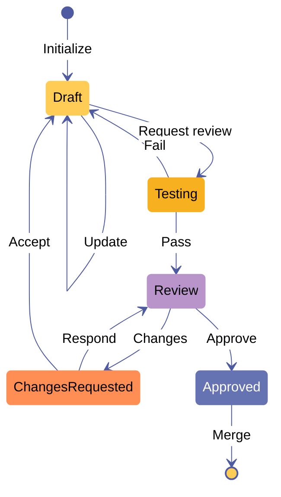

***Figure 21.** State diagram of a simplified git pull-request workflow, modeled as a single-threaded state machine.*

- **Draft (initial state).** The drafter is implementing a feature or bug fix in a repository branch. Transitions:

  - **Update.** The drafter updates the branch by adding some git commits. Next state: Draft.
  - **Request review.** The drafter requests a review for the branch. Next state: Testing.
- **Testing.** The test suite is executing. Transitions:

  - **Fail.** The branch fails its test suite. Next state: Draft.
  - **Pass.** The branch passes its test suite. Next state: Review.
- **Review.** The reviewer is deciding whether the branch should merge into the main branch. Transitions:

  - **Approve.** The reviewer approves the branch to be merged into the repository's main branch. Next state: Approved.
  - **Changes.** The reviewer requests some changes to the branch. Next state: Changes requested.
- **Changes requested.** The drafter is considering the reviewer's feedback. Transitions:

  - **Respond.** The drafter responds to the reviewer, arguing that changes are not required. Next state: Review.
  - **Accept.** The drafter accepts the reviewer's change requests. Next state: Draft.
- **Approved (final state).** The branch is merged into the main branch. Transitions:

  - **Merge.** The state machine terminates normally from the final state. The branch is merged into the main branch and then deleted.

The onchain state machine representation of the above git PR model uses one minting policy and five spending validators. The minting policy:

- Defines Draft as the initial state.
- Assigns the state machine a token name corresponding to the commit hash of the base branch of the PR.[^cb-2]
- Defines Approved as the final state.
- Updates the state of the main branch when the PR branch is merged.

The spending validators define the transitions out of their corresponding states. The state datum types include the PR's current commit hash and other information relevant to their outbound transitions. For example, the spending validator for the Draft state has redeemers to validate two state transitions:

- **Update.** Go to the Draft state. Update the PR commit hash and resolve any accepted change requests that the update addresses.
- **Request review.** Go to the Testing state. Ensure that no accepted change requests remain.

We can also add a Cancel redeemer to every spending validator and the minting policy. In the git PR workflow, this state transition would reflect the fact that a PR can be closed at any time. Some additional logic may be needed in each of these redeemers to properly dispose of the PR after it is closed.

[^cb-1]: This avoids double-satisfaction issues during onchain validation of state transitions, as any transition's before and after states can be uniquely identified in any transaction. However, the state machine's thread token does *not* need to be globally unique across the blockchain ledger — it may be desirable to run several machines simultaneously, evolving their states in independent transaction chains.

[^cb-2]: In this simplified model, the base branch cannot be changed for a PR.

## Appendix C. Protocol parameters

This appendix lists the parameters of the protocol, of the ledger, and of the node. Durations are in milliseconds unless a unit is given. A network that secures value fixes the consensus parameters within the design ranges of [Appendix C.1](#c1-consensus-protocol-parameters).

### C.1 Consensus protocol parameters

<a id="table-20"></a>

**Table 20.** Consensus protocol parameters and design ranges

| Parameter | Defined in | Meaning |
|---|---|---|
| `event_wait_duration` | [§2](#2-user-event-protocol) | Wait added to the upper bound of an event-creating transaction's validity interval to give an L1 event its inclusion time. |
| `maturity_duration` | [§3.4](#34-state-queue) | Minimum time a header waits in the state queue before merging; the length of a resolution claim's challenge period. |
| `registration_duration` | [§3.2](#32-operator-directory) | Wait before a registered operator can activate. |
| `required_bond` | [§3.2](#32-operator-directory) | ADA bond of an operator; equals `fraud_prover_reward` plus `slashing_penalty`. |
| `fraud_prover_reward` | [§3.2](#32-operator-directory) | Part of a forfeited bond paid to the fraud prover. |
| `slashing_penalty` | [§3.2](#32-operator-directory) | Part of a forfeited bond paid through transaction fees to the settlement L1's treasury (the Cardano treasury on Cardano). |
| `inactivity_slashing_penalty` | [§3.2.2](#322-operator-inactivity) | Part of an operator's bond slashed when it is retired for inactivity. |
| `shift_duration` | [§3.1](#31-time-model) | Length of an operator's shift. |
| `max_inactivity_between_block_commitments` | [§3.2.2](#322-operator-inactivity) | Longest period without a block commitment before an operator can be struck. |
| `user_events_negligence_timeout` | [§3.2.2](#322-operator-inactivity) | Longest period an operator can ignore a user event slated for its shift. |
| `new_shift_inactivity_grace_period` | [§3.2.2](#322-operator-inactivity) | Grace period of a newly appointed operator. |
| `max_inactivity_strikes` | [§3.2.2](#322-operator-inactivity) | Strikes after which an operator is partially slashed and retired. |
| `max_validity_range_length` | [§3.3](#33-scheduler), [§3.4.2](#342-minting-policy) | Longest validity range of a scheduler advance, a state queue Init, or a block commitment transaction. |
| `max_tokens_allowed_in_deposits` | [§2.1](#21-deposit-l1) | Most distinct tokens, ADA included, in a deposit. |
| `escape_hatch_block_age` | [§3.5](#35-escape-hatch) | Age of the last queued block beyond which the escape hatch can trigger. |
| `escape_hatch_trigger_duration` | [§3.5](#35-escape-hatch) | Longest validity range of a trigger transaction. |
| `emergency_duration` | [§3.5](#35-escape-hatch) | Length of the emergency period. |
| `emergency_required_bond` | [§3.5](#35-escape-hatch) | ADA bond that a registration must post while the emergency period is in force; less than `required_bond`. |
| `emergency_grace_period` | [§3.5](#35-escape-hatch) | Time after the emergency period in which reduced-bond operators can retire or increase their bonds. |
| `emergency_retirement_penalty` | [§3.5](#35-escape-hatch) | Part of an under-bonded operator's bond that the party retiring it after the grace period claims. |
| `da_multisig_threshold` | [§6.4](#64-storage-backing) | Quorum threshold of the certified availability backing. |

For a network that secures value the design ranges are: `event_wait_duration` 2 to 4 minutes; `maturity_duration` 3 to 7 days; `registration_duration` 1 day; `required_bond` 50,000 to 200,000 ADA; `fraud_prover_reward` 30% to 50% of `required_bond`; `slashing_penalty` 50% to 70% of `required_bond`; `shift_duration` 1 hour.

The constraint `required_bond = fraud_prover_reward + slashing_penalty` holds in every configuration. Three further constraints hold. `emergency_required_bond` is less than `required_bond` and greater than `slashing_penalty`. `escape_hatch_block_age` exceeds the sum of `max_inactivity_between_block_commitments` and `new_shift_inactivity_grace_period`, so that ordinary inactivity is handled by strikes before emergency mode is available. `max_validity_range_length` does not exceed `event_wait_duration`, so that an event which a block's interval obliges it to include was already on L1 when the operator built the block ([§3.1](#31-time-model)).

### C.2 Ledger parameters

<a id="table-21"></a>

**Table 21.** Ledger parameters

| Parameter | Value | Use |
|---|---|---|
| `min_fee_a` | 44 lovelace per byte | Rule [§5.1.4](#514-rule-minimum-fee); the same value as Cardano's `minFeeA`. |
| `min_fee_b` | 155,381 lovelace | Rule [§5.1.4](#514-rule-minimum-fee); the same value as Cardano's `minFeeB`. |
| `coins_per_utxo_byte` | The settlement L1's parameter (4,310 lovelace per byte on Cardano mainnet) | Rule [§5.1.13](#5113-rule-minimum-utxo-value). |
| `network_id_Sundial` | `1` when the node's `NETWORK` is `Mainnet`, otherwise `0`. | Rules [§5.1.14](#5114-rule-network-id-of-outputs) and [§5.1.15](#5115-rule-network-id-of-transaction). |

Sundial's ledger uses Cardano's ledger-associated parameters and omits those of staking, governance, and pre-Conway features ([§1.6.2](#162-sundial-transaction-type)). Fees are collected from every L2 transaction. An L1 commitment costs a fixed fee regardless of the number of transactions in the block ([§18.4](#184-l1-cost-per-committed-block)), and the data availability cost of a block grows with its size, so per-block fee revenue grows faster than cost as blocks fill.

### C.3 Node parameters

The table lists the environment variables read by `src/services/config.ts`.

<a id="table-22"></a>

**Table 22.** Node parameters and defaults

| Variable | Default | Meaning |
|---|---:|---|
| `NODE_ROLE` | `all` | `all`, `api`, `tx-processor`, or `sequencer` ([§9.3](#93-role-model)). |
| `PORT` | 3000 | HTTP port. |
| `PROM_METRICS_PORT` | 9464 | Prometheus exporter port. |
| `WAIT_BETWEEN_BLOCK_COMMITMENTS` | 500 | Commitment fiber spacing (ms). |
| `WAIT_BETWEEN_BLOCK_SUBMISSIONS` | 1,000 | Submission fiber spacing (ms). |
| `WAIT_BETWEEN_USER_EVENT_FETCHES` | 10,000 | User-event synchronization spacing (ms). |
| `WAIT_BETWEEN_MERGE_TXS` | 10,000 | Merge fiber spacing (ms). |
| `COMMITMENT_WORKER_TIMEOUT_MS` | 300,000 | Commitment worker request timeout. |
| `COMMITMENT_MAX_UNSUBMITTED_BLOCK_BACKLOG` | 0 | Unsubmitted blocks tolerated before commitment cycles are skipped. |
| `COMMITMENT_MIN_TX_REQUESTS_PER_BLOCK` | 1 | Batching threshold for transaction-only windows. |
| `COMMITMENT_MAX_WAIT_MS` | 0 | Longest deferral of a transaction-only window (0 disables batching). |
| `COMMITMENT_MAX_TX_REQUESTS_PER_BLOCK` | 2,000 | Most transaction requests in one block. |
| `COMMITMENT_WINDOW_WARN_TX_REQUESTS` / `_TOTAL_EVENTS` / `_TOTAL_BYTES` | 50,000 / 60,000 / 20,000,000 | Window size warning thresholds. |
| `SUBMIT_SIGNED_TX_TIMEOUT_MS` | 30,000 | Timeout of a commitment submission. |
| `SUBMIT_SIGN_TIMEOUT_RECOVERY_MAX_RETRIES` | 1 | Retries after a signing timeout. |
| `TX_QUEUE_DRAIN_BATCH_SIZE` | 100 | Entries per consume cycle. |
| `TX_QUEUE_CONSUMER_WORKER_COUNT` | 1 | Consumer loops per process. |
| `TX_QUEUE_PROCESSOR_INTERVAL_MS` | 250 | Consumer loop spacing. |
| `TX_QUEUE_CLAIM_IDLE_MS` | 30,000 | Idle time after which a pending entry is reclaimed. |
| `TX_QUEUE_CLAIM_BATCH_SIZE` | 100 | Entries reclaimed per cycle. |
| `TX_QUEUE_MAX_DELIVERY_ATTEMPTS` | 5 | Deliveries before dead-lettering. |
| `TX_QUEUE_DEAD_LETTER_STREAM` | `midgard:tx-submissions:dead-letter` | Dead-letter stream key. |
| `TX_PARSE_CONCURRENCY` | 8 | Parse worker pool concurrency. |
| `REDIS_STREAM_KEY` / `_CONSUMER_GROUP` / `_BLOCK_MS` | `midgard:tx-submissions` / `midgard-tx-processors` / 1,000 | Ingress stream, consumer group, blocking read. |
| `LUCID_INIT_MAX_RETRIES` | −1 | Provider initialization retries (−1: retry indefinitely). |
| `FAUCET_ENABLED` | `false` | Testnet faucet switch (forced off on `Mainnet`). |
| `FAUCET_AMOUNT_LOVELACE` / `_COOLDOWN_SECONDS` / `_DAILY_IP_LIMIT` / `_MIN_BALANCE_LOVELACE` | 100,000,000 / 86,400 / 5 / 100,000,000 | Faucet economics. |

The merge fiber merges when the state queue holds at least 8 blocks and refreshes its cached queue length every 30 minutes ([§12.7](#127-merge)).

### C.4 Values by network

<a id="table-23"></a>

**Table 23.** Network configurations

| Network | Settlement L1 | Network id | Genesis UTXOs and faucet |
|---|---|:-:|---|
| `Preprod` | Cardano Preprod testnet | 0 | Seeded from three genesis wallets; faucet enabled by the cloud variables |
| `Preview` | Cardano Preview testnet | 0 | Seeded from three genesis wallets |
| `Custom` | A local or emulated L1 | 0 | Seeded from three genesis wallets |
| `Mainnet` | Cardano mainnet | 1 | Not seeded; faucet disabled |

## Appendix D. Reject code reference

The rule engine ([§11](#11-ledger-rule-engine)) reports the following 21 reject codes. The *rule* columns name the engine rule and the ledger rule of [§5.1](#51-sundial-ledger-rules-and-fraud-proofs) that the code enforces.

<a id="table-24"></a>

**Table 24.** Reject codes

| Code | Engine rule | Ledger rule | Meaning |
|---|---|---|---|
| `E_CBOR_DESERIALIZATION` | decode stage | — | The submitted CBOR does not decode to a transaction. Reported by the inspection helper; the queue records decode failures as `malformed_cbor`. |
| `E_TX_HASH_MISMATCH` | R2 | [§5.1.17](#5117-rule-transaction-hash-integrity) | The hash recomputed from the decoded body differs from the submitted transaction id, or the hash cannot be computed. |
| `E_UNSUPPORTED_FIELD_NONEMPTY` | R3 | [§5.1.18](#5118-rule-field-admissibility) | A redeemer, a Plutus V3 script, or a script data hash is present. The detail names the field. |
| `E_EMPTY_INPUTS` | R4 | [§5.1.3](#513-rule-at-least-one-input) | The transaction has no spend input. |
| `E_DUPLICATE_INPUT_IN_TX` | R5 | [§5.1.19](#5119-rule-no-duplicate-inputs) | An input appears twice. The detail names it. |
| `E_INVALID_OUTPUT` | R6 | [§5.1.12](#5112-rule-no-negative-value) | An output has a negative coin quantity, an unsummable value, or an unparseable address or credential. |
| `E_INPUT_NOT_FOUND` | R7, R8b | [§5.1.1](#511-rule-all-inputs-must-be-valid), [§5.1.16](#5116-rule-all-reference-inputs-must-be-valid) | A spend or reference input is absent from the ledger view and the batch, or a reference input is also spent by the same transaction. |
| `E_DOUBLE_SPEND` | R8 | [§5.1.1](#511-rule-all-inputs-must-be-valid) | An input is already spent by an accepted transaction. |
| `E_DEPENDENCY_CYCLE` | R17 | none | The transaction lies on a dependency cycle of the batch, or depends on one. |
| `E_DEPENDS_ON_REJECTED_TX` | R18 | none | The transaction depends on a rejected transaction, or its dependency chain cannot be resolved. |
| `E_INVALID_VALIDITY_INTERVAL_FORMAT` | R9 | [§5.1.2](#512-rule-transaction-validity-range) | The validity interval is not well-formed. |
| `E_VALIDITY_INTERVAL_MISMATCH` | R10 | [§5.1.2](#512-rule-transaction-validity-range) | The current time is outside the validity interval. |
| `E_MIN_FEE` | R11 | [§5.1.4](#514-rule-minimum-fee) | The fee is below `min_fee_a × size + min_fee_b`. |
| `E_VALUE_NOT_PRESERVED` | R12 | [§5.1.10](#5110-rule-value-preservation) | (Σ inputs − fee) − Σ outputs ≠ 0, or the arithmetic overflows. |
| `E_MISSING_REQUIRED_WITNESS` | R13, R16 | [§5.1.5](#515-rule-required-signatures-are-correct), [§5.1.7](#517-rule-every-needed-signature-is-provided), [§5.1.8](#518-rule-native-scripts-are-available) | A required signer, a spent key-hash input, or a spent script input lacks its witness. |
| `E_INVALID_SIGNATURE` | R14 | [§5.1.6](#516-rule-signatures-are-valid) | A verification-key witness does not verify, or its key does not decode. |
| `E_NATIVE_SCRIPT_INVALID` | R15 | [§5.1.8](#518-rule-native-scripts-are-available), [§5.1.9](#519-rule-native-scripts-validated) | A native script does not decode, has no hash, or fails evaluation. |
| `E_IS_VALID_FALSE_FORBIDDEN` | R19 | [§5.1.20](#5120-rule-validity-flag) | `is_valid` is `False`. |
| `E_AUX_DATA_FORBIDDEN` | R20 | [§5.1.21](#5121-rule-no-auxiliary-data) | An auxiliary data hash is present. |
| `E_MINT_FORBIDDEN` | R23 | [§5.1.11](#5111-rule-no-ada-minted) | The `mint` field is non-empty. |
| `E_NETWORK_ID_MISMATCH` | R24 | [§5.1.15](#5115-rule-network-id-of-transaction) | The body's `network_id` differs from the instance's. |

The mempool records a rejection as `validation_rejected:<code>`, followed by `:<detail>` when the engine supplies one. Three further reasons come from the ingestion path: `malformed_cbor:<message>` for a transaction that does not decode, `mempool_insert_failed:<message>` for a failed insert, and `E_DUPLICATE_TX_ID_CONFLICT` for a second, different CBOR under a transaction id already present. `E_UNSPECIFIED` labels a rejection for which the engine gave no code.

## Appendix E. Glossary

**Active operator.** An operator in the `active_operators` set, taking part in the rotating schedule.

**Archive node.** A node that stores the block data of confirmed blocks.

**Block.** A header hash, a header, and a block body of four sets: UTXOs, transactions, deposits, and withdrawals.

**Bond.** The ADA an operator posts to collateralize its promise to commit valid blocks. A proven-fraudulent block forfeits it.

**Computation thread.** A linear chain of spending validators, each a step, that verifies a fraud proof in pieces that fit within L1 transaction limits. A thread token records its progress.

**Confirmed state.** The record at the root of the state queue: the last confirmed header's hash, its `utxo_root`, and its time bounds and protocol version.

**Deposit.** An L1 event that moves a UTXO's tokens to the L2 ledger.

**Escape hatch.** The L1 mechanism that, when block production has stopped, opens an emergency period during which operators can register with a reduced bond; afterwards, a grace period lets them retire or restore the regular bond before anyone can retire them.

**Event interval.** The half-open interval `[start_time, end_time)` that a block claims. Its `start_time` is the previous block's `end_time`, and its `end_time` is the upper bound of the validity range of the block's commitment transaction. An operator block must include every user event whose inclusion time falls in its event interval.

**Fraud proof.** A demonstration, verified onchain by a computation thread, that a block violates a ledger rule.

**Fraud prover.** The party that initiates a computation thread and receives the fraud prover reward when the proof removes a block.

**Hub oracle.** The L1 UTXO that stores the policy ids and validator addresses of all Sundial components.

**Inclusion time.** The time at which an L1 event must be included: the creating transaction's validity upper bound plus `event_wait_duration`.

**Maturity period.** The time, `maturity_duration`, that a committed header waits in the state queue before it can be merged.

**Operator.** A party that receives L2 events, assembles blocks, publishes them, and commits their headers during its shift.

**Operator directory.** The three linked lists of registered, active, and retired operators.

**Payout accumulator.** An L1 UTXO that collects funds from the reserve until it can pay a confirmed withdrawal in full.

**Reserve.** The L1 store of the funds of absorbed deposits.

**Resolution claim.** An operator's optimistic claim, attached to a settlement UTXO, that all its user events have been processed.

**Scheduler.** The L1 UTXO that names the operator of the current shift and controls the transition to the next.

**Settlement queue.** The set of settlement UTXOs, one per merged block that contains user events, that let users absorb deposits and pay out withdrawals.

**Shift.** An interval of `shift_duration` in which one operator has the exclusive privilege to commit blocks and resolve settlements.

**State queue.** The L1 linked list that holds committed headers until they are merged or disqualified.

**Transaction order.** An L1 event that obliges operators to include a given L2 transaction.

**Watcher.** Any party that reads committed blocks from the DA layer and submits fraud proofs.

**Withdrawal order.** An L1 event that orders the transfer of an L2 UTXO's value to L1.

**Witness staking script.** A staking script parametrized by a user event's id, whose registration state proves whether the event exists.

## Appendix F. Related documents and realization map

This appendix lists the documents that accompany the whitepaper and maps each mechanism of the protocol to the artifact that realizes it in each layer.

### F.1 Related documents

<a id="table-25"></a>

**Table 25.** Related documents

| Document | Location |
|---|---|
| Technical specification (LaTeX source of Part I) | `technical-spec/` (`midgard.tex`) |
| Lean 4 formal models | `technical-spec/Lean4Midgard/` |
| Binary codec schema | `cddl-files/codec.cddl` |
| Aiken validators | `onchain/aiken/` |
| Plutarch Merkle proof helpers | `onchain/plutarch/` |
| Node HTTP API reference | `internal-docs/api.md` |
| Architecture and environment reference | `internal-docs/architecture.md`, `internal-docs/environment.md` |
| Observability, telemetry, and reliability reporting | `internal-docs/observability.md`, `telemetry.md`, `reliability-reporting.md` |
| Security practices and STRIDE threat model | `internal-docs/security.md`, `internal-docs/compliance/threat-model-stride.md` |
| Testing | `internal-docs/testing.md`, `master-test-plan.md`, `scalability-stress-test-report.md` |
| Mainnet readiness review | `internal-docs/mainnet-readiness.md` |
| Benchmark evidence | `demo/midgard-manager/packages/scalability-harness/benchmark-runs/` |
| Audit reports | `sundial-web/public/hacken-audit-report.pdf`, `internal-docs/reports/M4.5-Auditing-Overview.md` |
| Litepaper | `sundial-web/public/Sundial Litepaper.pdf` |

### F.2 Realization map

<a id="table-26"></a>

**Table 26.** Realization of each mechanism by artifact

Lean paths are relative to `technical-spec/Lean4Midgard/FMMidgard/`, Aiken paths to `onchain/aiken/`, and SDK paths to `demo/midgard-sdk/src/`.

| Mechanism | Specification | Realization |
|---|---|---|
| Linked list | [Appendix A](#appendix-a-linked-list) | Lean `DataStructures/List`; Aiken dependency `aiken-design-patterns` (`linked_list`); SDK `linked-list.ts` |
| Operator directory | [§3.2](#32-operator-directory) | Lean `OperatorDirectory/`; Aiken `validators/operator-directory/*`, `lib/midgard/operator-directory*`; SDK schemas, fetchers, Init |
| Scheduler | [§3.3](#33-scheduler) | Lean `Scheduler/`; Aiken `validators/scheduler.ak`; SDK schemas, fetchers, Init |
| State queue | [§3.4](#34-state-queue) | Lean `StateQueue/`; Aiken `validators/state-queue.ak`; SDK commit, merge, Init; node commitment, submission, and merge fibers |
| Escape hatch | [§3.5](#35-escape-hatch) | SDK `escape-hatch.ts` |
| Settlement | [§3.6](#36-settlement) | Lean `Settlement/`; Aiken `validators/settlement.ak`; SDK attach, disprove, resolve |
| Reserve and payout | [§3.7](#37-reserve-and-payout) | Aiken datum and redeemer types in `lib/midgard/payout.ak` |
| Hub oracle | [§3.8](#38-sundial-hub-oracle) | Lean `OracleHub.lean`; Aiken `lib/midgard/hub-oracle.ak`; SDK datum, fetcher, Init |
| User events | [§2](#2-user-event-protocol) | Lean `Bridge/`; Aiken `validators/user-events/*`; SDK deposit, withdrawal, transaction order; node user-event synchronization fiber, three event tables |
| Fraud proof catalogue, tokens, threads | [§4](#4-proof-protocol) | Lean `ProofProtocol/`; Aiken `validators/fraud-proof*.ak`, `computation-thread.ak`, `fraud-proofs/*`; SDK schemas; node catalogue root at initialization |
| Merkle proof helpers | [§4.3.4](#434-membership-and-non-membership-by-helper-scripts) | Lean `DataStructures/MerkleTree` (partial); Aiken `common/utils.ak` (`plutarch_phas`, `pexcludes`, `pdelete`) |
| Ledger rules | [§5](#5-ledger-rules-and-fraud-proofs) | Aiken four fraud proof categories; node `midgard-ts` rule engine |
| Data availability | [§6](#6-data-availability-and-archival) | Lean `DataLayer.lean` (abstract); node operator-held block data |
| Block and header | [§1](#1-ledger-state) | Lean `Commons/Block.lean`; Aiken `lib/midgard/ledger-state.ak`; SDK `ledger-state.ts`; node block commitment worker |

## Appendix G. Networks and deployments

This appendix lists the networks on which the node runs, the public endpoints of the reference testnet, and the onboarding flow of an operator.

### G.1 Networks

The node runs on the four networks of [Appendix C.4](#c4-values-by-network). The reference testnet settles on Cardano's `Preprod` network. The infrastructure variables of the testnet environment define its public host names, and the infrastructure module defines a `mainnet` environment (host names `rpc.sundialprotocol.com` and `grafana.sundialprotocol.com`, region `us-west-1`) whose variable file and backend file the repository does not contain.

### G.2 Public endpoints of the reference testnet

<a id="table-27"></a>

**Table 27.** Endpoints of the reference testnet

| Endpoint | Address |
|---|---|
| Node RPC | `https://rpc.testnet.sundialprotocol.com` |
| Dashboard (anonymous, read-only) | `https://dashboard.testnet.sundialprotocol.com` |
| Faucet page | `https://www.sundialprotocol.com/testnet/faucet` |

### G.3 Operator onboarding

An operator joins through the protocol's own flow ([§3.2](#32-operator-directory)): it registers by posting `required_bond` ADA in a transaction that prepends a node to the `registered_operators` queue, waits `registration_duration`, activates, and then commits blocks during its shifts. The node component that an operator runs is a `sequencer` (or an all-role node) configured with three seed phrases (main, block-commitment, and merge wallets), an L1 provider, PostgreSQL, Redis, and a volume for the trie stores ([§16](#16-deployment-architecture), [Appendix C.3](#c3-node-parameters)). The node README (`demo/midgard-node/README.md`) and deployment runbook (`demo/midgard-node/docs/deployment.md`) document the commands.

## References

Numbers in square brackets in the text refer to this list.

1. Cardano Ledger, Conway era transaction type. <https://github.com/IntersectMBO/cardano-ledger>
2. CIP-112: Observe script purpose. <https://github.com/cardano-foundation/CIPs/tree/master/CIP-0112>
3. CIP-128: Preserving order of transaction inputs. <https://github.com/cardano-foundation/CIPs/tree/master/CIP-0128>
4. B. David, P. Gaži, A. Kiayias, A. Russell. *Ouroboros Praos: An Adaptively-Secure, Semi-Synchronous Proof-of-Stake Blockchain.* EUROCRYPT 2018.
5. P. Chaidos, A. Kiayias. *Mithril: Stake-based Threshold Multisignatures.* IACR ePrint 2021/916.
6. J.-P. Aumasson, S. Neves, Z. Wilcox-O'Hearn, C. Winnerlein. *The BLAKE2 Cryptographic Hash and Message Authentication Code (MAC).* RFC 7693, 2015.
7. G. Wood. *Ethereum: A Secure Decentralised Generalised Transaction Ledger*, Appendix D: Modified Merkle Patricia Tree.
8. Aiken. Merkle Patricia Forestry. <https://github.com/aiken-lang/merkle-patricia-forestry>
9. Anastasia Labs. Lucid Evolution. <https://anastasia-labs.github.io/lucid-evolution>
10. Effect: a TypeScript library for building robust applications. <https://effect.website>
11. Redis Streams. <https://redis.io/docs/latest/develop/data-types/streams/>
12. H. Kalodner et al. *Arbitrum: Scalable, Private Smart Contracts.* USENIX Security 2018.
13. L. de Moura, S. Ullrich. *The Lean 4 Theorem Prover and Programming Language.* CADE-28, 2021.
14. B. Beyer, N. Murphy, D. Rensin, K. Kawahara, S. Thorne. *The Site Reliability Workbook*, ch. 5: Alerting on SLOs. O'Reilly, 2018.
15. A. Shostack. *Threat Modeling: Designing for Security.* Wiley, 2014.

## Changelog

**Version 1.0 — 25 September 2026.** First release of the whitepaper. It merges the technical specification (Part I, from `technical-spec/` at the commit of the source stamp), the June 2025 publication *Sundial L2: Scaling Cardano with Optimistic Rollups* (`sundial.pdf`), the July 2025 litepaper, and the implementation. Changes relative to those sources:

- Retitled and rebranded; all diagrams redrawn; sections added: Executive summary, Introduction (*Protocol realization*), Part II, Part III, and Appendices C–G with references.
- Chapter 1: the block header is §1.1.1; “Deviations from the Cardano transaction types” became the definition of Sundial's transaction type (§1.6.2), and the auxiliary data hash is prohibited.
- Chapter 2: an inclusion-time paragraph opens the chapter; the three spending validators are specified.
- Chapter 3: the escape hatch is specified as an emergency period with a reduced bond requirement, completed with the reduced-bond registration, the `Increase Bond` redeemer, the `UnderBonded` retirement reason, three parameters, and the hub oracle entries; the reserve and payout are specified; the state queue checks `start_time < end_time` and ties `end_time` to the upper bound of the commitment transaction's validity range, so that event intervals follow L1 time; shifts advance only the scheduler; the merge conditions include `end_time`, and the confirmed state's `start_time` is the genesis time.
- Chapter 4: the implemented catalogue and a worked double-spend proof are added; the catalogue's index capacity is corrected to $2^{32}$.
- Chapter 5: the rules are 21 (five back-ported from the implementation); the minimum fee, native script evaluation, and minimum UTXO value are specified; the validity range rule uses the overlap predicate; §5.2 specifies root correspondence; §5.3 maps rules to the engine; §5.4 states the three block-level conditions of block validity.
- Chapter 6: restructured from a survey of candidate designs into a specification.
- Corrections of copy errors in violation texts.
- Introduction: “sparse Merkle trees” corrected to Merkle Patricia Tries.

